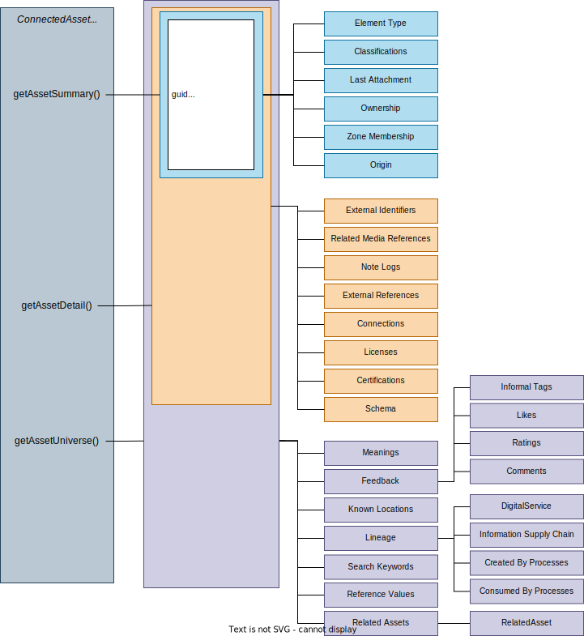

---
hide:
- toc
---

<!-- SPDX-License-Identifier: CC-BY-4.0 -->
<!-- Copyright Contributors to the ODPi Egeria project. -->

# Connected Asset Properties

Connected Asset Properties are the properties known about an asset accessed through a connector.
These properties are presented at three levels:

* AssetSummary
* AssetDetails
* AssetUniverse

> **Figure 1:** The structure of the connected asset properties

## Asset Summary

AssetSummary holds asset properties that are used for displaying details of
an asset in summary lists or hover text.  It includes the following properties:

 * **type** - metadata type information for the asset
 * **guid** - globally unique identifier for the asset
 * **url** - external link for the asset
 * **qualifiedName** - The official (unique) name for the asset. This is often defined by the IT systems
    management organization and should be used (when available) on audit logs and error messages.
    
    (Sourced from the qualifiedName attribute in Referenceable - [model 0010](/egeria-docs/types/0//egeria-docs/types/0/0010-Base-Model))
    
 * **displayName** - A consumable name for the asset.  Often a shortened form of the asset's qualifiedName
    for use on user interfaces and messages.   The asset's displayName should be only be used for audit logs and error
    messages if the qualifiedName is not set. 
    
    (Sourced from displayName attribute  within Asset - [model 0010](/egeria-docs/types/0/0010-Base-Model)))
 
 * **shortDescription** - short description about the asset.
    
    (Sourced from assetSummary within ConnectionsToAsset - [model 0205](/egeria-docs/types/2/0205-Connection-Linkage))
 
 * **description** - full description of the asset.
    
    (Sourced from description attribute within Asset - [model 0010](/egeria-docs/types/0/0010-Base-Model)))
 
 * **owner** - name of the person or organization that owns the asset.
    
    (Sourced from the AssetOwnership Classification - [model 0445](/egeria-docs/types/4/0445-Governance-Roles)).
 
 * **zoneMembership** - list of governance zones assigned to the asset.
 
    (Sourced from the AssetZoneMembership classification - [model 0445](/egeria-docs/types/4/0424-Governance-Zones)))
 
 * **classifications** - full list of the classifications assigned to the asset along with their properties.

## Asset Detail

AssetDetail extends AssetSummary to provide all of the properties directly related to this asset.  It includes:

 * **ExternalIdentifiers** - list of identifiers for this asset that are used in other systems.
 
 * **RelatedMediaReferences** - list of links to external media (images, audio, video) about this asset.
 
 * **NoteLogs** - list of NoteLogs for this asset, often providing more detail on how to use the asset and
    its current status.
 
 * **ExternalReferences** - list of links to additional information about this asset.
 
 * **Connections** - list of connections defined to access this asset.
 
 * **Licenses** - list of licenses associated with the asset.
 
 * **Certifications** - list of certifications that have been awarded to this asset.

## Asset Universe

AssetUniverse extends AssetDetail which extend AssetSummary.  AssetUniverse adds information about the
common open metadata entities related to this asset.

 * **meanings** - glossary term(s) assigned to this asset.
 
 * **schema** - details of the schema type associated with the asset.
 
 * **feedback** - details of the likes, reviews and comments, that are connected to the asset.
 
 * **knownLocations** - details of the known locations of the asset.
 
 * **lineage** - details of the lineage for the asset.
 
 * **relatedAssets** - details of the assets linked to this asset.

## Implementation details

The [Connector Broker](connector-broker.md) does not have access
to a metadata repository because the OCF is metadata repository neutral.
When it creates a connector, the connected asset properties
are null.

Egeria Open Metadata Access Services (OMASs) such as
[Asset Consumer OMAS](/egeria-docs/services/omas/asset-consumer/overview), 
[Asset Owner OMAS](/egeria-docs/services/omas/asset-owner/overview) and
[Discovery Engine OMAS](/egeria-docs/services/omas/discovery-engine/overview), 
include the connector broker in their clients and 
support APIs for managing connections and creating
connectors.

Connectors created by the Egeria access services
will include the Connected Asset Properties object
configured to retrieve metadata from the
same open metadata repository where the OMAS is running.

The Connected Asset Properties
are retrieved from the open metadata repositories by
[OCF Metadata Management](/egeria-docs/services/ocf-metadata-management).
It will use the same user id that was used to create the
connector.

--8<-- "snippets/abbr.md"