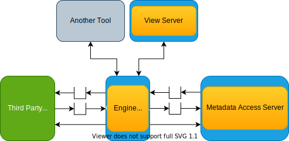

---
hide:
- toc
---

<!-- SPDX-License-Identifier: CC-BY-4.0 -->
<!-- Copyright Contributors to the Egeria project 2020. -->

# Governance Engine Hosting Servers

An *engine host* is an [OMAG Server](/egeria-docs/concepts/omag-server) that hosts one or more [governance engines](/egeria-docs/concepts/governance-engine). Governance engines define collections of [governance services](/egeria-docs/concepts/gpvernance-service) used to automate governance activity in the digital landscape. The governance services within the governance engines may access third party technology to perform their responsibilities or implement their behavior directly.

The engine host uses a [metadata access server](/egeria-docs/concepts/metadata-access-server) to retrieve the [definitions of the governance engines](/egeria-docs/governance-engine-definition) and the governance services within them. These definitions are retrieved through the [Governance Engine OMAS](/egeria-docs/services/omas/governance-engine/overview). The Governance Engine OMAS also manages the definition of [governance action processes](/egeria-docs/concepts/governance-action-process) that choreograph calls to the services in a governance engine in order to implement technical controls in the governance program.

Typically, an engine host is deployed close to where the artifacts/resources/data are stored because it can generate a lot of network traffic when its services are running.

The metadata interfaces needed by the governance engines are provided by the [Open Metadata Engine Services (OMES)](/egeria-docs/services/omes) (or engine services for short). The engine services also run in the engine host OMAG Server.

The engine services each run a specialist type of governance engine - and hence specialist governance services.  The engine services are:

- **Asset Analysis** - Supports [Open Discovery Engines](/egeria-docs/concepts/open-discovery-engine) running [Open Discovery Services](/egeria-docs/guides/developer/open-discovery-services/overview) that analyse the content of an asset's real world counterpart ([resource](/egeria-docs/concepts/resource)) in the digital landscape, generates annotations in an open discovery analysis report that is attached to the asset in the open metadata repositories.

- **Governance Action** - Supports [Governance Action Engines](/egeria-docs/concepts/governance-action-engine) running [Governance Action Services](/egeria-docs/guides/developer/governance-action-services/overview). There are five types of governance action services:
    - **Watchdog governance service** - Monitors changes in the open metadata repositories and initiates governance activity as a result. This is typically by creating a [governance action](/egeria-docs/frameworks/gaf/#governance-action), a [governance action process](/egeria-docs/frameworks/gaf/#governance-action-process) or an [incident report](/egeria-docs/frameworks/gaf/#incident-report). One example of a watchdog governance service is to monitor for the addition of a new asset.
    - **Verification governance service** - Runs checks on the metadata properties to ensure they are complete and correct. One example of a verification governance service is detection for metadata elements with the same qualified name, or an asset without an owner.
    - **Triage governance service** - Runs triage tasks to determine how to manage an incident or situation. For example, it could initiate an external workflow, assign a task to a steward, wait for manual decision or initiate a remediation request.
    - **Remediation governance service** - Makes updates to the open metadata or the digital landscape. An example of a remediation governance service could be to link or consolidate metadata elements with the same qualified name. Another remediation governance service may move assets between zones when a particular date is reached.
    - **Provisioning governance service** - Invokes a provisioning service whenever a provisioning request is made. Typically, the provisioning service is an external service. It may also create lineage metadata to describe the work of the provisioning engine.

- **Archive Manager** - Supports [Archive Engines](/egeria-docs/concepts/archive-engine) running [Archive Services](/egeria-docs/guides/developer/archive-services/overview) that dynamically maintain [Open Metadata Archives](/egeria-docs/concepts/open metadata-archive).

An engine service is paired with a specific open metadata service running in either a [metadata access point](/egeria-docs/concepts/metadata-access-point) or a [metadata access-store](/egeria-docs/concepts//egeria-docs/concepts/metadata-access-store). The specific access services are:

- [Discovery Engine OMAS](/egeria-docs/services/omas/discovery-engine/overview) for Asset Analysis OMES.
- [Governance Engine OMAS](/egeria-docs/services/omas/governance-engine/overview) for Governance Action OMES.
- [Open Metadata Repository Services (OMRS)](/egeria-docs/services/omrs) for Archive Manager OMES.

The name and URL root of the server where the open metadata service is running is needed to configure an engine service.  The open metadata service is used to retrieve the [governance engine definitions](/egeria-docs/concepts/governance-engine-definition) for the names governance engines configured for each engine service.

The metadata server used by the engine services does not need to be the same metadata server as the one used by the engine host server. This enables the management of metadata about the assets to be maintained close to the assets, and the definitions of the governance engines, services and processes to be maintained close to the governance team:

The engine host services have a REST API to query the status of the governance engines running in the engine services. The engine services also have a REST API to query specific details of their governance engines. All these REST APIs may be called by a [view server](/egeria-docs/concepts/view-server) as part of the support for a user interface.

!!! education "Further information"

    - The capabilities of each of the engine services are described in the [engine services](/egeria-docs/services/omes).
    - Configuring an engine host is described in the [Administration Guide](/egeria-docs/guides/admin/servers/configuring-an-engine-host).

--8<-- "snippets/abbr.md"
