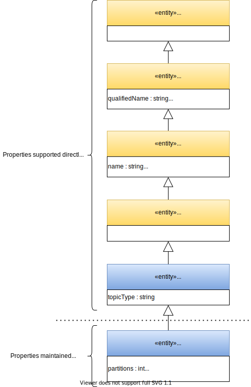

<!-- SPDX-License-Identifier: CC-BY-4.0 -->
<!-- Copyright Contributors to the ODPi Egeria project 2020. -->

# Extended Properties

Extended properties provide a means to maintain the properties of elements that are [subtypes of the types](/concepts/open-metadata-type-definitions) supported directly on an API.

For example, the [Data Manager OMAS](/services/omas/data-manager/overview) has support for maintaining metadata about *Topics*.  Topics are special types of [*assets*](/concepts/asset) that provide a destination for exchanging events.  

Model [0223 Events and Logs](/types/2/0223-Events-and-Logs) extends the `Topic` type with a new type called `KafkaTopic` that introduces two new properties: `partitions` and `replicas`.  `KafkaTopic` is used to represent a topic that is owned and managed by [*Apache Kafka*](https://kafka.apache.org/).  The full type hierarchy for `KafkaTopic` is shown in Figure 1.


**Figure 1:** The type inheritance hierarchy for KafkaTopic.  This shows all of the properties that are valid for an element of type `KafkaTopic`.  Properties `qualifiedName` and `additionalProperties` are inherited from `Referenceable`; properties `name` and `description` are inherited from `Asset`; finally `topicType` is inherited from `Topic`.  All of these properties are supported natively by the Data Manager OMAS.  The `partitions` and `replicas` properties introduced by the `KafkaTopic` type are maintainable through `extendedProperties`.

The code snippet below shows a call to the Data Manager OMAS to create an element of type `KafkaTopic`.
The standard properties for a topic are set up first.  Then the name of the subtype for the new element (null means `Topic`).  Then any extended properties for the requested subtype are set up.
Finally any additional properties that the organization wants to store that are not defined in the type definitions go in `additionalProperties`.
```

   TopicProperties topicProperties = new TopicProperties();

   /*
    * Set up the standard properties - note displayName maps to the name property.
    */
   topicProperties.setQualifiedName("Topic:myTopicName");
   topicProperties.setDisplayName("myTopicName");
   topicProperties.setDescription("Testing that topics can be catalogued");
   topicProperties.setTopicType("PLAINTEXT");

   /*
    * Set up the specific type name for the new element. It must be a null
    * (for a type of Topic) or a type name that is a subtype of Topic.
    */
   topicProperties.setTypeName("KafkaTopic");

   /*
    * Set up the properties that come from the subtypes of Topic.
    */
   Map<String, Object> extendedProperties = new HashMap<>();
   extendedProperties.put("partitions", 1);
   extendedProperties.put("replicas", 5)
   topicProperties.setExtendedProperties(extendedProperties);

   /*
    * Set up additional properties.  These do not need to be defined in any of the
    * type definitions.
    */
   Map<String, String> additionalProperties = new HashMap<>();
   additionalProperties.put("autoDefined", "true");
   additionalProperties.put("jsonPayload", "true");
   topicProperties.setAdditionalProperties(additionalProperties);

   String topicGUID = dataManagerClient.createTopic(userId, 
                                                    eventBrokerGUID
                                                    eventBrokerName, 
                                                    eventBrokerIsHome, 
                                                    topicProperties);

```


--8<-- "snippets/abbr.md"
