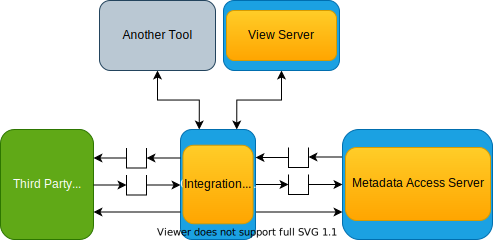

<!-- SPDX-License-Identifier: CC-BY-4.0 -->
<!-- Copyright Contributors to the Egeria project 2020. -->

# Integration Daemon

An *integration daemon* is an [OMAG Server](omag-server.md) that provides metadata exchange services between third party technology and the open metadata ecosystem.

The integration daemon interacts with the open metadata ecosystem through [Open Metadata Access Services (OMAS)](/egeria-docs/services/omas) running in a [metadata access point](/egeria-docs/concepts/metadata-accces-point) or [metadata access store](/egeria-docs/concepts/metadata-access-store).

Inside the integration daemon are one or more [Open Metadata Integration Services (OMIS)](/egeria-docs/services/omis) that each focus on metadata exchange with a specific type of technology. They are paired with a specific [Open Metadata Access Service (OMAS)](/egeria-docs/services/omas) running in the metadata access point / metadata server.

## Integration connectors

The code that manages the specific APIs and formats of the third party technology is encapsulated in a special type of connector called an [integration connector](/egeria-docs/connectors/integration-connector).

The specific interface that the integration connector needs to implement is defined by the [integration service](/egeria-docs/services/omis). This interface enables the integration service to pass a context object to the connector before it is started. The context enables the connector to register a listener with the associated access service's [Out Topic](/egeria-docs/concepts/out-topic), or call its REST API, or to push events to the access service's [In Topic](/egeria-docs/concepts/in-topic). By default, the context uses the integration daemon's userId for requests to the access service which means that the metadata created by the integration connector will be credited to this user. If you want to use a different userId for metadata from each connector, the server's userId can be overridden in the connector's configuration.

--8<-- "snippets/abbr.md"
