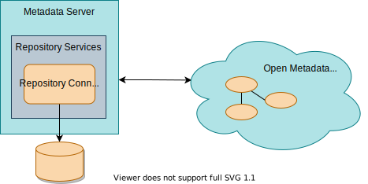

<!-- SPDX-License-Identifier: CC-BY-4.0 -->
<!-- Copyright Contributors to the Egeria project. -->

# Exchange connectors

These connectors help to accelerate the rollout of your open metadata ecosystem since they can be used to automate the extraction and distribution of metadata to the third party technologies.

## Integration connectors

The [integration connectors](/egeria-docs/connectors/integration-connector) support the exchange of metadata with third party technologies. This exchange may be inbound, outbound, synchronous, polling or event-driven.

### Files

The `files` integration connectors run in the [Files Integrator Open Metadata Integration Service (OMIS)](/egeria-docs/services/omis/files-integrator) hosted in the [integration daemon](/egeria-docs/concepts/integration-daemon).

| Connector | Description |
|---|---|
| [Data files monitor](data-files-monitor-integration-connector.md) | maintains a `DataFile` asset for each file in the directory (or any subdirectory) |
| [Data folder monitor](data-folder-monitor-integration-connector.md) | maintains a `DataFolder` asset for the directory |

### Databases

The database integration connectors run in the [Database Integrator Open Metadata Integration Service (OMIS)](/egeria-docs/services/omis/database-integrator) hosted in the [integration daemon](/egeria-docs/concepts/integration-daemon).

| Connector | Description |
|---|---|
| [PostgreSQL database connector :material-github:](https://github.com/odpi/egeria-database-connectors/tree/main/egeria-connector-postgres){ target=gh } | automatically maintains the open metadata instances for the databases hosted on a [PostgreSQL server :material-dock-window:](https://www.postgresql.org){ target=psql } |

### Security enforcement engines

The security integration connectors run in the [Security Integrator Open Metadata Integration Service (OMIS)](/egeria-docs/services/omis/security-integrator) hosted in the [integration daemon](/egeria-docs/concepts/integration-daemon).

## Repository connectors

The [repository connectors](/egeria-docs/connectors/repository-connector) implement the [`OMRSMetadataCollection` :material-github:](https://github.com/odpi/egeria/blob/master/open-metadata-implementation/repository-services/repository-services-apis/src/main/java/org/odpi/openmetadata/repositoryservices/connectors/stores/metadatacollectionstore/OMRSMetadataCollection.java){ target=gh } interface to allow metadata to be communicated and exchanged according to Egeria's protocols and [type definitions](/egeria-docs/introduction/key-concepts/#metadata-types).

### Pluggable repositories

These connectors allow different back-ends to act as a native open metadata repositories in a [metadata server](/egeria-docs/concepts/metadata-server).

| Connector | Description |
|---|---|
| [JanusGraph OMRS Repository Connector :material-github:](https://github.com/odpi/egeria/tree/master/open-metadata-implementation/adapters/open-connectors/repository-services-connectors/open-metadata-collection-store-connectors/graph-repository-connector){ target=gh } | provides a native repository for a metadata server using [JanusGraph :material-dock-window:](https://janusgraph.org){ target=janus } as the backend |
| [Crux OMRS Repository Connector :material-github:](https://github.com/odpi/egeria-connector-crux){ target=gh } | provides a native repository for a metadata server that supports historical queries, using [Crux :material-dock-window:](https://opencrux.com){ target=crux } as the backend |
| [In-memory OMRS Repository Connector :material-github:](https://github.com/odpi/egeria/tree/master/open-metadata-implementation/adapters/open-connectors/repository-services-connectors/open-metadata-collection-store-connectors/inmemory-repository-connector){ target=gh } | provides a simple native repository implementation that "stores" metadata in HashMaps within the JVM; it is used for testing, or for environments where metadata maintained in other repositories needs to be cached locally for performance/scalability reasons |
| [Read-only OMRS Repository Connector :material-github:](https://github.com/odpi/egeria/tree/master/open-metadata-implementation/adapters/open-connectors/repository-services-connectors/open-metadata-collection-store-connectors/inmemory-repository-connector){ target=gh } | provides a native repository implementation that does not support the interfaces for create, update, delete; however, it does support the search interfaces and is able to cache metadata -- this means it can be loaded with open metadata archives to provide standard metadata definitions |

### Repository adapters

These connectors act as an adapter to integrate third party metadata repositories (catalogs) into an [open metadata repository cohort](/egeria-docs/services/omrs/cohort).

| Connector | Description |
|---|---|
| [Apache Atlas OMRS Repository Connector :material-github:](https://github.com/odpi/egeria-connector-hadoop-ecosystem){ target=gh } | implements read-only connectivity to the [Apache Atlas :material-dock-window:](https://atlas.apache.org){ target=atlas } metadata repository |
| [IBM Information Governance Catalog (IGC) OMRS Repository Connector :material-github:](https://github.com/odpi/egeria-connector-ibm-information-server){ target=gh } | implements read-only connectivity to the metadata repository within the [IBM InfoSphere Information Server :material-dock-window:](https://www.ibm.com/analytics/information-server){ target=ibm } suite |
| [SAS Viya OMRS Repository Connector :material-github:](https://github.com/odpi/egeria-connector-sas-viya){ target=gh } | implements metadata exchange to the metadata repository within the [SAS Viya Platform :material-dock-window:](https://support.sas.com/en/software/sas-viya.html){ target=sas } |

## Open discovery services

[Open discovery services](/egeria-docs/frameworks/odf/#discovery-service) are connectors that analyze the content of resources in the digital landscape and create annotations that are attached to the resource's Asset metadata element in the open metadata repositories in the form of an open discovery report.

The interfaces used by a discovery service are defined in the [Open Discovery Framework (ODF)](/egeria-docs/frameworks/odf) along with a guide on how to write a discovery service.

| Connector | Description |
|---|---|
| [CSV Discovery Service :material-github:](https://github.com/odpi/egeria/tree/master/open-metadata-implementation/adapters/open-connectors/discovery-service-connectors){ target=gh } | extracts the column names from the first line of the file, counts up the number of records in the file and extracts its last modified time |
| [Sequential Discovery Pipeline :material-github:](https://github.com/odpi/egeria/tree/master/open-metadata-implementation/adapters/open-connectors/discovery-service-connectors){ target=gh } | runs nested discovery services in a sequence ([more information on discovery pipelines](/egeria-docs/frameworks/odf/#discovery-pipeline)) |

The definition of the connector interfaces for discovery services is defined in the [open-discovery-services :material-github:](https://github.com/odpi/egeria/tree/master/open-metadata-implementation/frameworks/open-discovery-framework/src/main/java/org/odpi/openmetadata/frameworks/discovery){ target=gh } module.

## Governance action services

[Governance action services](/egeria-docs/frameworks/gaf/#governance-action-service) are connectors that perform monitoring of metadata changes, validation of metadata, triage of issues, assessment and/or remediation activities on request.

They run in the [Governance Action Open Metadata Engine Service (OMES)](/egeria-docs/services/omes/governance-action) hosted by the [Engine Host OMAG Server](/egeria-docs/concepts/engine-host).

| Connector | Description |
|---|---|
| [Generic Element Watchdog Governance Action Service](generic-element-watchdog-governance-action-service.md) | listens for changing metadata elements and initiates governance action processes when certain events occur |
| [Generic Folder Watchdog Governance Action Service](generic-folder-watchdog-governance-action-service.md) | listens for changing assets linked to a `DataFolder` element and initiates governance action processes when specific events occur |
| [Move/Copy File Provisioning Governance Action Service](move-copy-file-provisioning-governance-action-service.md) | moves or copies files from one location to another and maintains the lineage of the action |
| [Origin Seeker Remediation Governance Action Service](origin-seeker-remediation-governance-action-service.md) | walks backwards through the lineage mappings to discover the origin of the data |

The definition of the connector interfaces for governance action services is defined in the [governance-action-framework :material-github:](https://github.com/odpi/egeria/tree/master/open-metadata-implementation/frameworks/governance-action-framework) module.

--8<-- "snippets/abbr.md"
