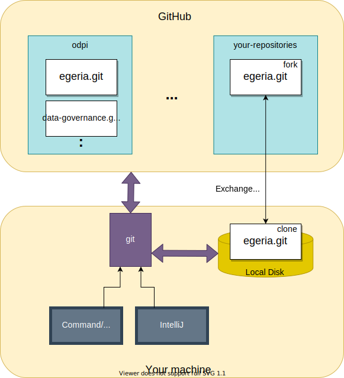

<!-- SPDX-License-Identifier: CC-BY-4.0 -->
<!-- Copyright Contributors to the ODPi Egeria project 2020. -->

### Adding your contribution to an Egeria git repository

Once you have prepared a contribution and these changes are added to your clone, you are ready to commit the changes and push them to your clone on GitHub.


> **Figure 4:** Pushing changes to GitHub

Below is the command to commit your changes.  Make sure 
to use the `-s` option to sign your changes (see [Why the DCO?](https://github.com/odpi/egeria/blob/master/developer-resources/why-the-dco.md))
and the `-m` option to provide a useful commit message. In the message you can
make use of [special strings](https://blog.github.com/2011-10-12-introducing-issue-mentions/) to
directly link to GitHub
issues. By doing this others following the issue will see the commits to your fork
easily so can track the work going on even before you submit to the **egeria** repository.

It is also essential to push the changes from your local machine up to GitHub ready for the next step.

```bash
$ git commit -s -m 'Best code change ever as per Issue #1433'
$ git push 
```

If you think there is ongoing work in a similar area to that of your changes, you may find it useful to pull
the latest master code prior to completing your changes.

```bash
$ git pull upstream master
```


> **Figure 5:** Pulling latest changes from master

and then making any necessary changes to merge conflicts, and commit/push as above.

### Creating a pull request

Pull requests are created on GitHub, so go to your browser window.

The easiest way to create a pull request is by navigating to your local fork of the Egeria repository eg. `https://github.com/USER/egeria`, selecting your working branch, and clicking on 'pull request'. Add an explanation and links to any GitHub Issues that are relevant to your change, and then submit the pull request.

GitHub automatically validates that you have signed all of your commits and that any code builds.

The Egeria maintainers will then review and if all is well, it will be merged into the master branch and you have officially made a successful contribution to the project.  Congratulations :).

Further changes can be done using the same branch, and will be added to the same pull request automatically until the pull request is merged into master.


### Cleaning up

Once all work has been completed, including changes appearing in master, only then can your temporary branch be deleted:

```bash
$ git branch -d example-branch
$ git push -d origin example-branch
```

You may need to use `-D` if not all changes are merged, but check carefully!


---8<-- "snippets/abbr.md"