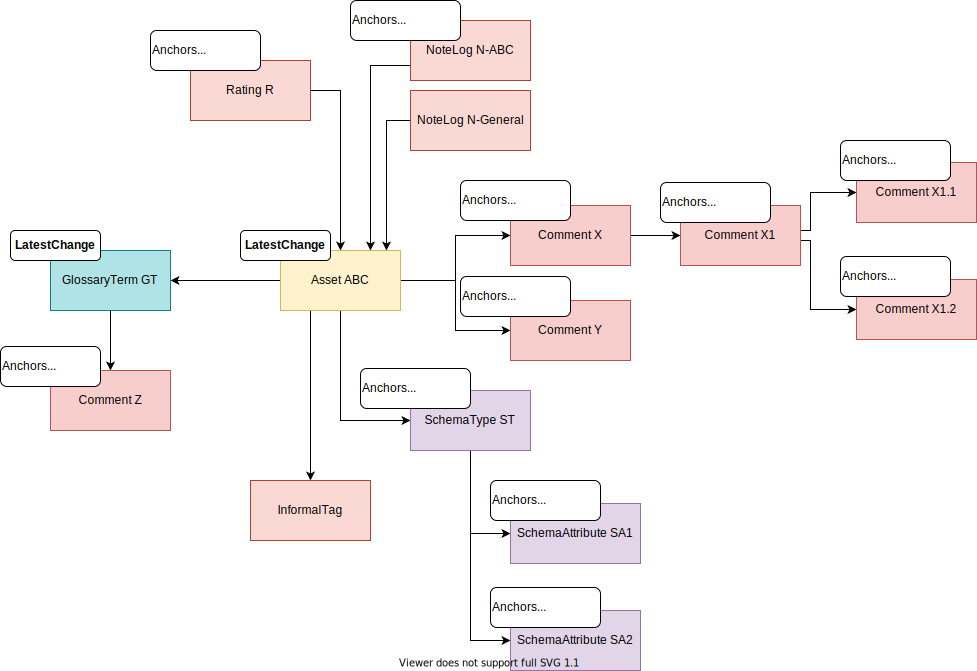

---
hide:
- toc
---

<!-- SPDX-License-Identifier: CC-BY-4.0 -->
<!-- Copyright Contributors to the ODPi Egeria project. -->

# Anchors

*[Anchors](/concepts/anchor)* are [Referenceable](/concepts/referenceable) metadata entities that group other entities together.  They act like containers.  This means, for example, if the anchor entity is deleted then the entities anchored to this entity are also deleted.  

The value of establishing this grouping is to ensure that entities that have little meaning without their anchor entity are cleaned up properly and are not left to uselessly clutter the repository when the anchor is deleted. 

!!! example "Example: personal messages and profiles"
    For example, if a [personal message](/concepts/personal-message) is attached to a [personal profile](/concepts/personal-profile) then that personal profile is its anchor.  If the personal profile is deleted then the personal message is deleted too.

Anchored entities are also bound by the visibility and security restrictions of their anchor. 

!!! example "Example: Assets"
    For example, [Asset](/concepts/asset) visibility is controlled by [governance zones](/features/governance-zoning/overview). An Asset is only visible through a service if it is a member of that service's **supportedZones**.  Similarly,   authorization to perform specific operations on an Asset is granted by the [Open Metadata Security Services](/features/metadata-security).  When a [SchemaType](/types/5/0501-Schema-Elements/#schematype) is attached to an Asset, it is anchored to that Asset. Subsequent requests to read or update the SchemaType will result in visibility and authorization checks for the requesting user being made with respect to its Asset anchor.
    
The anchor is also important in [templated cataloguing](/features/templated-cataloguing/overview) where an existing entity is used as a template to create another.  When the template entity is an anchor, it and all of the other entities that are anchored to it are duplicated to create the new entry and relationships are created to all other entities that are linked to the template and its anchored entities.

## Anchors classification

The [Anchors](/types/0/0010-Basic-Model/#Anchors) classification contains the unique identifier (GUID) of an anchor entity.  It is attached to an anchored entity and makes it easier to navigate from an anchored entity to its anchored entity.

!!! example "Example: SchemaElements and Comments"
    Figure 1 is an illustration of this example, with the addition of an Asset. The entities that have the Anchors classification are those that are anchored to the Asset.  This includes entities such as Ratings, Likes and Attachments (from the [Open Discovery Framework (ODF)](/frameworks/odf/overview).

    
    > **Figure 1:** Examples of dependent entities that are anchored to an Asset

If a [GlossaryTerm](/concepts/glossary-term), or [InformalTag](/concepts/informal-tag) is attached to the Asset, they are not anchored to it. GlossaryTerms and InformalTags are independent entities. They are not anchored to the Asset and hence do not have an Anchors classification. Any change to these entities does not reflect in the LatestChange classification of the Asset. However, the act of attaching them to, or detaching them from the Asset is recorded in the Asset's LatestChange classification. Since the GlossaryTerm is also an anchor, when the GlossaryTerm and the Asset are linked together, this change is reflected in both of their LatestChange classifications because they are both Referenceable anchors.

NoteLogs are Referenceables that can be attached to many other Referenceables. They can be set up either to be anchored with a single Referenceable or to be their own anchor to allow then to be attached to and detached from many Referenceables over its lifetime.

!!! example "Example: NoteLog and Referenceables"
    For example, these are cases where the [NoteLog](/concepts/note-log) is anchored to another Referenceable

    - NoteLogs are used to support the personal blog linked off of the Personal Profile in Community Profile OMAS.
    - Assets may have a NoteLog to record "news" for consumers such as planned maintenance and unexpected situations.

    Egeria uses the Anchors classification on a NoteLog to indicate that the NoteLog is tied to the Referenceable it is attached to. 
    The presence of this classification would prevent it from being linked to another Referenceable.

    Figure 2 is an illustration of the additional objects connecting to an asset that do not have the Anchors classification
    because they are not anchored to the Asset.
    Also notice there are two NoteLogs attached to the asset,
    one with the Anchors classification and one without.
    The one with the Anchors classification is anchored to the the Asset. The one without the Anchors classification is
    independent of the Asset.
    
    
    > **Figure 2:** Examples of other types of entities that are linked to an Asset but not necessarily anchored there
    
It is worthwhile maintaining the `Anchors` classification because reads of and updates to the anchored entities will happen many times, and it is rare that an anchored entity will change its anchor during its life time.
    
## LatestChange classification

The [`LatestChange`](/types/0/0011-Managing-Referenceables/#LatestChange) classification is attached to each anchor Referenceable. It is used to record the latest change to this anchor or any of the entities anchored to it.

So for example, if a hierarchy of SchemaElements, or a hierarchy of Comments (all Referenceables) were anchored to an Asset (also a Referenceable), then the LatestChange classification goes on the Asset and records changes to any of these entities. This includes changing property values, attaching or detaching entities through relationships as well ans any changes to their classifications.

Maintaining "LatestChange" on Assets means that it is easier to monitor for changes affecting the Asset and any of its anchored entities. However it also means that it must be easy to located the Asset from any of the anchored entities when they change, even though they may not be directly connected.
    
!!! education "Further information"
    - [Generic Handlers](/services/generic-handlers) maintain the Anchors and LatestChange classifications.
    - [Open Metadata Type definitions for LatestChange and Anchors classification](/types/0/0011-Managing-Referenceables)
    - [Open Metadata security checks for Assets and Connections](/features/metadata-security/overview)
    - [Governance Zones and Assets](/features/governance-zoning/overview)
    

--8<-- "snippets/abbr.md"
