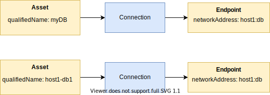
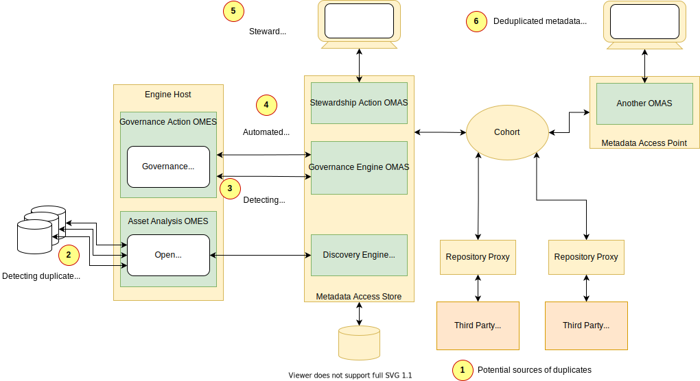
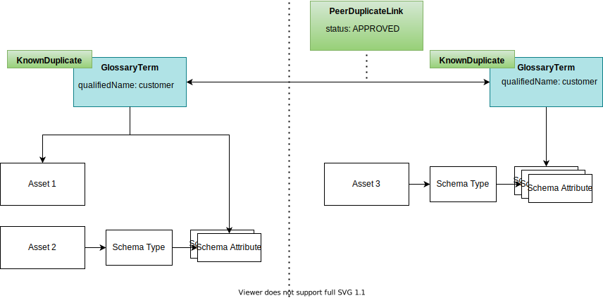

<!-- SPDX-License-Identifier: CC-BY-4.0 -->
<!-- Copyright Contributors to the ODPi Egeria project 2020. -->

# Duplicate Management

Duplicate management covers the identification of multiple instances of metadata that represent the same concept or resource.  These duplicate instances are then linked and classified so that when metadata is being retrieved from the open metadata ecosystem, the information from the duplicates is combined to give a meaningful result.

## What is a duplicate?

Duplicates occur when the same concept or resource is captured in multiple tools.  They are not noticed as duplicates when the tools operate independently.  However, when these tools are connected together through Egeria, the inconsistencies between them create partial results and possible errors in decisions made using this information.

Figure 1 shows a simple duplicate where each instance originates from a different repository.  Although each instance has a different unique identifier (GUID), the rest of the metadata is consistent.  This makes it easy to spot when both are returned in a search query.  However, a query to count, say, the number of glossary terms would give misleading results.

> **Figure 1:** Two copies of the same glossary term originating from different repositories

When related information is required (for example, which assets are linked to the glossary term `customer`) the request needs to be issued for each duplicate instance to retrieve the complete picture.  Figure 2 shows that the users of one repository have linked their copy of the glossary term to assets 1 and 2 whereas the users of the other repository have linked their copy of the glossary term to asset 3.

> **Figure 2:** Different sets of relationships associated with each duplicate

It is often not possible to delete one of the duplicate instances because many repositories are not able to store metadata from other repositories and so each copy is needed by its originating repository.  Egeria needs a mechanism to handle these duplicates.

Some duplicates are not so easy to identify.  Figure 3 shows an example of duplicate assets where the values in the assets are different, but the fact that they describe the same resource can be deduced by the fact that the related endpoints point to the same location.

>**Figure 3:** Duplicate assets identified through their endpoints

In some circumstances the metadata is correctly cataloguing the existence of two resources however the resources themselves are duplicates of one another.  Figure 4 shows two copies of the same image.  The metadata records the name of each copy but has no knowledge that their contents are the same.

> **Figure 4:** Two copies of the same resource are catalogued as two assets.  There is no shared values in the metadata.

## Avoiding duplicates

Duplicates can add a significant burden to your data processing.  Therefore there is value in controlling the copying of data and ensuring that resources are catalogued only once.

However some duplication can not be avoided and Egeria has mechanisms to handle them.

## How are duplicates managed in Egeria?

Duplicate management has four parts to it:

* Detecting duplicate resources
* Detecting duplicate metadata entries for the same resource or concept.
* Linking duplicates together so that they can be processed together.
* Combining duplicates so that they can be retrieved as if they were one.

Figure 5 shows the architecture of an Egeria duplicate management solution.

>**Figure 5:** Components in a deduplication solution include the cohort members that are supplying the duplicates and retrieving metadata along with the engine host that is running the governance engines detecting and managing duplicates in conjunction with the stewards

The numbers on the diagram refer to the following points:

1. These are the tools that are potentially introducing duplicates into the cohort.  In this example they are connected through repository proxies and are not capable of storing reference copies of metadata.  This means the duplicates that they collectively introduce must be managed for the benefit of other consumers of the metadata.

2. [Metadata Discovery](/egeria-docs/features/discovery-and-stewardship) analyses the content of resources.  There are algorithms for producing a fingerprint (like a hash) that represents the content of each resource. These fingerprints can be [stored as annotations](/egeria-docs/types/6/0620-Data-Profiling) attached to the resource's asset via a [discovery analysis report](/egeria-docs/concepts/discovery-analysis-report).  These fingerprint annotations are metadata that can be automatically analysed during duplicate detection.

3. The examples in figures 1-4 show that the mechanisms to detect duplicates are varied and often require knowledge of the data management practices in the organization.  As such this function must be pluggable into Egeria's runtime. [Governance Actions](/egeria-docs/concepts/governance-action) therefore monitor for changes in metadata and search for duplicate instances.  They link detected duplicates together.

4. A governance action, possibly the same one that detected the duplicates, can validate and action the duplicates so that survivorship processing occurs when they are retrieved from the metadata repositories (see step 6).

5. Alternatively, the duplicates can be validated and actioned by a steward.

6. When a [service](/egeria-docs/services/omas) detects duplicates during a request to retrieve metadata from the repositories it automatically processes the duplicates so the caller is not aware that the duplicates exist.

Figure 6 shows an example of a [governance action process](/egeria-docs/concepts/governance-action-process) that controls the governance actions and the use of the stewards for duplicate detection.

>**Figure 6:** The steps in an example governance action process 

There is a watchdog governance action that is monitoring for new assets. It initiates a verification governance action to detect any duplicates for each new asset.  Each verification governance action produces a guard whose value depends on the confidence that it has in the accuracy of any detected duplicates:

* `no-duplcates` guard means it discovered no duplicates and so the process stops.
* `link-duplicates` guard means it is very confident that it has detected a duplicate and it can be actioned automatically by a remediation governance action before the process stops.
* `validate-duplicates` guard means that a steward should verify that duplicates have really been detected.  This is achieved by a triage governance action creating a [`ToDo`](/egeria-docs/concepts/to-do) and a watchdog governance action waiting for the steward to complete the ToDo before stopping.  The steward uses the [Stewardship Action OMAS](/egeria-docs/services/omas/stewardship-action) to verify and set up the duplicates.

## Duplicate management styles

Egeria has two styles of duplicate management that can be actioned automatically or by a steward.  They are peer linking and consolidation.  The open metadata types used in both styles are defined in model [0465 Duplicate Management](/egeria-docs/types/4/0465-Duplicate-Management).

### Peer linking

When duplicate entities are first detected, they are linked together by the [PeerDuplicateLink](/egeria-docs/types/4/0465-Duplicate-Management#PeerDuplicateLink) relationship.  This relationship includes properties that indicate how confident the detecting process is that the entities are duplicates.  No change occurs in the retrieval of these instances at this point.

If a steward or automated process confirms the duplicates are correctly identified, [KnownDuplicate](/egeria-docs/types/4/0465-Duplicate-Management#knownDuplicate) classifications added to the entities tell the metadata retrieval functions to [automatically combine the content of the duplicates](#survivorship-rules) when any of them is requested.  This is peer linking.

### Consolidation

Consolidation is the process where the combined results of the duplicates is pre-calculated, stored as an entity and linked to the duplicate entities using the [ConsolidatedDuplicateLink](/egeria-docs/types/4/0465-Duplicate-Management#consolidatedduplicate-and-consolidatedduplicatelink) relationship.  The assessment of confidence of the deduplication is stored in the [ConsolidatedDuplicate](/egeria-docs/types/4/0465-Duplicate-Management#consolidatedduplicate-and-consolidatedduplicatelink) classification on the instance that contains the combined results.

### Metadata retrieval of duplicates

When an Egeria retrieval operation is requested by an [Open Metadata Access Service (OMAS)](/egeria-docs/services/omas), it monitors for the `KnownDuplicate` classification on the entities it is retrieving.  When found, and the retrieval request is not part of duplication management, deduplication occurs.  

#### Deduplication

During deduplication, the retrieval process first looks for the `ConsolidatedDuplicateLink` relationship.  If that is found, the consolidated instance is returned instead. If not, the instances linked via `PeerDuplicateLink` relationships are combined.  The combination process requires choices to be made on which values to use.  These choices are called the *survivorship rules*.

#### Survivorship rules

The survivorship rules operate on the following principles:

* Newer metadata is more accurate.
* The cardinality of relationships must be respected.
* If multiple peer entities point to the same target entity with the same type of uni-link relationship then the target entity is processed only once.

Figure 7 shows two glossary terms linked as peer duplicates. When entity is queried by GUID, properties from requested entity are returned with combination of classifications.  Conflicts in classifications are recorded on the audit log.  The latest values are used. 

When the relationships of an identified duplicate are queried, the combination from all duplicates is returned unless only one instance of a relationship is allowed in which case the latest values are used.  

> **Figure 7:** Peer duplicates with distinct relationships

Figure 8 shows that both glossary terms link to the same schema attribute using the [SemanticAssignment](/egeria-docs/types/3/0370-Semantic-Assignment) relationship.  Although this relationship has a cardinality of many-to-many, it is uni-link so only the newesst relationship is processed. 

> **Figure 8:** Peer duplicates pointing to the same entity via the same type of uni-link relationship

Finally figure 9 shows a consolidated duplicate linked to the glossary terms.  If any of these three entities are requested the consolidated duplicate is returned.

> **Figure 9:** Peer duplicates linked to a consolidated duplicate

Note: survivorship rules only operate on instances with appropriate [effectivity dates](/egeria-docs/features/effectivity-dates).

--8<-- "snippets/abbr.md"