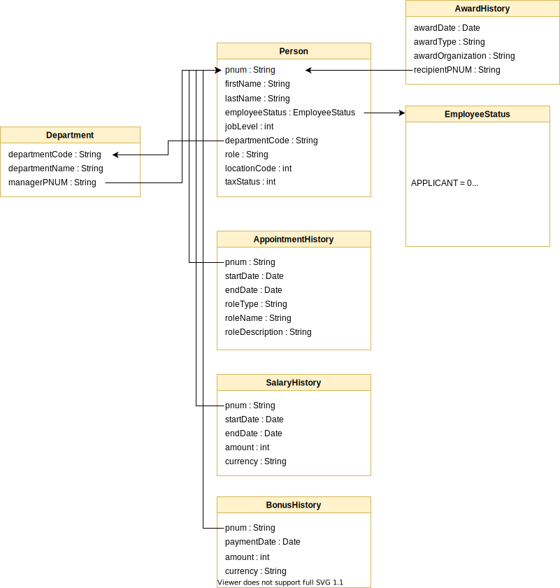
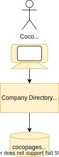

<!-- SPDX-License-Identifier: CC-BY-4.0 -->
<!-- Copyright Contributors to the ODPi Egeria project 2020. -->

# People, roles and organizations

## The nature of organizations

Everyone plays multiple roles in their lives: parent, daughter, employee, scout leader, … Even within an organization it is not uncommon, particularly for more experienced people, to be assigned multiple roles.

For example, figure 1 shows some of the roles that [Tessa Tube](https://opengovernance.odpi.org/coco-pharmaceuticals/personas/tessa-tube.html) performs at [Coco Pharmaceuticals](https://opengovernance.odpi.org/coco-pharmaceuticals/).  Researcher is her primary role, but she is also a manager, system owner and information consumer.  Each of these roles needs particular skills and knowledge.  They will also take up some of her time.

> **Figure 1:** Roles that Tessa Tube plays in Coco Pharmaceuticals

A role has a context. For example, Tessa is a manager, but not for everyone in Coco Pharmaceuticals. She is a manager of a specific team. Similarly, she may be a system owner, but not of all systems.

So a role has a scope and roles can be combined together to form the complete “job” that an individual performs.

Now consider what a role is from an organization's perspective. Roles can be thought of as slots, or vacancies, in the organization's teams that individuals are appointed to for a span of time.  A role can have more than one person appointed. [Head count](/egeria-docs/concepts/person-role/#head-count-limit) is an optional attribute that indicates how many people are expected to be assigned to the role.

The teams are typically organized into one or more hierarchies.  These hierarchies reflect how the work has been divided up to meet the objectives of the organization. Figure 2 shows the general structure.

> **Figure 2:** Basic structure of an organization showing the top-level organization linked to the top-level teams.  Nested under the top-level teams are the sub-teams.  The roles in each team are divided into leaders and members.  The roles can have multiple people appointed to them.

Figure 3 shows part of the Coco Pharmaceuticals organization.

> **Figure 3**: Coco Pharmaceuticals divides its labs and research work from the sales and manufacturing.  The leader of the labs is one of the founders, Terri Daring.  Tessa Tube works for her and Callie Quartile works for Tessa.

Coco Pharmaceuticals is a small company but even so, its organization structure is hard to draw on a flat diagram.  Terri Daring is a founder and a member of the *Founders* team (not shown in figure 3) as well as bing a leader of the the *Labs* organization.

## Roles in action

Roles may be targeted to a particular project and are a key mechanism for organizing people for governance. Consider this scenario.

### Clinical trial example

The characters in figure 4 are involved in the clinical trial for a new cancer drug developed by Coco Pharmaceuticals.  They are collaborating on their findings as selected patients are given the new drug.  The data is created by the hospital and shared with Coco Pharmaceuticals for analysis.  Results and feedback are returned to the hospital personnel.

> **Figure 4:** The people from the hospital (Grant Able, Angela Cummings, Julie Stitched and Robbie Records) and from Coco Pharmaceuticals (Callie Quartile, Tanya Tidie and Tessa Tube) who are working together on the clinical trial.

In this example, there is an exchange of sensitive personal data which needs to managed carefully, both for legal reasons and to maintain the trusted partnership between the hospital and Coco Pharmaceuticals. 

When it comes to working with data, the role each are playing is often related to the task an individual is performing and the data resources they are working with.  This becomes important in managing the access that an individual has to the resources.

### Clear responsibilities

The hospital has a close association with the information subjects (patients) and information originators (medical staff) who are typically the information owners.

The hospital appoints an information steward ([Robbie Records](https://opengovernance.odpi.org/coco-pharmaceuticals/personas/robbie-records.html)) to work with the information owners on the terms and conditions that must be met by external organizations using the data.  Robbie also chases down data quality issues and ensures their data practices are clean.

At Coco Pharmaceuticals, Tanya Tidie is appointed as the information custodian for the data.  She takes responsibility for meeting the terms and conditions for the incoming data.

> **Figure 5:** Robbie Records and Tanya Tidie managing the sharing of data from the hospital

Figure 6 shows a broader view the roles of each character when it comes to the transfer of data from the hospital.  The role names are not important.  There is little standardization fo these names in the industry.  Just focus on the fact that the people involved with the clinical data have different roles/responsibilities with respect to its protection and use.

> **Figure 6:** The patent is the information subject.  The information originators are the medical staff making notes and capturing clinical data.  Robbie is the information steward managing the data and its transfer to external organization on the hospital-side.  Tanya Tidie is the receiver of the data and as the information custodian, she is responsible for the proper management of Coco Pharmaceutical's copy of the data. Tessa Tube and Callie Quartile are information consumers.  They read the data and perform analysis on it to determine how well the new drug is helping the patient.

Tanya Tidie needs to ensure that only the clinical trials team have access to the data.  The team also need to be educated on their responsibilities to meet the terms and conditions of the data transfer.

## Linking governance and security to roles

The roles in an organization help to determine who should have access to specific resources.  Egeria's synchronization capability helps in the maintenance of security permissions both:

- When onboarding a new service that has an embedded security system (such as a cloud platform) or even for Egeria itself.
- When making changes to the organization structure.
- When setting up new projects.

Egeria provides the means to link information about the organization with the asset descriptions of the resources teams and individuals need and security control information that links into the security authorization services.

> **Figure 7;** Security groups are governance definitions.  They can be linked to resources with the *GovernanceBy* relationship to show that the security group is used to govern access to these resources.  The security group can also be linked to an organization, service or business capability using the *ScopedBy* relationship to show that it is only used within the identified scope.

## Using organization data with open metadata

Egeria may have one or more of the following uses of organization data and this will effect the scope and coverage of this data that flows through Egeria.

- Egeria is a consumer of the organization data for collaboration and governance.
- Egeria is a validator of the consistency of the organization data in the different systems.
- Egeria is a distributor of the organization data between systems.  This may include its only security definitions used to security the access of open metadata through Egeria.

In general, if Egeria is just consuming the organization data then it only needs information about the people and teams using Egeria.  If, however, Egeria is validating or distributing organization data, it tends to hold all of the organization data that is relevant to the sources and consumers of the organization data.

The text below covers all three uses.

## Systems that hold organization data

Organization data is widely distributed across an organization's systems.  Each system holds a different subset of the organization data and is updating some or all of its content.  When planning to integrate organization data into Egeria, it is important to understand where the authoritative source of each attribute is located and how the information in different systems can be correlated together.  Below are the descriptions of three systems in Coco Pharmaceuticals that are responsible for managing organization information.

### HR Information Manager (HRIM)

HRIM is owned by the Human Resources (HR) team in Coco Pharmaceuticals for managing information about employees.  It covers applicants, current employees and those who have left.

This is a model of the HRIM data.  You can see it includes not only the employees, but also the department structure.

### The cocopages company directory

The cocopages application provides contact information for anyone associated with Coco Pharmaceuticals business.  This includes contractors and business partners such as the hospital staff working on clinical trials. It is also owned by the Human Resources (HR) team in Coco Pharmaceuticals but any Coco employee can update their own entry and add third parties to it.

This is a model of the cocopages data.  You can see it covers email addresses and telephone numbers.

### Security Administration (SecAdmin)

SecAdmin is owned by the security team in Coco Pharmaceuticals.  It defines who has access to which resources.

This is a model of the SecAdmin data. 

## Automating the exchange of information

## Using information about individuals in collaboration

--8<-- "snippets/abbr.md"