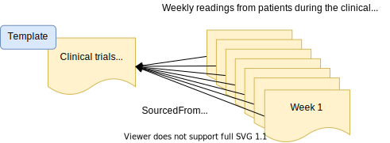

---
hide:
- toc
---

<!-- SPDX-License-Identifier: CC-BY-4.0 -->
<!-- Copyright Contributors to the ODPi Egeria project 2020. -->

# Templated cataloging

When a new resource is catalogued, the catalog entry of a similar resource can be used as a template to set up the asset for the new resource.  This means that the new asset can contain governance metadata attachments, not just the technical metadata extracted from the digital resource.

Templated cataloguing is useful for situations where new resources are regularly catalogued that are of the same kind.

## An example

[Peter Profile](https://opengovernance.odpi.org/coco-pharmaceuticals/personas/peter-profile.html) is responsible for cataloguing the weekly measurements supplied by the various hospitals as part of a clinical trial.  These measurements are supplied with certain terms and conditions (also known as a license) that Coco Pharmaceuticals must not only adhere to, but prove that they are doing so.  For that reason, when the measurements are catalogued, the [asset](/concepts/asset) for the measurements data set is linked to the license as well as other elements that help to ensure that the measurements data sets are appropriately used and governed.

Figure 1 shows Peter making calls to Egeria to catalog the first set of measurements received for the clinical trial.  This includes an asset to represent the data set that is linked to the license along with a connection to allow the data scientist to connect to the data set and access the data and the schema showing the structure of the data in the data set.  The data fields identified in the schema each link to the glossary term that describes the meaning of the data stored in the field. There are also two classifications on the asset:

- *AssetZoneMembership* - The [governance zones](/concepts/governance-zone) that the asset is a member of.  This controls who can access the asset and its related metadata elements such as the connection and the schema.
- *Ownership* - The owner of the data set.  This is the person who is accountable for ensuring that Coco Pharmaceuticals adheres to the license.

> **Figure 1:** In week 1, Peter manually creates the asset and links it to the governance elements needed to ensure the data set is used and protected as laid out in the license.

Without templating, Peter would need to issue the same sequence of requests to catalog each of the weekly results rom each of the hospitals.  This is a lot of work from Peter, particularly as the number of clinical trials, and participating hospitals rises.  He may then make a mistake and forget one of the steps in the cataloguing process.

What if the catalog entry for the Week 1 measurements could be used as a template for cataloguing the subsequent weeks' measurements as shown in figure 2?

> **Figure 2:** For subsequent weeks, the week 1 entry could be used as a template for cataloguing subsequent weeks.  The result is an asset for each data set with a connector, a schema along with the ownership and zone membership classifications.  All of the assets are linked to the license and the data fields in each schema are linked to the correct glossary terms.

This is the idea behind *templated cataloguing*.  A template that defines the common settings for a set of digital resources is defined and this template is used when cataloguing the resources.

Figure 3 shows a set of templates used by Coco Pharmaceuticals when cataloguing their digital landscape.  There are different templates for different types of digital resources. Each would include the classifications and relationships that are relevant for the resources that they catalog.  They are decorated with the [`Template`](/types/0/0011-Managing-Referenceables) classification to identify that they do not represent real digital resource and should be used as templates.

> **Figure 3:** A set of templates defined to use when cataloguing digital resources

When a template is used in cataloguing a digital asset, the caller needs to supply the values that must be unique for the digital asset.  This is typically the `qualifiedName`, `displayName`, `description` and may also include the `networkAddress` for its connection's endpoint.  These values override those in the template.

Egeria uses the [anchor](/features/anchor-management/overview) classification to determine which elements linked to the template are duplicated and which elements are just linked to by the new catalog entry.  In figure 2, for example, the connection and schema are anchored to the asset whilst the glossary terms and license are not.  This means that copies of the connection and schema elements are made for the new catalog entry whilst the glossary terms and and licence just receive new relationships to the new catalog entry.

Finally, when a template is used, it is linked to the resulting element with the [`SourcedFrom`](/types/0/0011-Managing-Referenceables) relationship.  This makes it easier to identity the elements that need changing if the template needs to be corrected or enhanced at a later date.

> **Figure 4:** The `SourcedFrom` relationship links a template to the elements that are created from it

## Support for templated cataloguing

The [Asset Owner OMAS](/services/omas/asset-owner/overview), [Asset Manager OMAS](/services/omas/asset-manager/overview), [Data Manager OMAS](/services/omas/data-manager/overview), [IT Infrastructure OMAS](/services/omas/it-infrastructure/overview) and [Digital Architecture OMAS](/services/omas/digital-architecture/overview) provides the ability to set up and use templates to catalog new assets.

## Adding automation

It is also possible to use templates in the integration connectors running during [Integrated cataloguing](/feaatures/integrated-cataloguing).  The connector is typically passed the qualified name of the template that it should use in its configuration properties.

--8<-- "snippets/abbr.md"