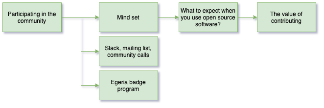

<!-- SPDX-License-Identifier: CC-BY-4.0 -->
<!-- Copyright Contributors to the ODPi Egeria project 2020. -->

# Participating in the Egeria Community

In this session, you will learn about the resources to help you
participate effectively in the Egeria community.

Watch the video of this session: [https://youtu.be/UJ7to5aG2oc](https://youtu.be/UJ7to5aG2oc).

## Mind set

Egeria is an open source project.  This means its most important asset is the community
that it draws together to collaborate. It is only through
this community that new ideas and content are contributed,
and the results deployed into organization to help them
operate more effectively.

This community is stronger if it consists of individuals from different organizations
and backgrounds.  This means we need a respectful and inclusive
culture to allow a diverse range of people to participate.

This culture is reflected in the [Code of Conduct](../../../CODE_OF_CONDUCT.md)
that every participant must adhere to.

Within the community, contributors are focused on making the contributions
that are meaningful to them, or their employer.  Beyond conforming to
the rules of the community, they are not required to make changes requested by
people and organizations outside of the community.

Contributions are incorporated into the project at the discretion of the
maintainers.  For large changes, typically the maintainers look for consensus
within the community before incorporating it.

This means the only way to influence the progress of the project is to join the community,
build a reputation as a valuable member of the community and then either influence
other contributors, or make the contribution yourself.

## Getting connected

The processes used by the community are documented
in the [Community Guide](../../../Community-Guide.md).
This includes information about how to join the community and participate.

## Raising your status in the community

The Egeria community has three special roles that you can work towards:

* **Egeria Contributor** - someone who has made multiple quality contributions to the community.
* **Egeria Maintainer** - an experienced Egeria contributor who is willing to help in the
management of the community and the project contents.
* **Egeria Project Leader** - individual who is elected by the maintainers to lead the Egeria project.

These roles are described in the [Operations Guide](../../../Egeria-Operations.md).

## Egeria badges

To recognise individuals who are either contributors or maintainers on the Egeria project,
we are able to award [Acclaim badges](../../../developer-resources/badges).

## Test yourself

Using the material from the code of conduct and community guide
answer the following questions.

* What time is the weekly community call in your local timezone?
* What are the principle communication mechanisms used by the Egeria community?
* Who nominates an individual to be officially recognized as an Egeria Contributor?
* To which foundation does the ODPi belong?
* Give two examples of unacceptable behavior when participating in the community.

## End of Day 1

Congratulations you have completed all of the sessions in
Day 1 of the Egeria Dojo.

Day 2 covers the information that you need to become and
**Egeria Contributor**.

Day 3 covers additional information for advocates
and those wishing to become **Egeria Maintainers**.

---8<-- "snippets/abbr.md"
