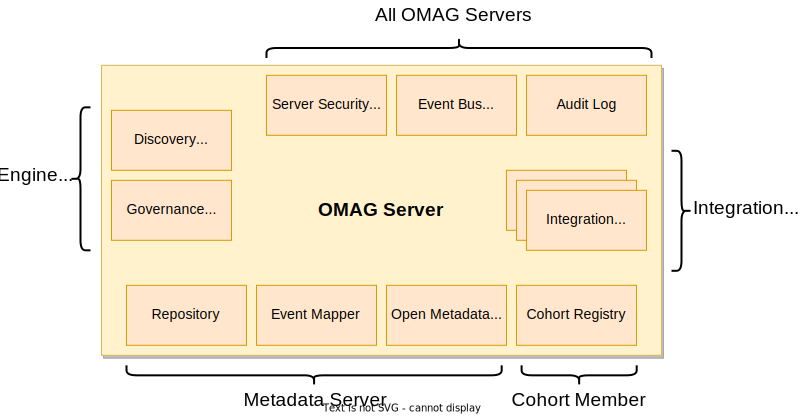

<!-- SPDX-License-Identifier: CC-BY-4.0 -->
<!-- Copyright Contributors to the Egeria project 2020. -->

# Configuring an OMAG Server

An [OMAG Server](/egeria-docs/concepts/omag-server.md) is a configured set of services and connectors that support the integration of a particular type of technology.

There are [different types of OMAG Server](/egeria-docs/concepts/omag-server.md#types-of-omag-server) for each type of technology. Each are configured separately and then linked together to form a connected ecosystem.

The [configuration document](/egeria-docs/concepts/configuration-document.md) for the OMAG Server determines which OMAG subsystems (and hence the types of open metadata and governance services) should be activated in the OMAG Server. For example:

- Setting basic descriptive properties of the server that are used in logging and events originating from the server.
- What type of local repository to use.
- Whether the Open Metadata Access Services (OMASs) should be started.
- Which cohorts to connect to.

Each of the configuration commands builds up sections in the configuration document. This document is stored in the [configuration store](/egeria-docs/concepts/configuration-document/#storage) after each configuration request, so it is immediately available for use each time the open metadata services are activated in the OMAG Server.

Many of the configuration values are [connections](/egeria-docs/concepts/connection) to allow the server to create the connectors to the resources it needs.

These connectors enable Egeria to run in different deployment environments and to connect to different third party technologies.



In the descriptions of the configuration commands, there are placeholders for the specific configuration values: they are names of the value in double curly braces. For example:

- `{{platformURLRoot}}` - the network address where the OMAG Server Platform is registered, such as `https://localhost:9443`.
- `{{adminUserId}}` - the user id of the administrator, for example `garygeeke`.
- `{{serverName}}` - the name of the OMAG Server, for example `cocoMDS1`.

## Retrieving the configuration

!!! get "GET - retrieve the configuration document for a specific OMAG Server"
    ```
    {{platformURLRoot}}/open-metadata/admin-services/users/{{adminUserId}}/servers/{{serverName}}/configuration
    ```

!!! get "GET - retrieve the origin of the server"
    It is also possible to query the origin of the server supporting the open metadata services.
    For the Egeria OMAG Server Platform, the response is `Egeria OMAG Server Platform (version 3.1-SNAPSHOT)`.

    ```
    {{platformURLRoot}}/open-metadata/platform-services/users/{{adminUserId}}/servers/{{serverName}}/server-platform-origin
    ```

## Migrating configuration documents

As Egeria evolves, the content of the configuration document expands. Many of the changes are pure additions and are therefore backward compatible.

!!! attention "OMAG Server Platform fails to load configuration document"
    From time to time the structure of the configuration document needs to change. When this happens, the OMAG Server Platform is not able to load the configuration document and a message similar to this is returned:

    ```json
    {
        "class": "VoidResponse",
        "relatedHTTPCode": 400,
        "exceptionClassName": "org.odpi.openmetadata.adminservices.ffdc.exception.OMAGInvalidParameterException",
        "exceptionErrorMessage": "OMAG-ADMIN-400-022 The configuration document for OMAG Server cocoMDS1 is at version V1.0 which is not compatible with this OMAG Server Platform which supports versions [V2.0]",
        "exceptionSystemAction": "The system is unable to configure the local server because it can not read the configuration document.",
        "exceptionUserAction": "Migrate the configuration document to a compatible version (or delete and recreate it).  See https://egeria.odpi.org/open-metadata-implementation/admin-services/docs/user/migrating-configuration-documents.html"
    }
    ```

### Migrating a configuration document from V1.0 to V2.0

The `additionalProperties` property name changed to `configurationProperties`. To migrate the configuration document, make a global change from `additionalProperties` to `configurationProperties` throughout the configuration document.

### Release 2.x+ of Egeria

Release 2.0 encrypts the configuration document by default. This includes automatically detecting and encrypting any clear-text (unencrypted) configuration document that may already exist. No user action is required for this migration, the encryption will be handled automatically when the clear-text configuration document is first opened by the platform in these releases.

--8<-- "snippets/abbr.md"
