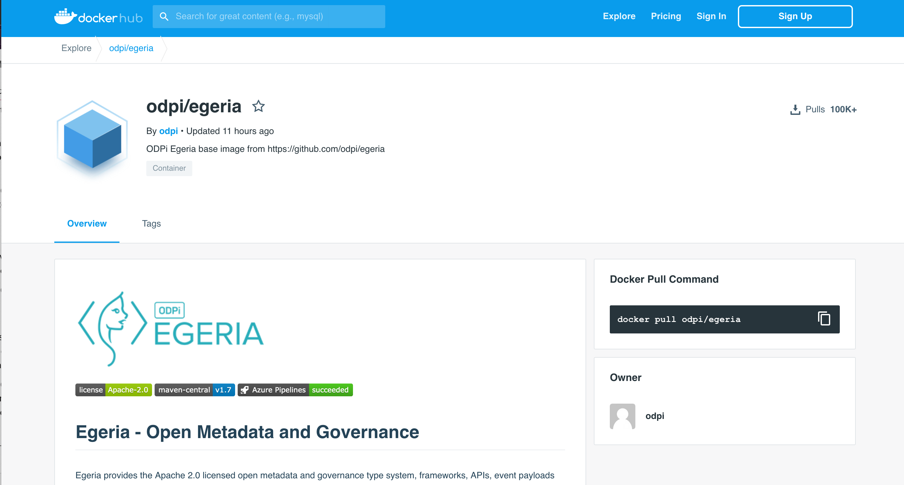
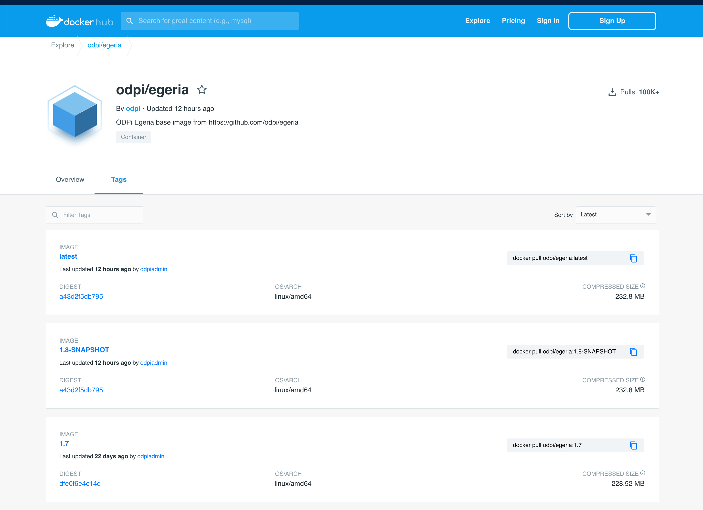
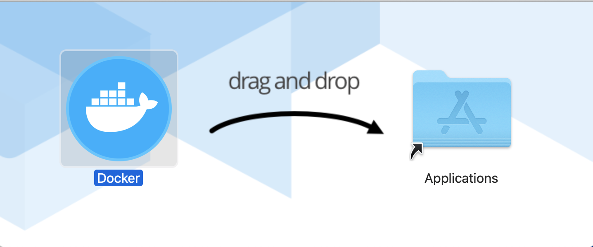
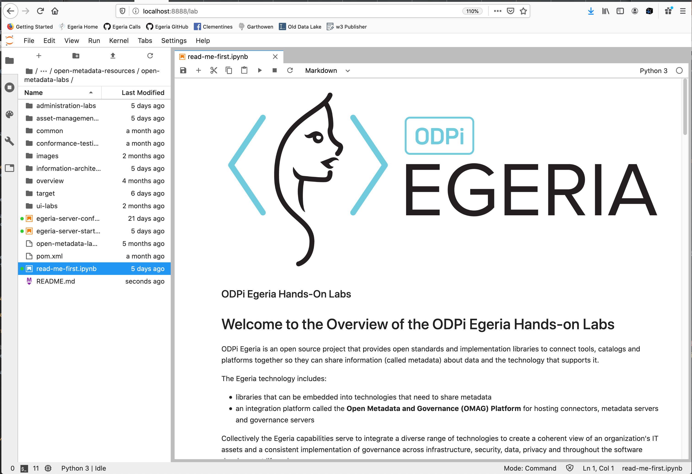

<!-- SPDX-License-Identifier: CC-BY-4.0 -->
<!-- Copyright Contributors to the Egeria project 2020. -->

# Runtime Tools

## Apache Kafka

[Apache Kafka :material-dock-window:](https://kafka.apache.org){ target=kafka } is an event bus that is used to pass events between different Egeria servers.

Kafka's own [QuickStart Guide :material-dock-window:](https://kafka.apache.org/quickstart){ target=kafka } covers installation and basic usage. You may alternatively wish to install Kafka using a package manager such as [HomeBrew :material-dock-window:](https://brew.sh){ target=homebrew } on MacOS.

For Egeria, the Kafka server needs to be running a `PLAINTEXT` listener. From the directory where Kafka is installed, check the `config/server.properties` file so that the `listeners` and `advertised.listeners` are setup as follows:

!!! example "Example: Kafka configuration"
    ```text
    listeners=PLAINTEXT://localhost:9092
    advertised.listeners=PLAINTEXT://localhost:5092
    ```

    The example above uses `localhost:9092` for simplicity, assuming you are running Kafka locally on the same machine where you are doing your development. If running elsewhere, replace this with a name that is fully network resolveable (i.e. by both the host running Kafka and the client machines that will connect to Kafka from other hosts).

Starting Kafka:

=== "MacOS"

    !!! cli "When installed via [HomeBrew :material-dock-window:](https://brew.sh){ target=homebrew }"
        ```shell
        brew services start zookeeper
        brew services start kafka
        ```

=== "Linux"

    !!! cli "From within the `bin` folder of Apache Kafka"
        ```shell
        ./zookeeper-server-start.sh ../config/zookeeper.properties &
        rm -rf /tmp/kafka-logs/*
        ./kafka-server-start.sh ../config/server.properties
        ```

Shutting down Kafka:

=== "MacOS"

    !!! cli "When installed via [HomeBrew :material-dock-window:](https://brew.sh){ target=homebrew }"
        ```shell
        brew services stop kafka
        brew services stop zookeeper
        ```

=== "Linux"

    !!! cli "From within the `bin` folder of Apache Kafka"
        ```shell
        ./kafka-server-stop.sh
        ./zookeeper-server-stop.sh
        ```

## Docker

[Docker :material-dock-window:](https://www.docker.com){ target=docker } is a [simple container runtime and standard :material-dock-window:](https://www.docker.com/why-docker){ target=docker }. Every day, the Egeria build processing creates a Docker image of Egeria and pushes it to the public Docker catalog called [*Docker Hub* :material-dock-window:](https://hub.docker.com/r/odpi/egeria){ target=docker }.

This docker image provides a simple way to bring a runnable version of Egeria onto your machine without any additional dependencies aside from Docker itself. It also provides the basis for a [Kubernetes](#kubernetes) deployment of Egeria.

The **Overview** tab describes the docker container.



The **Tags** tab shows the different releases that are available.



The docker image needs a runtime to execute. It can run in the cloud using various platforms or on your machine using [*Docker Desktop*](https://www.docker.com/products/docker-desktop){ target=docker }.

Docker Desktop supports running a docker image as a standalone container, or as part of group of containers started with `docker-compose`.

Follow the instructions for you operating system. For MacOS, Docker Desktop is installed like a standard application.



Once it is installed, it can be launched like any other application, such as through the launchpad / start menu.

!!! education "Further information"
    If you are working through the Egeria Dojo, you can return to the guide for [Day 1 of the Egeria Dojo](/egeria-docs/getting-started/dojo/1/egeria-dojo-day-1-3-1-1-platform-set-up-prerequisites)

    Otherwise, use the [Docker tutorial](../../open-metadata-resources/open-metadata-tutorials/docker-tutorial) to get the image up and running in Docker. It describes how to install, set up Docker and make use of Egeria's Docker image.

## Kubernetes

[Kubernetes :material-dock-window:](https://kubernetes.io/){ target=k8s } orchestrates (starts / stops / connects) different containers, such as [Docker containers](#docker) together so that they can be managed as a complete solution.

Kubernetes is an open source project managed by the [Cloud Native Computing Foundation :material-dock-window:](https://www.cncf.io/){ target=cncf }.

Egeria uses Kubernetes to run all the components in the [Coco Pharmaceuticals hands-on labs](/egeria-docs/education/open-metadata-labs/overview).

## Helm

[Helm :material-dock-window:](https://helm.sh){ target=helm } is a package manager for [Kubernetes](#kubernetes). Through Helm, a *chart* can be used to deploy multiple containers and other related components as a single deployable unit. This makes it one simple step to deploy what may otherwise be a complex solution composed of multiple runtimes (like Egeria's [OMAG Server Platform](/egeria-docs/concepts/omag-server-platform), [Apache Kafka](#apache-kafka), [JupyterHub](#jupyter-notebooks), and so on) -- without needing to obtain or download all the various runtimes, know how to operate them, and so on.

The Egeria team maintains an [`odpi-egeria-lab` Helm chart :material-github:](https://github.com/odpi/egeria-charts){ target=gh } that can be used to automatically deploy all the components necessary to run through the [open metadata labs](/egeria-docs/education/open-metadata-labs/overview).

## Spring

[Spring :material-dock-window:](https://spring.io/){ target=spring } is a framework and set of annotations for building REST APIs. *Spring Boot* provides the server chassis (or `main()` method) for hosting RESTful services in a server. It is used in the [OMAG Server Platform](/egeria-docs/concepts/omag-server-platform) to provide the server chassis that searches for all REST API definitions to start them in a server.

Spring is used in our client libraries to call REST APIs. Specifically it provides the `org.springframework.web.client.RestTemplate` class for formatting REST calls and parsing the responses.

On the server-side, Spring provides the annotations that define how a Java method is exposed as a REST API. This includes the URL of the call, and how the parameters and responses are mapped. A REST API is typically implemented as a single Java class where each method is a different operation on the REST API.

At the top of the Java class is a declaration of the URI that is common for all methods in the class.

!!! example "Example: declaration used for the OMRS REST APIs"
    ```java linenums="1"
    @RestController
    @RequestMapping("/open-metadata/repository-services")
    ```

    Such a URI follows the root URL of the server: so if the server was using `https://localhost:9443`, the methods are called using:

    ```
    https://localhost:9443/open-metadata/repository-services ...
    ```

For each method / operation, the rest of the URL is defined and mapped through additional annotations.

!!! example "Example: operation defined through annotation"
    ```java linenums="1"
    @GetMapping(path = "/metadata-collection-id")
    public MetadataCollectionIdResponse getMetadataCollectionId()
    {
       /*
        * ... implementation here
        */
    }
    ```

## Jupyter Notebooks

[Project Jupyter :material-dock-window:](https://jupyter.org){ target=jupyter } provides tools for interactive computing. In particular, we use Jupyter notebooks to provide an interactive environment for running snippets of [Python](/egeria-docs/guides/developer/languages/#python) code, interspersed with [Markdown](/egeria-docs/guides/developer/languages/#markdown) documentation, for our [hands-on labs](/egeria-docs/education/open-metadata-labs).



A free version of the latest Jupyter Notebook support (called [*JupyterHub* :material-dock-window:](https://jupyter.org/hub){ target=jupyter }) can be installed in various ways.

???+ cli "Installing JupyterHub on MacOS"
    Using [HomeBrew :material-dock-window:](https://brew.sh){ target=homebrew } you can simply run:

    ```shell
    brew install jupyterlab
    ```

--8<-- "snippets/abbr.md"
