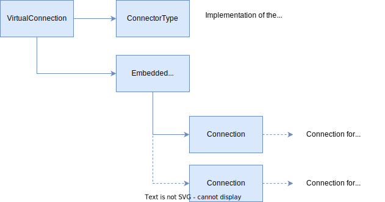

<!-- SPDX-License-Identifier: CC-BY-4.0 -->
<!-- Copyright Contributors to the Egeria project 2020. -->

# Building Integration Connectors

---8<-- "docs/connectors/integration/integration-connector-intro.md"

The purpose of the integration daemon and its integration services is to minimise the effort required to integrate a third party technology into the open metadata ecosystem.  They handle:

* Management of configuration - including user security information.
* Starting and stopping of your integration logic.
* Thread management and polling.
* Access to the open metadata repositories for query and maintenance of open metadata.
* Ability to write to audit log and maintain measurements for performance metrics.
* Metadata provenance.

This means you can focus on interacting with the third party technology and mapping its metadata to open metadata in your integration connector.

## Integration connector interface

---8<-- "docs/guides/developer/integration-connectors/integration-connector-interface.md"

## Designing your integration connector

### Three patterns for connections

Figure 3 shows the approach used for a dedicated connector to a specific third party technology deployment.

> **Figure 3:** An explicit endpoint is added to the integration connector's connection in its configuration to provide information on the network location of the third party technology.  This is used to initialize the client libraries needed to call the third party technology.

Figure 4 shows the approach used to catalog all instances of a particular type of technology.

> **Figure 4:** No endpoint is configured in the integration connector's connection because endpoint information is to be retrieved from open metadata by calling the context object and/or listening for notifications from the partner OMAS.

Location is determined from the endpoints that are stored in open metadata.  The connector registers a listener with the context and it listens for events relating to endpoint of the appropriate values.  For example 

An integration connector can choose to support one of these patterns, both patterns simultaneously, or switch dynamically depending on the presence of the endpoint in the connector's configuration. 

An alternative approach to calling the third party technology directly in your integration connector is to use one or more appropriate [digital resource connectors](/concepts/digital-resource-connectors) to call the third party technology.  The connection objects for these digital resource connectors are nested in the connection object for the integration connector.

> **Figure 5:** A [Virtual Connection](/concepts/connection/#virtual-connections) is a special type of connection that allows connections for different connectors to be embedded.  This style of connection can be used by an integration connector that is maning use of digital resource connectors to call its third party technology.  Typically there is only one embedded connection, but multiple embedded connections can be used.  Also, the embedded connections themselves may be virtual connections.

### Mapping the third party technology to open metadata

## Writing the connector provider

---8<-- "docs/guides/developer/connector-provider-intro.md"

---8<-- "docs/guides/developer/implementing-an-integration-connector-provider.md"

!!! example "Example: connector provider for the Kafka Monitor Integration Connector"
    For example, the [`KafkaMonitorIntegrationProvider` :material-github:](https://github.com/odpi/egeria/blob/master/open-metadata-implementation/adapters/open-connectors/integration-connectors/kafka-integration-connector/src/main/java/org/odpi/openmetadata/adapters/connectors/integration/kafka/KafkaMonitorIntegrationProvider.java){ target=gh } is used to instantiate connectors that are monitoring an Apache Kafka broker. Therefore, its name and description refer to Kafka, and the connectors it instantiates are of type [`KafkaMonitorIntegrationConnector :material-github:](https://github.com/odpi/egeria/blob/master/open-metadata-implementation/adapters/open-connectors/integration-connectors/kafka-integration-connector/src/main/java/org/odpi/openmetadata/adapters/connectors/integration/kafka/KafkaMonitorIntegrationConnector.java){ target=gh }.

## Writing the connector

### Accessing configuration properties
### Accessing endpoint
### Accessing context
### Registering a listener
### Setting metadata provenance
### Locating elements created for this third party technology

## Testing your connector

Your integration connector implementation should be built and packaged in a *jar* file.  This jar file contains your connector provider and connector implementation.  It may optionally contain any dependent client libraries to the third party connector that are called directly by your integration connector.  This is necessary if these client libraries are not available in their own jar file.

The connector jar file (and any jar files for the dependent third party client libraries not included in your connector's jar file) need to be added to the [OMAG Server Platform](/concepts/omag-server-platform) class path.  The easiest way to do this is to copy the JAR files into the `lib` directory of your OMAG Server Platform's [install directory](/education/tutorials/installing-egeria-tutorial).

??? education "Further information"
    - [Open Connector Framework (OCF)](/frameworks/ocf/overview) that defines the behavior of all connectors.
    - [Configuring an integration daemon](/guides/admin/servers/configuring-an-integration-daemon) to understand how to set up an integration connector.
    - [Developer guide](/guides/developer) for more information on writing connectors.

--8<-- "snippets/abbr.md"
