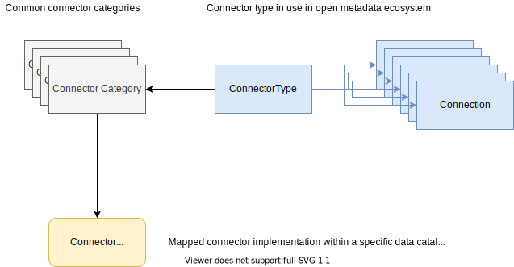

<!-- SPDX-License-Identifier: CC-BY-4.0 -->
<!-- Copyright Contributors to the Egeria project. -->


[*Connectors*](/egeria-docs/concepts/connector) can be created through the following clients:

- [Asset Consumer OMAS](/egeria-docs/services/omas/asset-consumer/overview)
- [Asset Owner OMAS](/egeria-docs/services/omas/asset-owner/overview)

??? example "Example: [connecting to CSV files using Asset Consumer OMAS :material-github:](https://github.com/odpi/egeria/blob/master/open-metadata-resources/open-metadata-samples/access-services-samples/asset-management-samples/asset-reader-csv-sample/src/main/java/org/odpi/openmetadata/accessservices/assetconsumer/samples/readcsvfile/CSVFileReaderSample.java){ target=gh }"
    The code sample below uses the Asset Consumer OMAS client to retrieve a list of assets from a [metadata access server](/egeria-docs/concepts/metadata-access-server) and then create a connector to each one using the `getConnectorToAsset()` method.

    This method assumes that there is a connection object with a [connector type](/egeria-docs/concepts/connector-type) and [endpoint](/egeria-docs/concepts/endpoint) linked to the requested asset in the metadata repository.

    

    An exception is thrown if an asset does not have a connection. 

    In the sample, the connector returned by the Asset Consumer OMAS client is then cast to the `CSVFileConnector`. Assets that are not CSV files will have a different connector implementation and so the casting to `CSVFileConnector` also results in an exception.

    Assets that do not have a `CSVFileConnector` are ignored. The result is that the sample method returns a connector for the first CSV file asset retrieved from the metadata repository.

    ```java linenums="1"
    /**
     * This method uses Asset Consumer OMAS to locate and create an Open Connector Framework (OCF) connector
     * instance.
     *
     * @return connector to first CSVFile located in the catalog
     */
    private CSVFileStoreConnector getConnectorUsingMetadata()
    {
        try
        {
            /*
             * The Asset Consumer OMAS supports a REST API to extract metadata from the open metadata repositories
             * linked to the same open metadata cohort as the Asset Consumer OMAS.  It also has a Java client that
             * provides an equivalent interface to the REST API plus connector factory methods supported by an
             * embedded Connector Broker.  The Connector Broker is an Open Connector Framework (OCF) component
             * that is able to create and configure instances of compliant connectors.  It is passed a Connection
             * object which has all of the properties needed to create the connector.  The Asset Consumer OMAS
             * extracts the Connection object from the open metadata repositories and then calls the Connector Broker.
             */
            AssetConsumer client = new AssetConsumer(serverName, serverURLRoot);

            /*
             * This call extracts the list of assets stored in the open metadata repositories that have a name
             * that matches the requested filename.
             */
            List<String>   knownAssets = client.findAssets(clientUserId, ".*", 0, 4);

            if (knownAssets != null)
            {
                System.out.println("The open metadata repositories have returned " + knownAssets.size() + " asset definitions for the requested file name " + fileName);

                for (String assetGUID : knownAssets)
                {
                    if (assetGUID != null)
                    {
                        try
                        {
                            /*
                             * The aim is to return a connector for the first matching asset.  If an asset of a different
                             * type is returned, on one where it is not possible to create a connector for, then an
                             * exception is thrown and the code moves on to process the next asset.
                             */
                            return (CSVFileStoreConnector) client.getConnectorForAsset(clientUserId, assetGUID);
                        }
                        catch (Exception error)
                        {
                            System.out.println("Unable to create connector for asset: " + assetGUID);
                        }
                    }
                }
            }
            else
            {
                System.out.println("The open metadata repositories do not have an asset definition for the requested file name " + fileName);
            }
        }
        catch (Exception error)
        {
            System.out.println("The connector can not be created from metadata.  Error message is: " + error.getMessage());
        }

        return null;
    }
    ```

## Connecting to assets with different levels of security

It is possible that an asset can have multiple connections, each with different levels of security access encoded. Egeria is able to determine which one to use by calling the `validateUserForAssetConnectionList()` method of the [Server Security Metadata Connector](/egeria-docs/guides/developer/runtime-connectors/server-metadata-security-connector).


## Other links to the connection

Open metadata is a connected network (graph) of information. The connector type and endpoint that a connection object links to are typically shared with many connections. This creates some interesting insight.

For example, there is typically one connector type for each connector implementation. By retrieving the relationships from the connector type to the connections, it is possible to see the extent to which the connector is used.

### Connector Types


The connector types for Egeria's data store connectors are available in an open metadata archive called `DataStoreConnectorTypes.json` that can be loaded into the server. This approach can be used for all of your connector implementations to create the connector type objects in our metadata repository. See the [open-connector-archives :material-github:](https://github.com/odpi/egeria/tree/master/open-metadata-resources/open-metadata-archives/open-connector-archives){ target=gh } for more detail.

### Connector categories

By default, connector implementations are assume to support the OCF. However, many vendor platforms have their own connector frameworks. The ConnectorCategory allows equivalent connector types from different connector frameworks to be gathered together so that the connector type from a connection can be swapped for an equivalent connector type for the locally supported connector framework.



### Endpoints

The endpoints are typically linked to the software server that is called by the connector. By navigating from the `Endpoint` to the linked connections it is possible to trace the callers to the software server.


Software servers and endpoints are set up through the [IT Infrastructure OMAS](/egeria-docs/services/omas/it-infrastructure).

!!! education "Further information"
    The [connector catalog](/egeria-docs/connectors) lists the connectors provided by the Egeria community.

--8<-- "snippets/abbr.md"
