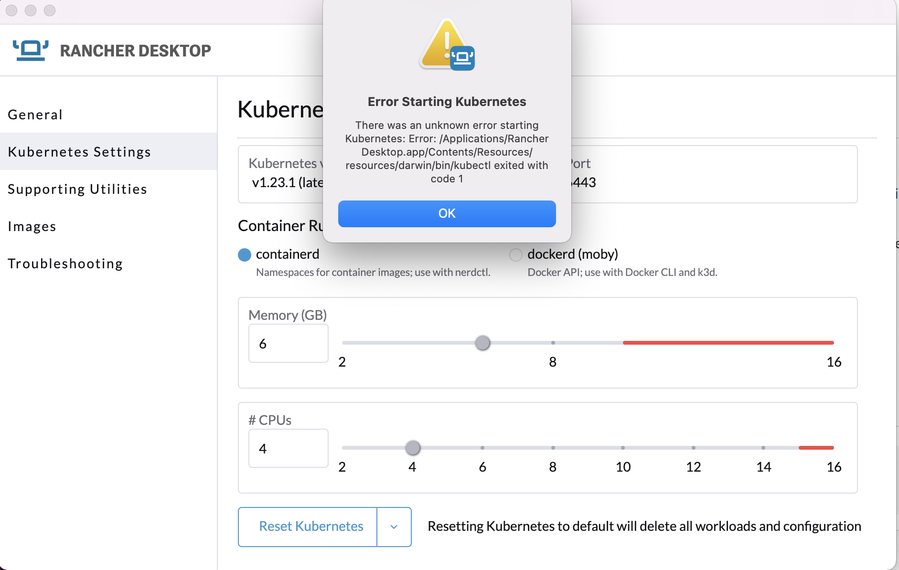
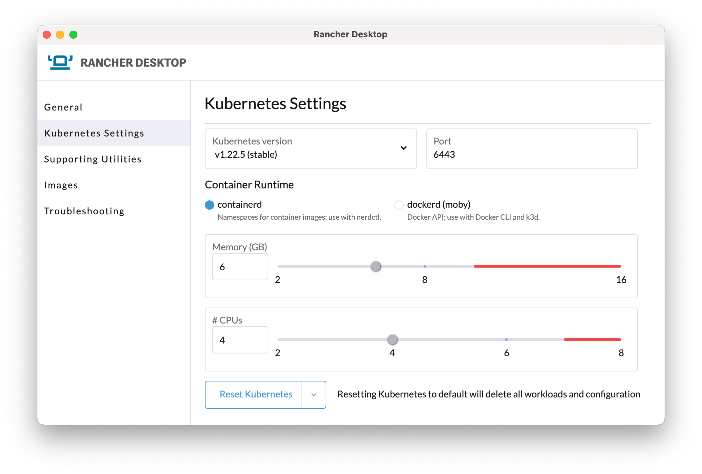
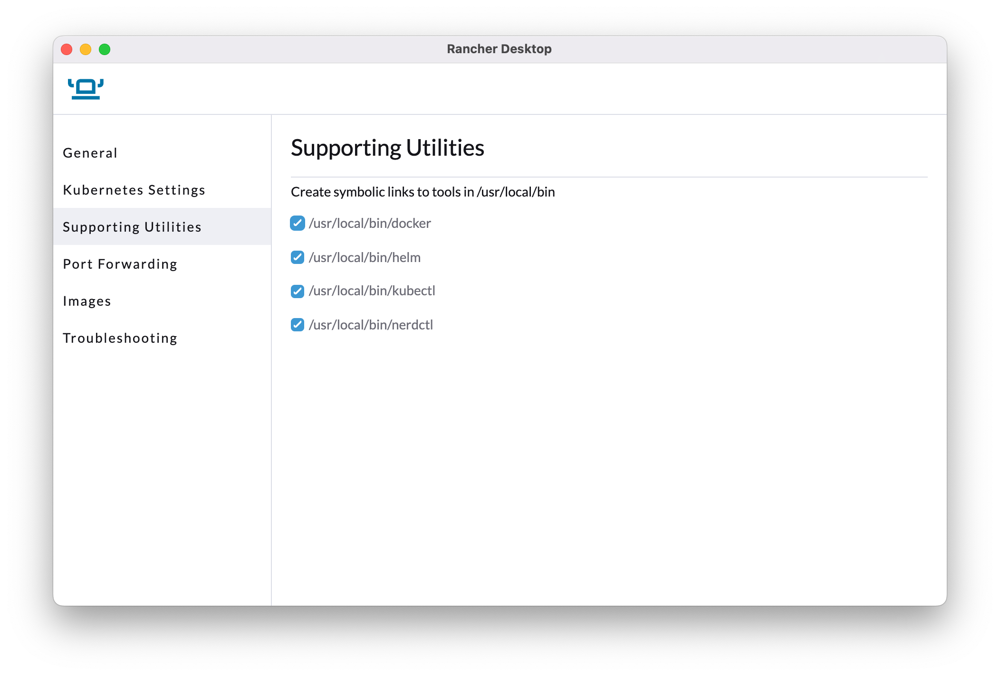

<!-- SPDX-License-Identifier: CC-BY-4.0 -->
<!-- Copyright Contributors to the ODPi Egeria project 2022. -->

# How do I get access to Kubernetes?

[Kubernetes' own Getting Started guide :material-dock-window:](https://kubernetes.io/docs/setup/){ target=k8s } provides links to setting up Kubernetes in many environments. Below we'll take a quick look at some of the simpler examples, especially for new users.

As with most k8s implementations, when running some ongoing cpu will be used, so if running on your laptop/low power device it's recommended to refer to the relevant docs and stop k8s when not in use.

When running on a separate server or a cloud service this isn't a concern.

Only install **ONE** of the options below.

## [Rancher Desktop](https://rancherdesktop.io){ target=rd } (Linux, Windows, MacOS)

!!! attention Recommended for Dojo

    Rancher Desktop is the **recommended environment** for running our **Dojos** locally, and was used to document and test the scenarios.


[Rancher desktop](https://rancherdesktop.io){ target=rd } is an open-source distribution for Kubernetes which is designed to be easy to set up. 

### MacOS

The [install :material-dock-window:](https://docs.rancherdesktop.io/installation){ target=rd } docs cover the steps needed to install Rancher Desktop on macOS and this
is the recommended route, as this is the supported approach from the Rancher development team.

If you have [HomeBrew :material-dock-window:](https://docs.brew.sh/Installation){ target=brew } installed, you can also install the application via  using
```console
brew install rancher
```

You may need to remove other implementations of the kubectl or helm commands in order to use Rancher Desktop
### Windows

Follow the [official instructions :material-dock-window:](https://docs.rancherdesktop.io/installation){ target=rd } (untested)


### Linux

Follow the [official instructions :material-dock-window:](https://docs.rancherdesktop.io/installation){ target=rd } (untested)

### IMPORTANT - Rancher Desktop configuration for all platforms

After installation open the Rancher Desktop app and in preferences under **Kubernetes Settings** set the following:
  - check you are using the latest 'stable' kubernetes version.
  - use containerd for the runtime.
  - a minimum of 6GB RAM allocated to Kubernetes. Do not go into the red area.
  - at least 1 less CPU allocated than you have on your machine. Do not go into the red area.

### Rancher: Error starting Kubernetes

If you see an error such as 
**Error Starting Kubernetes** from the Rancher UI, similar to that below, make sure you are not running any other k8s implementation. For example ensure either microk8s or docker desktop are fully shut down or uninstalled, and then try restarting Rancher Desktop. If that fails reboot and try again.

If you still see issues, contact the [Rancher desktop community](https://github.com/rancher-sandbox/rancher-desktop) for advice.





Also ensure the following symbolic links are set up for helm & kubectl. If you are only using Rancher it's recommended to enable all the links.




## [microk8s](https://microk8s.io){ target=mk8s } (Linux, Windows, MacOS)

!!! attention "microk8s uses its own commands to avoid conflicts"
    When using microk8s, note that the standard k8s commands are renamed to avoid clashes, so use the microk8s ones in the remainder of the Egeria documentation:

    - `kubectl` becomes `microk8s kubectl`
    - `helm` becomes `microk8s helm`

    They can also be aliased on some platforms, for instance using `alias kubectl='microk8s kubectl'` in `~/.zshrc` or an equivalent shell startup script.

### MacOS

The [MacOS install :material-dock-window:](https://microk8s.io/#tab-three__content){ target=mk8s } docs cover the steps needed to install microk8s.

Most of the Egeria development team use MacOS, so the instructions are elaborated and qualified here:

!!! attention "Disable firewall stealth mode first"
    Before installing, go into **System Preferences** -> **Security and Privacy**. Click the lock to get into Admin mode. Then ensure **Firewall Options** -> **Enable Stealth Mode** is NOT enabled (no tick). [If it is left enabled, microk8s will not work properly! :material-dock-window:](https://github.com/ubuntu/microk8s/issues/2509){ target=mk8s }

    If you do not make this change the install will end prematurely with an error such as:
    `An error occurred when trying to execute 'sudo ping -c 1 snapcraft.io' with 'multipass': returned exit code 1.`

- The recommended approach uses [HomeBrew :material-dock-window:](https://docs.brew.sh/Installation){ target=brew }. This offers a suite of tools often found on Linux which are easy to setup on MacOS.
- If you are concerned over the firewall change, or HomeBrew requirement, refer back to the official k8s documentation and choose another k8s implementation that works for you.
- Ensure you allocate 6GB ram for Kubernetes, for example install would be `microk8s install --cpu 4 --mem 6 --disk 10`
- Ensure you turn on the following services: `storage`, `dns`, `helm3`. `dashboard` is also useful to understand more about k8s and what is running. However, it is currently failing as described in [issue 2507 :material-dock-window:](https://github.com/ubuntu/microk8s/issues/2507){ target=mk8s }

As an example, the following commands should get you set up, but always check the official docs for current details

!!! cli "Installing microk8s on MacOS"
    ```console
    brew install ubuntu/microk8s/microk8s
    # Use 4 virtual CPUs, 6Gb ram (required minimum) and 10GB disk space
    microk8s install --cpu 4 --mem 6 --disk 10
    microk8s status --wait-ready
    microk8s enable dns storage helm3
    microk8s kubectl get all --all-namespaces
    ```
    Kubernetes is now running.

### Windows

Follow the [official instructions :material-dock-window:](https://microk8s.io/#tab-two__content){ target=mk8s } (untested)

Ensure when installing you specify at least 6GB RAM.

### Linux

Follow the [official instructions :material-dock-window:](https://microk8s.io/#tab-one__content){ target=mk8s } (untested)

Ensure when installing you specify at least 6GB RAM.

## [Docker Desktop](https://www.docker.com/products/docker-desktop){ target=docker } (Windows, MacOS)

!!!attention Licensing Changes for Docker Desktop
    Docker has recently updated their licensing conditions for Docker Desktop.

    As such, it is therefore no longer our preferred/tested environment for Dojos.

    Ensure you are familiar before using. See https://www.docker.com/pricing/faq 

After installing, go into Docker Desktop **Settings** and select **Kubernetes**. Make sure **Enable Kubernetes** is checked. Also, under resources ensure at least 6GB is allocated to Docker.

## Cloud

Many cloud providers offer Kubernetes deployments which can be used for experimentation or production. These include:

- [Redhat OpenShift :material-dock-window:](https://www.redhat.com/en/technologies/cloud-computing/openshift/try-it){ target=rhos } on multiple cloud providers including on [IBM Cloud :material-dock-window:](https://www.ibm.com/uk-en/cloud/openshift){ target=ibm }
- [Kubernetes on IBM Cloud :material-dock-window:](https://www.ibm.com/cloud/kubernetes-service?p1=Search&p4=43700058232060428&p5=e&gclid=*&gclsrc=aw.ds){ target=ibm }
- [Azure Kubernetes Service :material-dock-window:](https://azure.microsoft.com/en-us/services/kubernetes-service/){ target=aws }
- [Google Kubernetes Engine (GKE) :material-dock-window:](https://cloud.google.com/kubernetes-engine){ target=google }

In addition to a cloud install, ensure you have installed the relevant cloud provider's tooling to manage their k8s environment, including having access to the standard Kubernetes command `kubectl`.

Note that in the team's testing we mostly are running Redhat OpenShift on IBM Cloud as a managed service. We welcome feedback of running our examples on other environments, especially as some of the specifics around ingress rules, storage, security can vary.


---8<-- "snippets/abbr.md"
