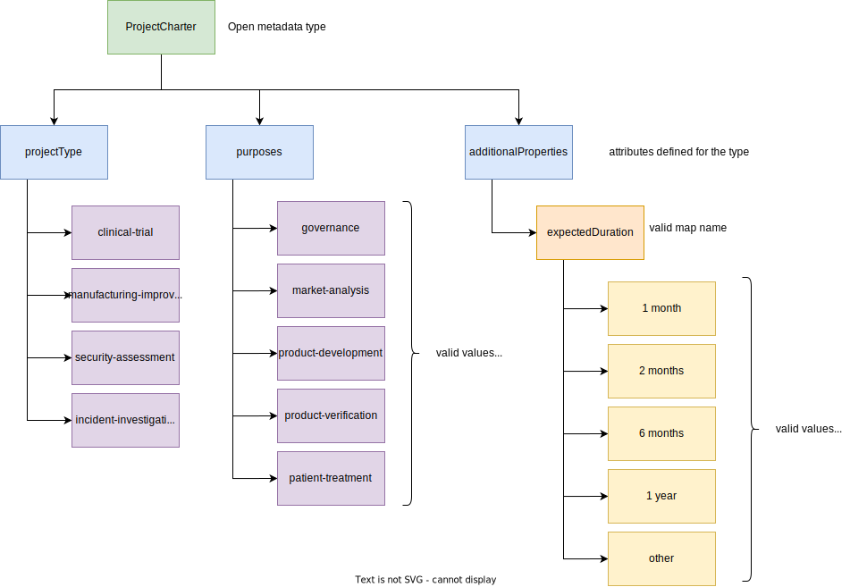

<!-- SPDX-License-Identifier: CC-BY-4.0 -->
<!-- Copyright Contributors to the Egeria project 2020. -->

# Defining valid values for your open metadata

The [open metadata types](/types) include attributes that are string values.  These string values give you freedom and flexibility to add the values you want.  However, arbitrary strings can make automation hard, and you may want to set up some more formal definitions of the values that should be used.

Consider the [*ProjectCharter*](/types/4/0442-Project-Charter) entity type shown below.  


In addition to the *qualifiedName* and *additionalProperties* attributes inherited from [*Referenceable*](/types/0/0010-Base-Model), this type adds in three new attribute to the properties of a ProjectCharter instance:

* *mission*
* *projectType*
* *purposes*

The *mission* attribute is likely to be free-form text laying out the reasons and aspirations behind the project.  However, the *projectType* and the *purposes* may be used by automated processes - or may trigger people to perform certain tasks.  

Having free-form text in such attributes may lead to errors and misunderstandings if the values are filled out incorrectly.  Therefore, Egeria supports the ability to set up lists of valid values for particular properties in open metadata.

Part of the planning process is to consider which metadata attributes should have restricted values and which can be free-form text. Setting these values up early avoids reworking the metadata values later.

## Creating your own valid value sets for open metadata

Some attributes associated with the [governance program](/guides/planning/governance-program) have specialised open metadata types that maintain the lists of their valid values.

For other metadata properties it is possible to set up *valid metadata value sets*.  These list the values that are expected in a particular string property and provide validation checks.

There are three types of valid metadata values:

* Lists of values for string attributes and for array of strings (array<string>) attributes.
* Values for the map names found in attributes that map from name to string value (map<string, string>).
* Values for the map values found in attributes tha map from name to string value (map<string, string>).

In the *ProjectCharter* type shown above:

* *projectType* is a string.
* *purposes* is an array of strings.
* *additionalProperties* is a map from a string name to a string value.

The diagram below shows possible valid values for these attributes:


> Valid values for ProjectCharter attributes

The *projectType* attribute can only take a single string, so it could be set to either "clinical-trial" or "manufacturing-improvement" or "security-assessment" or "incident-investigation".

The *purposes* attribute takes a list of strings which can include any or all of the following values: "governance", "market-analysis", "product-development", "product-verification", "patient-treatment".

The *additionalProperties* can have an entry in its map of "expectedDuration" that can be mapped to one of the following: "1 month", "2 months", "6 months", "1 year", or "other".  The "expectedDuration" is called a *mapName* and the values "1 month", "2 months", "6 months", "1 year", and "other" are called the *mapValues*

This is how these values could appear in an instance of a project charter:


Valid metadata values can either be set up in an [open metadata archive](/concepts/open-metadata-archive), or through the [OpenMetadataClient](https://odpi.github.io/egeria/org/odpi/openmetadata/accessservices/governanceprogram/client/OpenMetadataStoreClient.html) available on most [Open Metadata Access Services (OMASs)](/services/omas).


The code snippet below shows how to set up the strings "incident-investigation" and "clinical-trial" as a specific valid values for the *projectType* property of *ProjectCharter*.

```java
OpenMetadataStoreClient client     = new OpenMetadataStoreClient(serverName, serverPlatformRootURL);

ValidMetadataValue validMetadataValue = new ValidMetadataValue();

validMetadataValue.setDisplayName("Incident Investigation");
validMetadataValue.setPreferredValue("incident-investigation");
validMetadataValue.setDescription("An investigation into the causes, effects and remedies for a detected incident.");

client.setUpValidMetadataValue(userId, "ProjectCharter", "projectType", validMetadataValue);

validMetadataValue.setDisplayName("Clinical Trial");
validMetadataValue.setPreferredValue("clinical-trial");
validMetadataValue.setDescription("A controlled validation of the efficacy of a particular treatment with selected patients.");

client.setUpValidMetadataValue(userId, "ProjectCharter", "projectType", validMetadataValue);

```
The next code snippet shows how to retrieve information about a single valid value.

```java
validMetadataValue = client.getValidMetadataValue(userId, "ProjectCharter", "projectType", "clinical-trial");
```
This next code snippet shows how to retrieve all the valid values for `projectType`:
```java
List<ValidMetadataValue> validMetadataValues = client.getValidMetadataValues(userId, "ProjectCharter", "projectType", 0, 0);

System.out.println("Valid values for property projectType in entity ProjectCharter");
for (ValidMetadataValue retrievedValue : validMetadataValues)
{
    System.out.println(" ==> " + retrievedValue.getPreferredValue() + " means " + retrievedValue.getDisplayName() + ": " + retrievedValue.getDescription());
}
```
This final snippet shows how to validate a valid value:
```java
if (! client.validateMetadataValue(userId, "ProjectCharter", "projectType", "incident-investigation"))
{
    /*
     * Add error handling here ...
     */
}
```

--8<-- "snippets/abbr.md"
