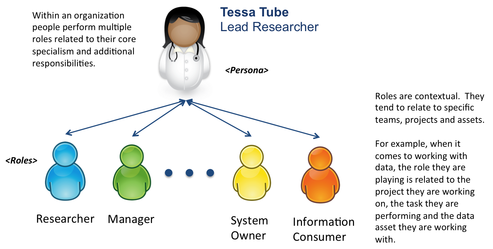

<!-- SPDX-License-Identifier: CC-BY-4.0 -->
<!-- Copyright Contributors to the ODPi Egeria project. -->

# Roles verses personas

Everyone plays multiple roles in their lives.   Parent, daughter, employee, scout leader, ... Even within an organization it is not uncommon, particularly for more experienced people, to be assigned multiple roles.

For example, the picture below shows some of the roles that [Tessa Tube](/practices/personas/tessa-tube) performs.

Each of these roles has a context.  For example, Tessa is a manager, but not for everyone in Coco Pharmaceuticals.  She is a manager of a specific team. Similarly, she may be a system owner, but not of all systems.

So a role has a scope and as we design the Egeria software, we need to be sure that this code is included with the definition of the role. We also need to ensure roles can be combined together to form the complete "job" that an individual performs.

The Egeria community uses the Coco Pharmaceuticals [personas](/practices/personas/overview) to test that there is easy movement from role to role.

This is implemented as follows:

* Each person has a personal profile [(stored as Person entity)](/types/1/0112-People) that describes the individual (persona).
* Linked off of the personal profile are person roles [(stored as PersonRole entity](/types/1/0112-Peoplel) that define each role (and their associated scope) that the person performs.

The profile and role are managed primarily by the [Community Profile OMAS](/services/omas/community-profile/overview) and this drives the display on Egeria's user interfaces as well as some aspects of security.

--8<-- "snippets/abbr.md"