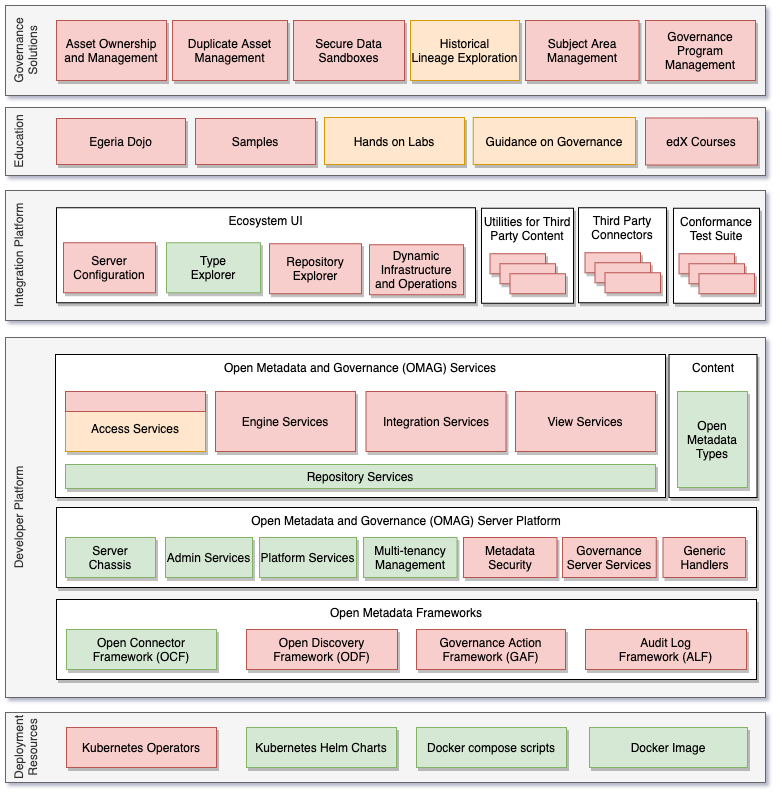

<!-- SPDX-License-Identifier: CC-BY-4.0 -->
<!-- Copyright Contributors to the Egeria project. -->

# Release 1.1 (November 2019)

Release 1.1 focuses on establishing a secure, multi-tenant platform for
metadata servers and governance servers.
There is also a new JanusGraph based metadata repository.

Below are the highlights:

* A [persistent metadata repository](../open-metadata-implementation/adapters/open-connectors/repository-services-connectors/open-metadata-collection-store-connectors/graph-repository-connector) based on JanusGraph.

* A multi-tenant [OMAG Server Platform](../open-metadata-publication/website/omag-server)
  that is able to host one to many metadata servers and/or governance servers.
  This platform supports APIs to administer servers, start and stop servers and query their
  status.  The platform offers a connector to change the store used for configuration
  documents and to control who can issue platform API calls.
  
* There are now [tutorials](../open-metadata-resources/open-metadata-tutorials) and
  [hands-on labs](../open-metadata-resources/open-metadata-labs) demonstrating
  the configuring and start up of servers on the OMAG Server Platform.
  The aim is to help people to get up and running
  with the Egeria technology.  In addition, there are both [docker scripts and
  Kubernetes helm charts](../open-metadata-resources/open-metadata-deployment) to deploy
  the platforms and related technology used in the tutorials, samples and labs.

  + Note that currently we do not push release specific docker containers to dockerhub. If you are using the 
  docker/kubernetes environments it is recommended to work from the 'master' branch instead of this release. This will
  be addressed in a future release. 

* The [Open Metadata Repository Services (OMRS)](../open-metadata-implementation/repository-services) shipped in the [first release](release-notes-1-0.md)
  have been enhanced with REST APIs to query the cohorts that a server
  is connected to.  There are also REST APIs to issue federated queries across
  the cohorts that a metadata server is connected to.
  
* There is a new user interface to explore the open metadata types.  It is called the **Type Explorer**.

## Code fixes and changes to released function

*  Release 1.1 fixes a problem in the open metadata cohort registration when
   there was a metadata server without a local repository.  The wrong registration
   message was being used which meant that the registration details were not being properly
   distributed around the cohort.
   
*  Release 1.1 changed the type of the AdditionalProperties from a map of String to Object to a map of
   String to String in order to match the open metadata types.  There is a new property called
   ConfigurationProperties which is a map from String to Object.
   
*  Release 1.1 changed the implementation of the data primitive type from
   a Java Date object to a Java Long object.  This was to overcome a problem
   deserialization dates from JSON to Java.

## Egeria Implementation Status at Release 1.1
 

 
 Link to Egeria's [Roadmap](../open-metadata-publication/website/roadmap) for more details about the
 Open Metadata and Governance vision, strategy and content.

--8<-- "snippets/abbr.md"
