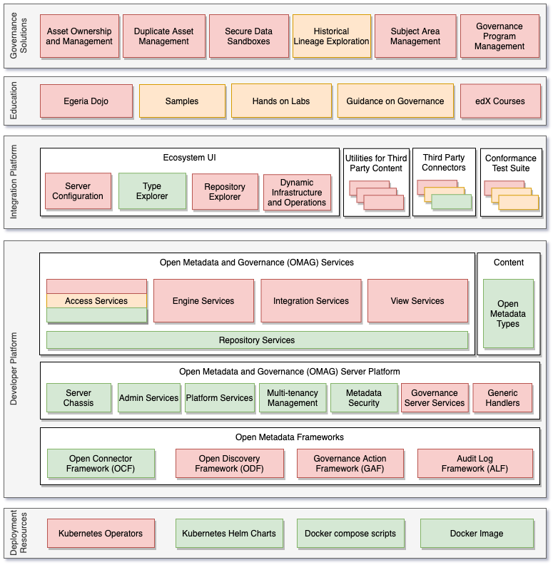

<!-- SPDX-License-Identifier: CC-BY-4.0 -->
<!-- Copyright Contributors to the Egeria project. -->

# Release 1.2 (December 2019)

Release 1.2 provides the ability to build an asset catalog, search for assets and also
access the data and function provided by these assets.
It is also possible to group Assets into governance zones to control the
discoverability and visibility of the Assets. 

In addition, we release the Egeria conformance test suite and four
conformant repositories.

Below are the highlights:
  
* A [conformance test suite](../open-metadata-conformance-suite)
  that validates implementations of open metadata repository connectors.
  In addition we are highlighting the repositories that are conformant.
  These are:
     * The [JanusGraph metadata repository](../open-metadata-implementation/adapters/open-connectors/repository-services-connectors/open-metadata-collection-store-connectors/graph-repository-connector).
     * The [In-memory metadata repository](../open-metadata-implementation/adapters/open-connectors/repository-services-connectors/open-metadata-collection-store-connectors/inmemory-repository-connector) used for testing and demos.
     * The [Apache Atlas repository proxy](https://github.com/odpi/egeria-connector-apache-atlas).
     * The [IBM Information Governance Catalog repository proxy](https://github.com/odpi/egeria-connector-ibm-information-server).

* There are new access services to support the cataloging of assets:
   * The [Asset Consumer OMAS](../open-metadata-implementation/access-services/asset-consumer) supports the access to both the data and metadata associated with an asset.
   * The [Asset Owner OMAS](../open-metadata-implementation/access-services/asset-owner) supports the manual cataloging of new Assets.
  
  The assets cataloged by these access services can be scoped by governance zones.
  
* The metadata servers and future governance servers running on the OMAG Server Platform
  support [metadata-centric security](../open-metadata-implementation/common-services/metadata-security)
  that is controlled by a connector.  This connector can validate access to individual servers,
  services, and assets based on the identity of the caller and the service or asset
  they wish to access.
  
* The [Open Metadata Repository Services (OMRS)](../open-metadata-implementation/repository-services)
  have been enhanced to support support dynamic types and type patching.
  There is also function to load archives of metadata instances.
     
* There are [tutorials](../open-metadata-resources/open-metadata-tutorials),
  [hands-on labs](../open-metadata-resources/open-metadata-labs) and
  [samples](../open-metadata-resources/open-metadata-samples) demonstrating
  the new Asset cataloging capabilities.

## Egeria Implementation Status at Release 1.2
 

 
 Link to Egeria's [Roadmap](../open-metadata-publication/website/roadmap) for more details about the
 Open Metadata and Governance vision, strategy and content.

--8<-- "snippets/abbr.md"
