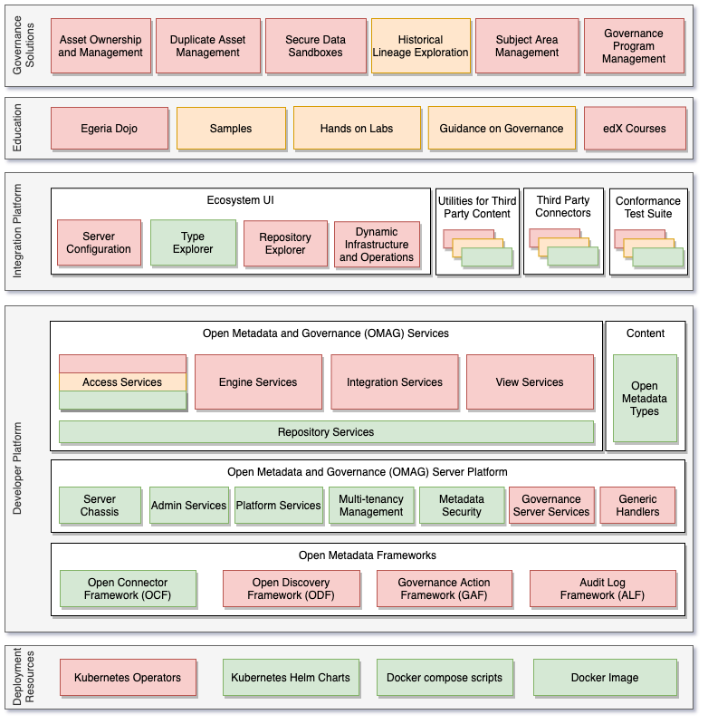

<!-- SPDX-License-Identifier: CC-BY-4.0 -->
<!-- Copyright Contributors to the Egeria project. -->

# Release 1.3 (January 2020)

Release 1.3 focuses on the support for open metadata archives, and formal versioning of open metadata types.
It includes much of the ground-work for
supporting design lineage and the detection and management of duplicate assets but that function is officially
released in [1.4](/release-notes/1-4).

Below are the highlights of the 1.3 release:

* The [hands-on labs](/education/open-metadata-labs/overview) have been updated to provide
  reusable Python functions for working with Egeria.
  
* The management of open metadata types includes formal versioning and patching of types.
  This makes it clearer where additions and updates are being made to the open metadata types.
  See [open metadata types archive](/types).
  
* There are the following changes to the open metadata types:
   * The [EmbeddedConnection](/types/2/0205-Connection-Linkage) has a new property called `position`.
   * The [OpenDiscoveryAnalysisReport](/types/6/0605-Open-Discovery-Analysis-Reports) has a new property called `discoveryRequestStep`.
   * There is a new collection of [Annotations](/types/6/0655-Asset-Deduplication) for recording suspected duplicates and divergent values in acknowledged duplicates.
     This is to support the asset deduplication work scheduled for the next release.

* There are new [open metadata archive](../open-metadata-resources/open-metadata-archives) utilities for creating your own open metadata archives.
  See the [open connector archives](../open-metadata-resources/open-metadata-archives/open-connector-archives) and
  [design model archives](../open-metadata-resources/open-metadata-archives/design-model-archives).

* The Conformance Suite Repository Workbench is now at Version 1.1, with the following enhancements:

   * Tests for relationship searches have moved into a separate, optional RELATIONSHIP_SEARCH profile. A repository connector can be fully conformant with the (mandatory) METADATA_SHARING profile despite not supporting the `findRelationshipsByProperty` or `findRelationshipsByPropertyValue` methods.

   * The ADVANCED_SEARCH profile is now divided into two profiles: ENTITY_ADVANCED _SEARCH and RELATIONSHIP_ADVANCED_SEARCH. They are both optional profiles. A repository connector can be fully conformant with the ENTITY_ADVANCED _SEARCH profile, despite not supporting either of the RELATIONSHIP_SEARCH or RELATIONSHIP_ADVANCED_SEARCH profiles.

   * New test verify the correct handling of mappingProperties in the InstanceAuditHeader.

   * The tests for 're-home' of a reference copy now use an instance mastered by a third (virtual) repository rather than the CTS Server's repository.

   * Type verification of relationship end types now cater for connectors that do not support all the supertypes of an entity type.

   * Search result checking is improved.

   * The CTS notebook (under open-metadata-resources/open-metadata-labs) has been enhanced:

      * The Conformance Profile Results cell there is additional reporting for the new profiles

      * A new cell "Polling for Status" shows how to determine whether the repository-workbench has completed its synchronous tests. The new API it demonstrates could be used to support automated testing

      * A new cell "Monitoring Progress" show how progress can be monitored based on workbench results retrieved during a test run.

      * Improvements to HTTP response checking and reporting of errors

## Egeria Implementation Status at Release 1.3
 

 
 Link to Egeria's [Roadmap](/release-notes/roadmap/) for more details about the
 Open Metadata and Governance vision, strategy and content.

--8<-- "snippets/abbr.md"
