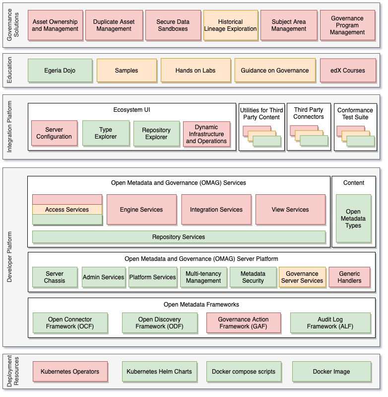

<!-- SPDX-License-Identifier: CC-BY-4.0 -->
<!-- Copyright Contributors to the Egeria project. -->

# Release 1.8 (June 2020)

Below are the highlights of Release 1.8:

* New tutorial information has been added in the form of the [Egeria Dojo](/egeria-docs/getting-started/dojo/)
* Usability & Capability improvements to [Repository Explorer :material-dock-window:](https://github.com/odpi/egeria/blob/master/open-metadata-implementation/user-interfaces/ui-chassis/ui-chassis-spring/docs/RepositoryExplorer/RepositoryExplorerGuide.md){ target=gh }
* Samples & utilities are now also packaged into jars with dependencies to make them easier to use (java -jar)
* Connections to kafka will now retry to improve availability. See 'Bring up Issues' in the [connector documentation](/egeria-docs/connectors/resource/kafka-open-metadata-topic-connector/)\

* New dependencies has been included:
    * [Spring Boot Actuator :material-dock-window:](https://github.com/odpi/egeria/blob/master/open-metadata-implementation/server-chassis/server-chassis-spring/README.md){ target=gh } - Provides features to help you monitor and manage your application when you push it to production
    * micrometer-registry-prometheus - Exposes metrics in a format that can be scraped by a Prometheus server
    
* Many dependencies have been updated. The most relevant include:
    * Spring has been updated to 5.2.6
    * Spring Boot, Spring Security, Spring Security, Spring Data have been updated to 2.3.0

## Egeria Implementation Status at Release 1.8
 

 
 Link to Egeria's [Roadmap](/egeria-docs/release-notes/roadmap/) for more details about the
 Open Metadata and Governance vision, strategy and content.

--8<-- "snippets/abbr.md"
