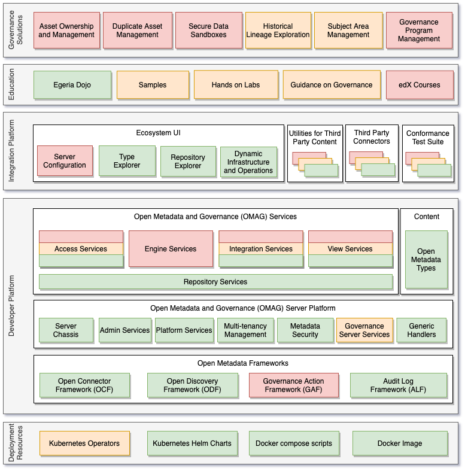

<!-- SPDX-License-Identifier: CC-BY-4.0 -->
<!-- Copyright Contributors to the Egeria project. -->

# Release 2.5 (December 2020)

Below are the highlights of the 2.5 release:

* The following improvements to the presentation-server user interface:
   
  * The Type Explorer UI
  
     * supports options to show/hide deprecated types and/or deprecated attributes. Please refer to the Type Explorer help.md for details.
     * preserves the user-selected focus type across reloads of type information from the repository server.
      
  * The Repository Explorer UI
  
     * has the Enterprise option enabled by default. It can be disabled to perform more specific, localized queries.
     * now indicates whether an instance was returned by an enterprise or local scope operation against its home repository or is a reference copy or proxy.
     * has a user-settable limit on the number of search results (and a warning to the user if it is exceeded)
     * now colors nodes based on their home metadata collection's ID. This previously used metadata collection's name but a metadata collection's name can be changed, whereas the metadata collection's ID is permanent.
     * has improved help information covering search
  
  * The Dino UI
  
     * displays a server's status history in a separate dialog instead of inline in the server details view.

* The following improvements to the repositories:

  * The Graph Repository
  
     * find methods have reinstated support for core properties, previously temporarily disabled due to property name clashes that are now resolved

* A new type **OpenMetadataRoot** has been added as the root type for all Open Metadata Types. See the [base model](../open-metadata-publication/website/open-metadata-types/0010-Base-Model.md) 
  
* The admin services guide has some [additional information](../open-metadata-implementation/admin-services/docs/user/omag-server-platform-transport-level-security.md) on configuring TLS security

* Improvements to the gradle build scripts, but at this point it remains incomplete and build of egeria still requires maven 

* Bug Fixes

* Dependency Updates

## Egeria Implementation Status at Release 2.5

Link to Egeria's [Roadmap](../open-metadata-publication/website/roadmap) for more details about the
Open Metadata and Governance vision, strategy and content.

--8<-- "snippets/abbr.md"
