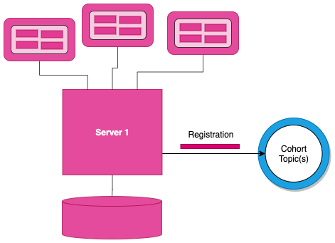
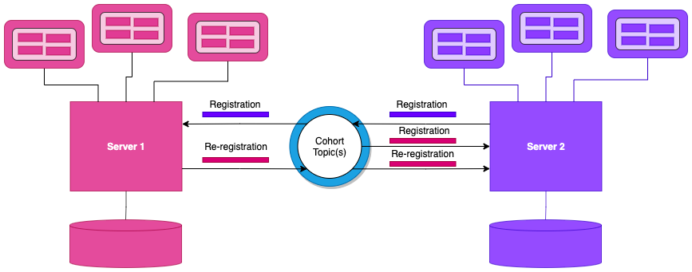
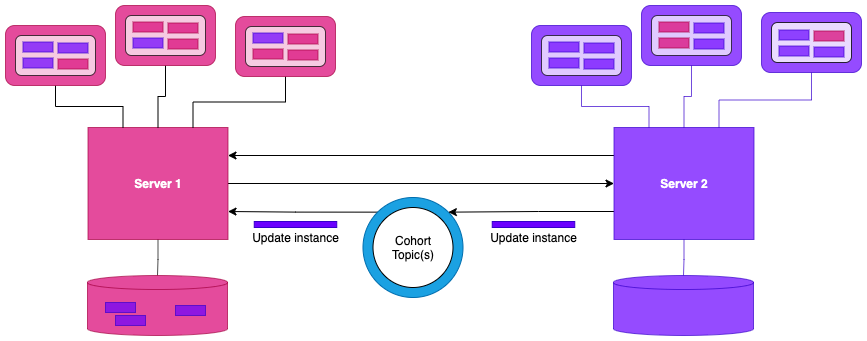
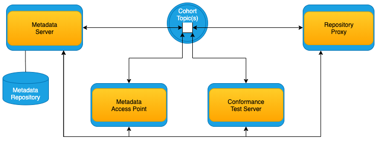

<!-- SPDX-License-Identifier: CC-BY-4.0 -->
<!-- Copyright Contributors to the Egeria project. -->

# Cohorts

An **open metadata repository cohort** is a collection of [servers](#cohort-members)
sharing metadata using the [Open Metadata Repository Services (OMRS)](index.md).
This sharing is peer-to-peer.

Once a server becomes a member of the cohort, it can share metadata with, and receive metadata from,
any other member.

The cohort itself is self-configuring. At the heart of it is between one and four shared
topics.

OMRS needs to be flexible to support different performance and availability requirements.
For example, where metadata is changing
rapidly (such as in a data lake), this metadata should be dynamically queried
from the repository where it was created and is being maintained because
the rate of updates mean it would cost a lot of network traffic to keep a
copy of this metadata up to date. The repository where a piece of metadata
(metadata instance) was created and where it is maintained is called
its [home metadata repository](../metadata-repositories/#home-metadata-repositories).

On the other hand, governance definitions
(such as policies) and glossary terms rarely change.
They are often administered centrally by the governance team and then
linked to all metadata that describes the organization's data resources.
Thus, it makes sense for this metadata to be replicated across the repositories
within the cohort.
These copies are called [reference copies](../metadata-repositories/#reference-copies) of
the metadata, and they are read-only.

The role of the OMRS is to optimize access to metadata across the cohort by using
a combination of replication and federated queries, driven by
the metadata workload from the connected tools.

## Formation of a cohort

Cohort membership is established dynamically. This is through the [cohort topic(s)](../metadata-events/#event-topics).

### First server

To join an open metadata repository cohort, a server must integrate
with the OMRS module. OMRS then manages the metadata exchange. When OMRS running inside the server is
[configured to join a cohort](/egeria-docs/guides/admin)
it first adds a [registration event](../metadata-events/#registry-events) to the cohort topic(s).
This event identifies the server, its metadata repository (if any) and its capabilities.

### Subsequent servers

When another server joins the cohort, it also adds its registration event to the cohort topic(s)
and begins to receive the registration events from other members. The other members respond with
[re-registration events](../metadata-events/#registry-events) to ensure the new member has the latest
information about the originator's capabilities. The exchange of registration information causes all members to verify
that they have the latest information about their peers. This is maintained in their own
[cohort registry store](component-descriptions/connectors/cohort-registry-store-connector.md)
so that they can reconfigure themselves on restart
without needing the other members to resend their registration information.

### Peer-to-peer operation

Once the registration information is exchanged and stored in each member's cohort registry store, it is ready to issue
federated queries across the cohort, and respond to requests for metadata from other members.
These requests can both retrieve metadata and maintain metadata in the [home metadata repository](../metadata-repositories/#home-metadata-repositories).

The management of federated queries and the routing of maintenance requests is managed by OMRS's
[enterprise repository services](../#enterprise-repository-services).
The enterprise repository services are configured with the registration information from across the cohort at the
same time as the cohort registry store is updated. This process is managed by the [cohort registry](#cohort-registry).

The registration information includes the URL Root and server name
of the member. The federation capability in each member allows it to issue
metadata create, update, delete and search requests to each and every member of the
cohort.

!!! tip "Primary mechanism for accessing metadata"
    This peer-to-peer operation and federated queries are the primary mechanism for accessing
    metadata, because the [access services](../omas.md) use federated queries for every request they
    make for metadata.

### Metadata exchange

Once the cohort membership is established, the server begins publishing information using
[instance events](../metadata-events/#instance-events) about changes to the
[home metadata instances](../metadata-repositories/#home-metadata-repositories) in their repository.
These events can be used by other members to maintain a cache of reference copies of this metadata to improve
availability of the metadata and retrieval performance. Updates to this metadata will, however, be automatically
routed to the home repository by the enterprise repository services:

!!! tip "Metadata refresh"
    A member may also request that metadata is "refreshed" across the cohort.
    The originator of the requested metadata then sends the latest version of this metadata to
    the rest of the cohort through the cohort topic. This mechanism is useful
    to seed the cache in a new member of the cohort and is invoked as a result of a
    federated query issued from the new member.

### Dynamic changes to types

Finally, as type definitions (TypeDefs) are added and updated, the cohort members send out
events to allow the other members to verify that this type does not conflict with any of their types.
Any conflicts in the types causes [audit log messages](/egeria-docs/concepts/audit-log) to be logged in all
members, prompting action to resolve the conflicts.

### Leaving the cohort

When an OMAG server permanently leaves the cohort, it sends an unregistration request.
This enables the other members to remove the parting member from their registries.

## Enabling cohort membership

Egeria provides a number of pre-built
[cohort members](#cohort-members).

One of them, the [repository proxy](/egeria-docs/concepts/repository-proxy)
provides a simple way to integrate a third party server into a cohort 
by creating an [OMRS Repository Connector and optional Event Mapper Connector :material-github:](https://github.com/odpi/egeria/tree/master/open-metadata-implementation/adapters/open-connectors/repository-services-connectors/open-metadata-collection-store-connectors){ target=gh }
to map between the third party APIs/events and the repository service's equivalents

A more bespoke integration involves:

- Creating an [OMRS repository connector and optional event mapper connector :material-github:](https://github.com/odpi/egeria/tree/master/open-metadata-implementation/adapters/open-connectors/repository-services-connectors/open-metadata-collection-store-connectors){ target=gh }
- Designing how to configure the OMRS Services for your metadata repository.
  Typically, this is done by extending the existing administration services of the
  metadata repository, but Egeria also offers
  some pre-built [administration services](/egeria-docs/guides/admin) that
  can be used or modified.
- Plugging the OMRS and any administration services into the metadata repository's security
  module so that requests to the server can be secured against unauthorized access.
- Integrating the OMRS, administration and security capability into your product.

There are different integration patterns available to help you choose the best approach for your product.
Each method is optimized for specific use cases and so the metadata repository can only play a full role in the open 
metadata use cases if it supports all integration methods. These are:

- Support for an OMRS repository connector to allow open metadata API calls to the 
  repository to create, query, update and delete metadata stored in the repository.  
    - The OMRS connectors support the [Open Connector Framework (OCF)](/egeria-docs/frameworks/ocf) to provide a call interface to 
      the metadata repositories.
    - The OMRS Repository Connector API is a standard interface for all metadata repositories. This enables services such
      as the Enterprise OMRS Repository Connector to interact with 1 or many metadata repositories through the same interface.  
    - The connection configuration it passes to the OCF determines which type of OMRS connector is returned by the OCF.
- Support for the OMRS event notifications that are used to synchronize selective metadata 
  between the metadata repositories. 

### Cohort members

A **cohort member** is an [OMAG Server](/egeria-docs/concepts/omag-server) that is registered with
at least one open metadata repository cohort.

Management of a server's membership is handled by the [cohort services](../#cohort-services).

The exchange of metadata uses the [Open Metadata Repository Services (OMRS)](/egeria-docs/services/omrs)
interfaces which gives fine-grained[^1] metadata notifications and updates. During server start up,
the repository services detect the configuration of at least one cohort and starts
the **metadata highway manager**.
The metadata highway manager creates a **cohort manager** for
each cohort configuration. The cohort manager manages the initialization and shutdown of the server's
connectivity to a cohort, including the management of the [cohort registry](#cohort-registry).

The server's [metadata security connector](../../../common-services/metadata-security)
provides fine-grained control on which metadata is sent, received and/or stored by the server.
This level of control is necessary for metadata repositories that are managing
specific collections of valuable objects such as
[Assets](../../../access-services/docs/concepts/assets).

The types of cohort members include:

- [Metadata Server](/egeria-docs/concepts/metadata-server)
- [Metadata Access Point](/egeria-docs/concepts/metadata-access-point)
- [Repository Proxy](/egeria-docs/concepts/repository-proxy)
- [Conformance Test Server](/egeria-docs/concepts/conformance-test-server)

!!! education "Explore hands-on"
    The administration [hands-on lab](/egeria-docs/getting-started/hands-on-labs)
    called "Understanding Cohort Configuration Lab" provides an opportunity to query the
    cohort registries of cohort members as they exchange metadata for Coco Pharmaceuticals.

## Cohort registration

Each repository in the cohort has a [cohort registry](#cohort-registry) that 
supports the registration of the metadata
repositories across the cohort. Through the registration process, each cohort registry 
assembles a list of all members of the cohort.  This is saved in the 
[OMRS Cohort Registry Store](component-descriptions/connectors/cohort-registry-store-connector.md).

The list of connections to the remote members of the cohort are passed to the OMRS Enterprise Connector Manager
that in turn manages the configuration of the Enterprise OMRS Repository Connectors. The Enterprise OMRS
Connector provides federated query support across the metadata cohort for the
[Open Metadata Access Services (OMAS)](/egeria-docs/services/omas).

When a metadata repository registers with the [cohort registry](#cohort-registry),
the administrator may either supply a unique server identifier, or ask the OMRS to generate one.
This server identifier (the [metadata collection ID](../metadata-repositories/#metadata-collection-id))
is used in the OMRS event notifications,
and on OMRS repository connector calls to identify the location of the home copy of the metadata entities and
to identify which repository is requesting a service or supports a particular function.

Once the metadata repository has registered with the [cohort registry](#cohort-registry),
it is a member of the metadata repository cohort and can synchronize and share metadata
with other repositories in the cohort through the [OMRS topic(s)](../metadata-events/#event-topics).

!!! tip "Registering with multiple cohorts"
    A single metadata repository can register with multiple metadata cohorts as long as its server
    identifier is unique across all cohorts that it joins and it manages the posting of events to the
    appropriate OMRS topic for each cohort it registers with.

    This capability is useful for a metadata repository that is aggregating reference
    copies of metadata from multiple open metadata repository cohorts.

### Cohort registry

The OMRS **cohort registry** resides in each [cohort member](#cohort-members).
It is responsible for registering a member with a specific open metadata repository cohort
and maintaining a list of the other members of this cohort.

The registration process is managed by exchanging [registry events](../metadata-events/#registry-events)
over the [cohort topic(s)](../metadata-events/#event-topics).

The cohort registry maintains its record of the membership of the cohort in a
[cohort registry store](../component-descriptions/connectors/cohort-registry-store-connector.md).

[^1]: You may want to see the [OMRS metamodel](todo.md) for more details on the granularity of metadata exchange.

--8<-- "snippets/abbr.md"
