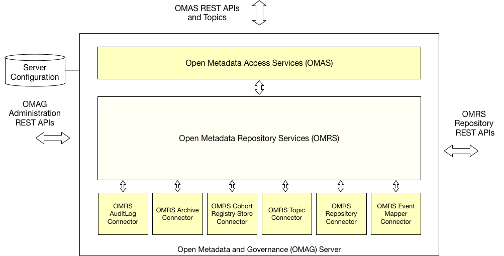
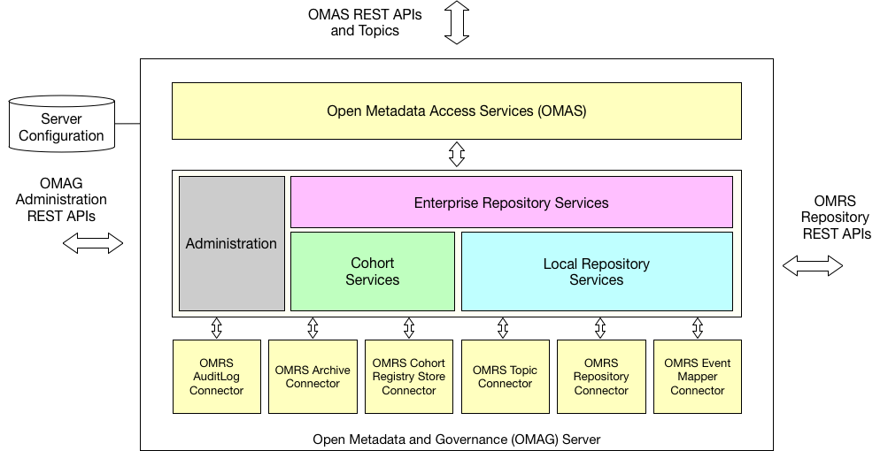
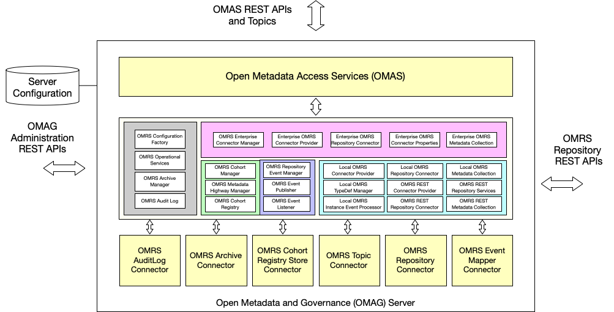

<!-- SPDX-License-Identifier: CC-BY-4.0 -->
<!-- Copyright Contributors to the Egeria project. -->

# Repository Services (OMRS) design

On the left-hand side is the **[administration interface](../../governance-servers/README.md)**
supported by the OMAG server. This is where configuration is passed to the OMRS, and status and other
relevant information is made available to the OMAG Administration Services.

Along the top is the interface with the [Open Metadata Access Services (OMAS)](/egeria-docs/services/omas).
The OMRS provides access to the open metadata repositories through both APIs
(see **[Enterprise OMRS Repository Connector](component-descriptions/enterprise-repository-connector.md)**) and events
(see **[Enterprise OMRS Topic](omrs-event-topic.md)**).

Along the bottom are the **[six types of connectors](component-descriptions/connectors/README.md)** that
provide the OMRS with access to the stores and system resources it needs to support the OMAS.

These connectors enable the OMRS to be deployed into different types of server environments and connect with
different types of infrastructure and services.

Repository connectors provide a common interface for metadata repositories.
The OMRS store connectors can range from simple file stores to
enterprise / cloud provider admin repositories and the event topic can
support different types of messaging infrastructure.

## OMRS subsystems

Inside the OMRS are 4 major subsystems (groups of components).

### Enterprise repository services

The **enterprise repository services** provide a virtual metadata repository by combining
the content of multiple open metadata repositories and delivering this metadata through a
single API and event topic. The Enterprise Repository Services provide the enterprise
access metadata support for the OMASs, supporting the federation of metadata across
all of the repositories that are members of the cohort.

The services include the following components:

- **[Enterprise Connector Manager](../component-descriptions/enterprise-connector-manager.md)** - Manages the list of open metadata repositories
  that the Enterprise OMRS Repository Connector should call to retrieve an enterprise view of the metadata collections
  supported by these repositories.
- **[Enterprise Repository Connector](../component-descriptions/enterprise-repository-connector.md)** - Supports federated queries.
    - Enterprise OMRS Connector Provider - The OCF Connector Provider factory for the Enterprise OMRS Repository Connector.
    - Enterprise OMRS Repository Connector - Implements the OMRS Repository Connector interface that supports enterprise
      access to the list of open metadata repositories registered with the OMRS Enterprise Connector Manager.
    - Enterprise OMRS Metadata Collection - Manages calls to the list of open metadata repositories
      registered with the OMRS Enterprise Connector Manager on behalf of the Enterprise OMRS Repository Connector.
    - Enterprise OMRS Connector Properties - Provides the connected asset properties for the Enterprise OMRS Repository Connector.

The enterprise repository services are enabled automatically in a metadata server when one or more
[Open Metadata Access Services (OMAS)](/egeria-docs/services/omas) are configured.

### Administration services

The **administration services** drive the initialization of the OMRS at server startup, provide access to the OMRS's
internal status and coordinate the orderly termination of OMRS when the open metadata services are deactivated.
OMRS's administration services are called by the server's administration services. It is supplied with configuration
information including:

- Connections for the connectors it should use.
- Information about the local repository (if any).
- Whether the enterprise repository services should be initialized.
- Details of any cohorts it should join.

The administration services include the following components:

- **[OMRS Operational Services](../component-descriptions/operational-services.md)** - supports the admin interface for the OMRS.
- **[OMRS Configuration Factory](../component-descriptions/configuration-factory.md)** - manages default values and creation of connectors.
- **[OMRS Audit Log](../component-descriptions/audit-log.md)** - manages the storage and retrieval of audit log records.
- **[OMRS Archive Manager](../component-descriptions/archive-manager.md)** - manages the loading of open metadata archives.

### Cohort services

The **cohort services** manage the exchange of metadata between a repository and
other members of an **[open metadata repository cohort](../open-metadata-repository-cohort.md)**.
It includes the following components:

- **OMRS Metadata Highway Manager** - manages the OMRS Cohort Manager for each
  open metadata repository cohort that the local server belongs to.
- **OMRS Cohort Manager** - manages the components needed in the local server for
  it to act as a member of an open metadata repository cohort.
- [OMRS Cohort Registry](cohort/#cohort-registry) - manages registration exchanges with other members of a
  cohort on behalf of the local server.

### Local repository services

The **local repository services** manage the interaction with the local server's
metadata collection (stored in the local repository). They include the following
components:

- **[Local OMRS Repository Connector](../component-descriptions/local-repository-connector.md)** - Implements the OMRS Repository Connector interface that supports access to the local metadata repository.
    - Local OMRS Connector Provider - The OCF Connector Provider factory for the Local OMRS Repository Connector.
    - Local OMRS Metadata Collection - Manages metadata requests for the local repository.
- **[Local OMRS Repository Content Manager](../component-descriptions/typedef-manager.md)** - Provides an in-memory cache of open metadata type definitions
  (TypeDefs) that are used for validating of TypeDefs from other open metadata repositories and creation of new open metadata instances (entities and relationships).
- **[Local OMRS Instance Event Processor](../component-descriptions/local-repository-instance-event-processor.md)** - Processes inbound Instance Events on behalf of the local repository.
  These events may come from one of the connected open metadata repository cohorts or the OMRS Archive Manager.
- **[OMRS REST Repository Services](../component-descriptions/omrs-rest-services.md)** - Implements the server-side of the In-memory OMRS Repository Connector.
- **[OMRS REST Repository Connector](../component-descriptions/rest-repository-connector.md)** - Implements the OMRS Repository Connector
  interface that supports metadata access to a remote open metadata repository service via the OMRS Repository REST API.
    - OMRS REST Connector Provider - The OCF Connector Provider factory for the OMRS REST Repository Connector.
    - OMRS REST Metadata Collection - Manages calls to the OMRS REST Repository Services in a remote open metadata repository.

### Event management services

??? question "Isn't this a fifth subsystem?"
    The event management services are not illustrated in the overview of OMRS subsystems as we do not consider
    them to be one of the major subsystems that can be used on its own. It is nonetheless a subsystem of the OMRS,
    and hence is described here for completeness -- you will also see it illustrated further below
    in the [component-level diagram](#omrs-components) in the purple box.

The **event management services** provide event passing:

- Inbound event passing from the cohort services to the optional local repository services and enterprise repository services.
- Outbound event passing from the local repository services to the optional cohort services and enterprise repository services.

The event management services ensure that the other subsystems do not need to be aware of whether the
other subsystems are active or not.

The event management services include the following components:

- **[OMRS Repository Event Manager](../component-descriptions/event-manager.md)** - Manages the distribution of repository events
  (TypeDef and Instance Events) within the local server's OMRS components.
- **[OMRS Event Listener](../component-descriptions/event-listener.md)** - Receives Registry and Repository (TypeDef and Instance)
  events from the OMRS Topic for a cohort.
- **[OMRS Event Publisher](../component-descriptions/event-publisher.md)** - Sends Registry and Repository (TypeDef and Instance)
  events to the OMRS Topic.
  This may be the OMRS Topic for a cohort, or the OMRS Topic used by the Open Metadata Access Services (OMAS).

## Patterns

The OMRS is highly configurable and runs in every type of [OMAG server](/egeria-docs/concepts/omag-server).
The figures below show the different combinations.

### Local repository (only)

The OMRS can support the OMAS's with access to a single,
local-only repository - with no connectivity to other open metadata repositories.
This is what runs in a [metadata server](/egeria-docs/concepts/metadata-server)
that is not connected to an [open metadata repository cohort](cohort.md).

### Access services (only)

The OMRS can also support a server without any local repository - so that all metadata for
the OMAS's is coming through the cohort services from remote metadata repositories.
This is the [caller integration pattern](../../../open-metadata-publication/website/open-metadata-integration-patterns/caller-integration-pattern.md)
supported by the [metadata access point OMAG server](/egeria-docs/concepts/metadata-access-point).

### Repository proxy

The OMRS can support a server where
the OMAS's are not deployed and the local repository is configured
to connect as an adapter for a non-native open metadata repository.
The cohort services connect this metadata repository with other
members in one or more cohorts.
This is called the **[adapter integration pattern](../../../open-metadata-publication/website/open-metadata-integration-patterns/adapter-integration-pattern.md)**
and is used in a [repository proxy OMAG server](/egeria-docs/concepts/repository-proxy).

### Connected metadata server

Of course, it is also possible to run all of the OMRS components together as well, supporting
the OMAS's with a local repository and connectivity to other
repositories through the cohort servers.

This is what runs in a [metadata server](/egeria-docs/concepts/metadata-server)
that is connected to an [open metadata repository cohort](cohort.md).

### Administration subsystem (alone)

Finally, the administration subsystem alone is active in the servers that are not
[cohort members](cohort/#cohort-members), that is the
[Governance Servers](/egeria-docs/concepts/governance-server)
and the
[view servers](/egeria-docs/concepts/view-server).

## OMRS components

The different combinations of operation required means that the OMRS
components need to be flexible and communicate with one another through
well-defined interfaces so that component implementations can be swapped
in and out to support different configurations.

--8<-- "snippets/abbr.md"
