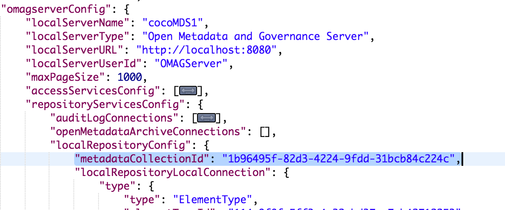

<!-- SPDX-License-Identifier: CC-BY-4.0 -->
<!-- Copyright Contributors to the Egeria project. -->

# Metadata repositories

A metadata repository that supports the open metadata repository standards
defined by the [Open Metadata Repository Services (OMRS)](/egeria-docs/services/omrs) is
called an "open metadata repository".

## Home metadata repositories

The metadata repository where a metadata entity or relationship is created
is called its **home repository**.

!!! attention "Metadata can only be updated and deleted in its home repository"

The [Open Metadata Repository Services (OMRS)](index.md) is responsible
for sharing this metadata with other metadata repositories who are
members of the same [cohort](cohort.md).

## Reference copies

These shared copies are called **reference copies**.

!!! attention "Reference copies are read-only"
    Update requests to a reference copy are automatically
    redirected to the home repository by the OMRS, without the caller being aware.

Every metadata repository in a cohort has a unique identifier called the
[local metadata collection id](#metadata-collection-id).
This identifier is set up in the server configuration and shared when this
server [connects to a cohort](/egeria-docs/concepts/cohort-member).

When metadata is shared by OMRS, each element is tagged with the metadata
collection id of its home repository.
OMRS is able to route update requests to the right server by comparing
the metadata collection
id in the metadata instance with the cohort registration information passed
between members of the cohort when they connect.

## Metadata collections

A metadata collection refers to a set of metadata instances that are being maintained and accessed as a
coherent set of information.  These instances are explicitly typed using
[open metadata type definitions (TypeDefs)](/egeria-docs/types).

Typically, metadata collections are stored in a single metadata repository.
However, the [Open Metadata Access Services (OMASs)](/egeria-docs/services/omas) provide access to
a federated metadata collection called the [enterprise metadata collection](#enterprise-metadata-collection).

### Enterprise metadata collection

The enterprise metadata collection is the metadata collection
that is the combination of metadata from all metadata collections held by the
open metadata repositories that are members of
the same [open metadata repository cohorts](cohort.md)
as the server where the
[enterprise repository services](../#enterprise-repository-services) are enabled.

### Metadata collection ID

Every metadata repository has a unique identifier called
the **local-metadata-collection-id**.
This identifier is assigned automatically during the configuration
of the local repository
but can be overridden through administrative commands.

!!! tip "A new local metadata collection id is assigned when the local repository is set up"

In the following server configuration, the local metadata collection id is
`1b96495f-82d3-4224-9fdd-31bcb84c224c`.



It also appears in an audit log message written at start up.

```text
OMRS-AUDIT-0001 The Open Metadata Repository Services (OMRS) is initializing
        :                                 :                              :
OMRS-AUDIT-0003 The local repository is initializing with metadata collection id 1b96495f-82d3-4224-9fdd-31bcb84c224c
```

If the server is connected to a cohort, the local [cohort registry](../cohort/#cohort-registry)
sends the local metadata collection id and a registration event like the following:

```json linenums="1" hl_lines="3"
{
  "localRegistration": {
    "metadataCollectionId": "1b96495f-82d3-4224-9fdd-31bcb84c224c",
    "serverName": "cocoMDS1",
    "serverType": "Open Metadata and Governance Server",
    "registrationTime": 1531820378765,
    "repositoryConnection": {
      "class": "Connection",
      "type": {
        "type": "ElementType",
        "elementTypeId": "114e9f8f-5ff3-4c32-bd37-a7eb42712253",
        "elementTypeName": "Connection",
        "elementTypeVersion": 1,
        "elementTypeDescription": "A set of properties to identify and configure a connector instance.",
        "elementOrigin": "CONFIGURATION"
      },
      "guid": "858be98b-49d2-4ccf-9b23-01085a5f473f",
      "qualifiedName": "DefaultRepositoryRESTAPI.Connection.cocoMDS1",
      "name": "DefaultRepositoryRESTAPI.Connection.cocoMDS1",
      "description": "OMRS default repository REST API connection.",
      "connectorType": {
        "type": {
          "type": "ElementType",
          "elementTypeId": "954421eb-33a6-462d-a8ca-b5709a1bd0d4",
          "elementTypeName": "ConnectorType",
          "elementTypeVersion": 1,
          "elementTypeDescription": "A set of properties describing a type of connector.",
          "elementOrigin": "CONFIGURATION"
        },
        "guid": "64e67923-8190-45ea-8f96-39320d638c02",
        "qualifiedName": "DefaultRepositoryRESTAPI.ConnectorType.cocoMDS1",
        "name": "DefaultRepositoryRESTAPI.ConnectorType.cocoMDS1",
        "description": "OMRS default repository REST API connector type.",
        "connectorProviderClassName": "org.odpi.openmetadata.adapters.repositoryservices.rest.repositoryconnector.OMRSRESTRepositoryConnectorProvider"
      },
      "endpoint": {
        "type": {
          "type": "ElementType",
          "elementTypeId": "dbc20663-d705-4ff0-8424-80c262c6b8e7",
          "elementTypeName": "Endpoint",
          "elementTypeVersion": 1,
          "elementTypeDescription": "Description of the network address and related information needed to call a software service.",
          "elementOrigin": "CONFIGURATION"
        },
        "guid": "cee85898-43aa-4af5-9bbd-2bed809d1acb",
        "qualifiedName": "DefaultRepositoryRESTAPI.Endpoint.cocoMDS1",
        "name": "DefaultRepositoryRESTAPI.Endpoint.cocoMDS1",
        "description": "OMRS default repository REST API endpoint.",
        "address": "https://localhost:9443/openmetadata/repositoryservices/"
      }
    }
  }
}
```

--8<-- "snippets/abbr.md"
