<!-- SPDX-License-Identifier: CC-BY-4.0 -->
<!-- Copyright Contributors to the ODPi Egeria project. -->

# OMRS Subsystem Descriptions

The open metadata repository services is divided into five subsystems.
The first four subsystems provide the core capabilities of OMRS:

> Figure 1: Functional subsystems

* **[Enterprise Repository Services](enterprise-repository-services.md)** provides a virtual
metadata repository by combining the content of multiple open metadata
repositories and delivering this metadata through a single API and event topic.
The Enterprise Repository Services provide the enterprise access metadata
support for the OMASs.

* **[Administration Services](administration-services.md)** drive the
initialization of the OMRS at server startup, provide access to the OMRS's internal status and
coordinate the orderly termination of OMRS when the open metadata services
are deactivated. OMRS's administration services are called by the server's administration
services.   It is supplied with configuration information including:
  * Connections for the connectors it should use.
  * Information about the local repository (if any).
  * Whether the enterprise repository services should be initialized.
  * Details of any cohorts it should join.

* **[Cohort Services](cohort-services.md)** manage the local
server's membership in one or more open metadata repository cohorts.

* **[Local Repository Services](local-repository-services.md)** manage the local
server's open metadata repository.

In addition, the  **[Event Management Services](event-management-services.md)** 
manage the flow of OMRS Events
between the other subsystems:  

* Inbound event passing from the cohort services to the optional local repository services and enterprise repository services.
* Outbound event passing from the local repository services to the optional cohort services and enterprise repository services.

The event management services ensure that the other subsystems do not need to be aware of whether the
other subsystems are active or not.

## Components within the subsystems

Figure 2 shows the components that are found within each subsystem.

> Figure 2: Components within the subsystems (level 2)

Figure 3 shows how they link together

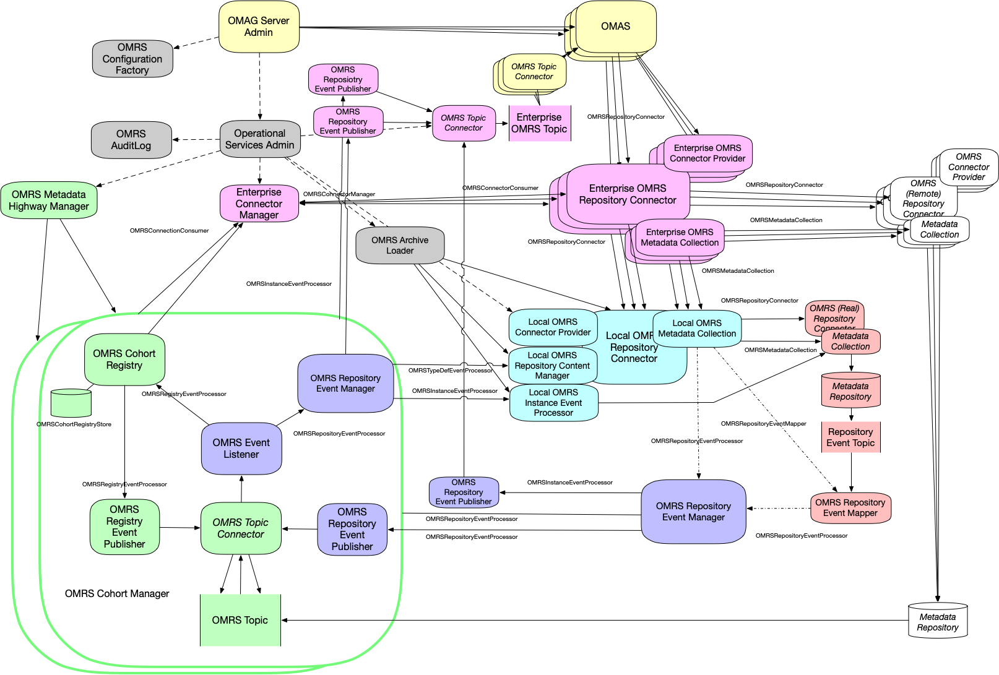
> Figure 3: Components Linkage

Details of an individual component can be found by clicking on the link of their owning subsystem above.

## Start up sequence

Below is the start up sequence for a metadata server connected to two cohorts.

The call to start the OMRS comes from Egeria's Administration services
when it is called to create a new OMAG Server instance.

> Figure 4: Startup Sequence 1 - Egeria Administration Services initiate server start up

The portion of the OMAG Server's configuration document relating to the repository services is
passes to the OMRS Administration Services to initiate start up.
The contents of this configuration determine which OMRS subsystems are started.

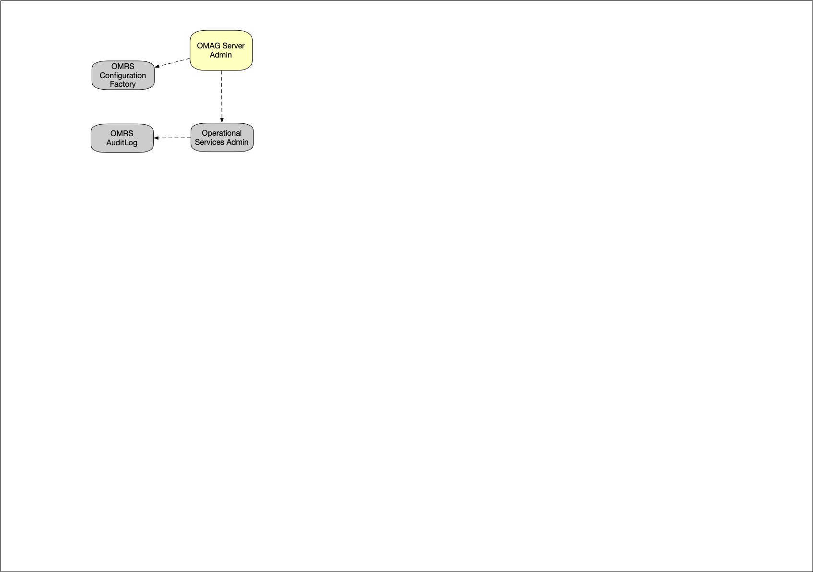
> Figure 5: Startup Sequence 2 - OMRS Administration services started

The enterprise repository services are started first.  The enterprise connector manager
handles the dynamic management of enterprise connectors for the OMASs
driven by the changing membership of the cohort.

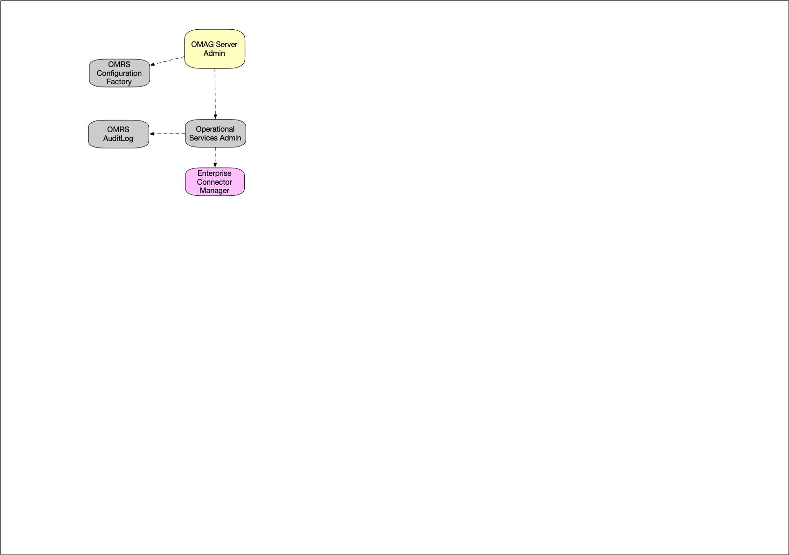
> Figure 6: Startup Sequence 3 - Enterprise connector manager started

Next the enterprise topic is started.  
It is an in-memory topic used for passing OMRS topic events to the OMASs.

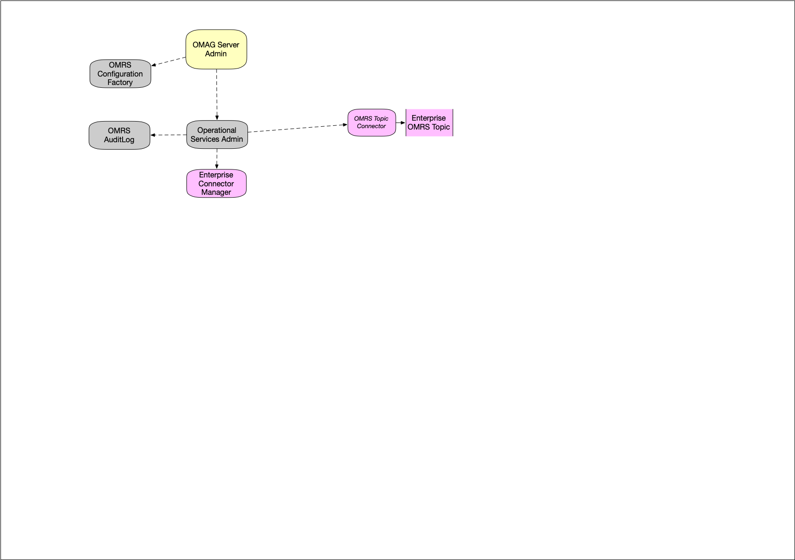
> Figure 7: Startup Sequence 4 - Enterprise Topic established for OMASs

Now the local repository services are started including the real repository connector
for the local repository.

The local repository connector's metadata collection is given the outbound event manager for
publishing events when metadata in the repository changes.
The outbound event manager is responsible for distributing the events.
It is initially set to buffer all events passed to it to give
the other components time to initialize.

The archive manager loads the open metadata type archive and any open metadata
archives listed in the server's configuration.  The local
repository connector produces TypeDef Events for all open metadata types it supports
and passes it to the outbound event manager.

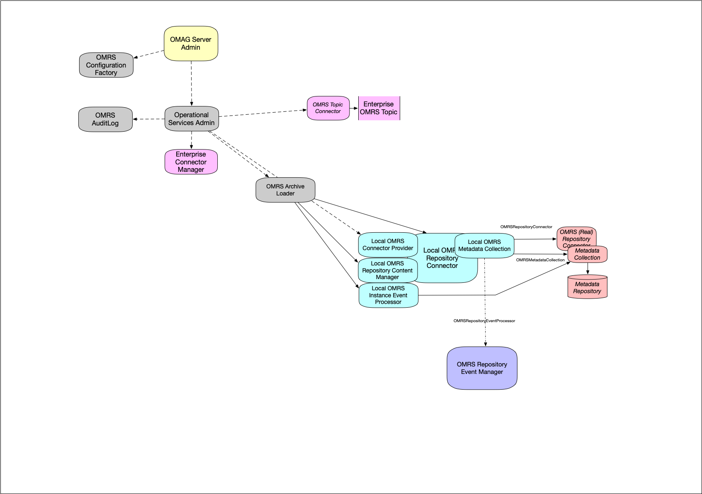
> Figure 8: Startup Sequence 5 - Local repository started (with real repository connector)

If the real repository connector also has an event mapper then it is started at this time,
connected to the outbound event mapper and responsibility for
producing events for the local repository is transferred from the 
local repository metadata collection to the event mapper.

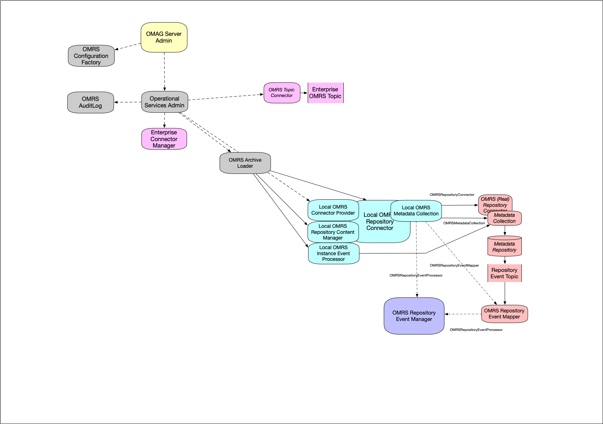
> Figure 9: Startup Sequence 6 - Optional Event Mapper started

An event publisher for the enterprise topic is registered with the outbound event manager.
This means events from the local repository will flow to the OMASs.

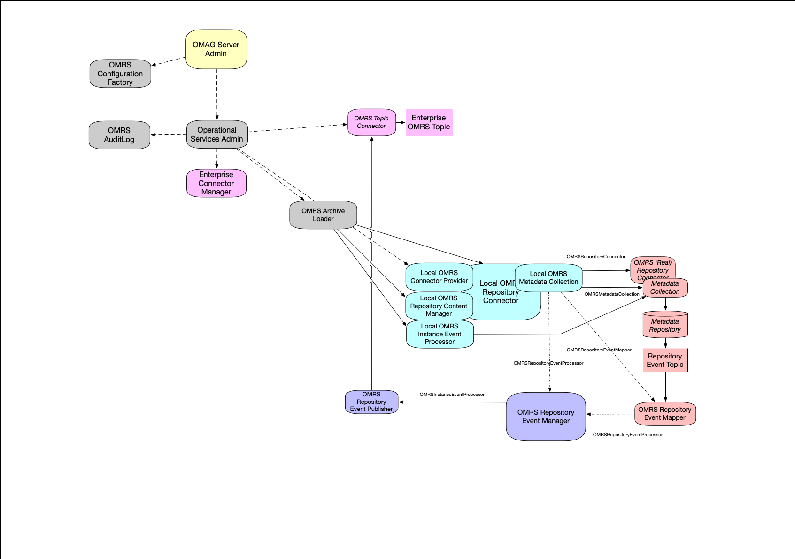
> Figure 10: Startup Sequence 7 - Local repository events wired to enterprise topic

Now the metadata highway manager starts a cohort manager for each configured cohort.
The cohort manager creates a cohort registry and the topic connector for the cohort OMRS Topic
plus an inbound event manager to manage inbound TypeDef and Instance Events.
Registration Events are passed to the cohort registry.

The cohort registry reads the registry store for details of all the previous registered
members of the cohort.  There are non in this example, but if there were,
the cohort registry would request a registration refresh from each of these partners to
ensure they are still valid and the details are still correct.

When valid registration replies are received, the cohort registry
notifies the enterprise connector manager of their registration.
(This includes the Connection for creating the connector to the remote repository.)

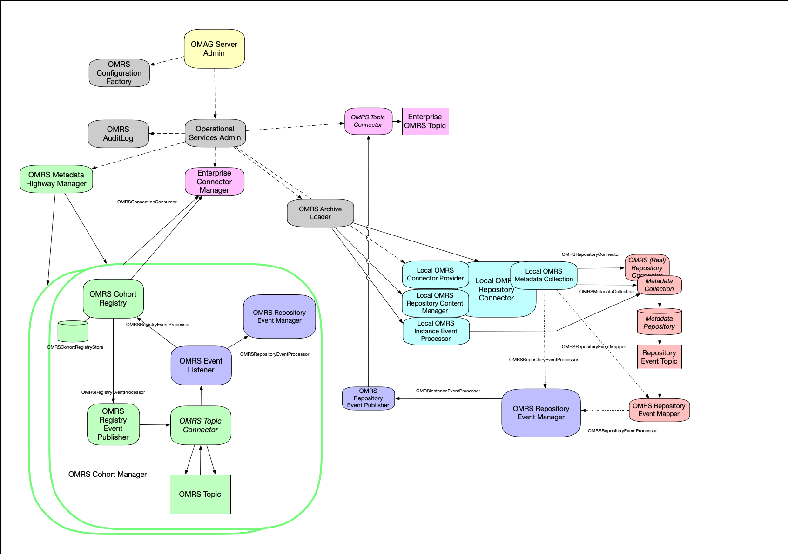
> Figure 11: Startup Sequence 8 - Metadata highway manager starts cohort manager for each cohort 

Each cohort manager registers two event processors with the inbound
event manager.  They pass TypeDef Events and Instance Events to the 
repository content manager and local repository instance event processor
respectively.  The repository content manager contains the TypeDef manager that
maintains the list of valid types.  The instance event processor passed validated
inbound events to the local repository.

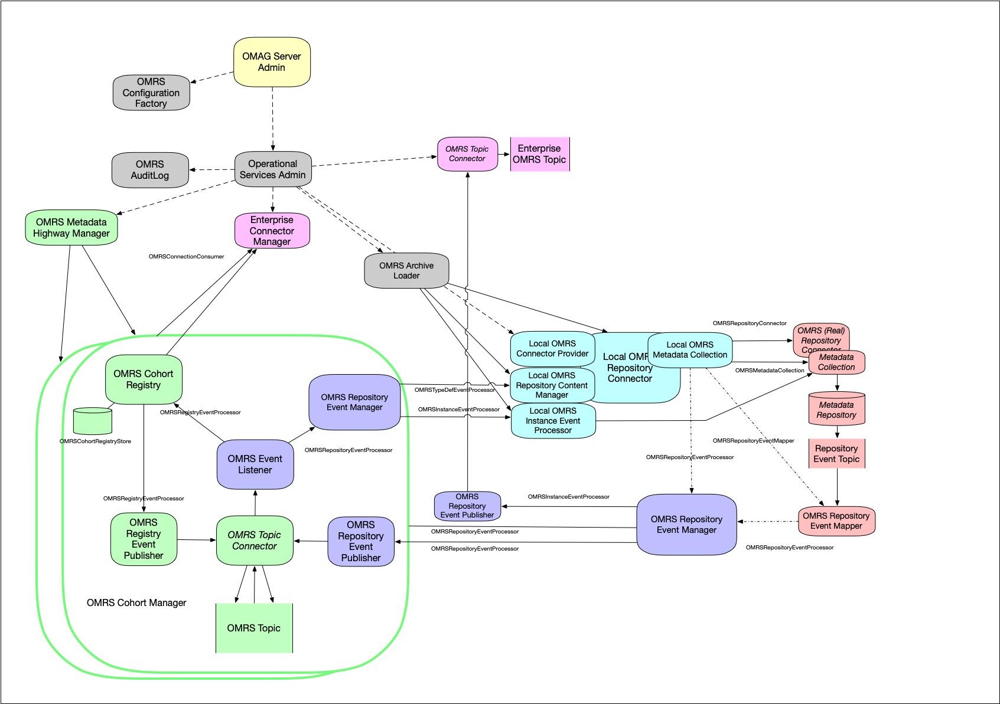
> Figure 12: Startup Sequence 9 - Cohort events wired to local repository

Finally each cohort manager registers an event publisher with in inbound event manager
for the enterprise topic and starts the listener for the OMRS topic
since it is ready to begin processing events.  Events buffered in the outbound event manager
from the cohort registry and the
local repository are able to flow out to the cohort and inbound events 
are received and distributed by the inbound event manager.

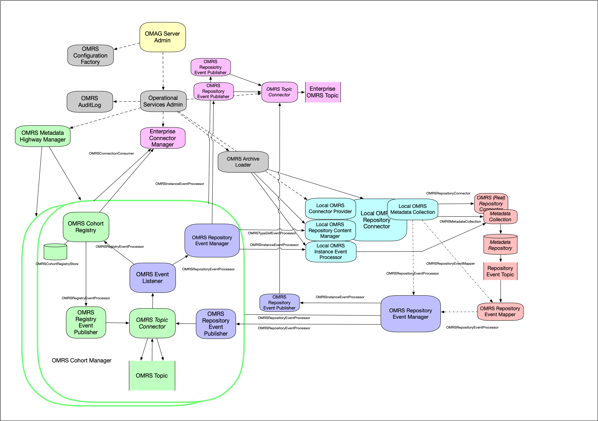
> Figure 13: Startup Sequence 10 - Cohort events wired to enterprise topic

At this point, the OMRS has completed initializing, it is processing events
from the cohort and and is ready for requests from the OMASs.
It returned to the Egeria Administration Services which then starts the OMASs.

The Egeria Administration Services asks the OMRS enterprise connector manager
for an enterprise repository connector for each OMAS.
It is configured with the local repository connector.
If there were validated remote members registered then a connector for each of them is
added to the enterprise connector.

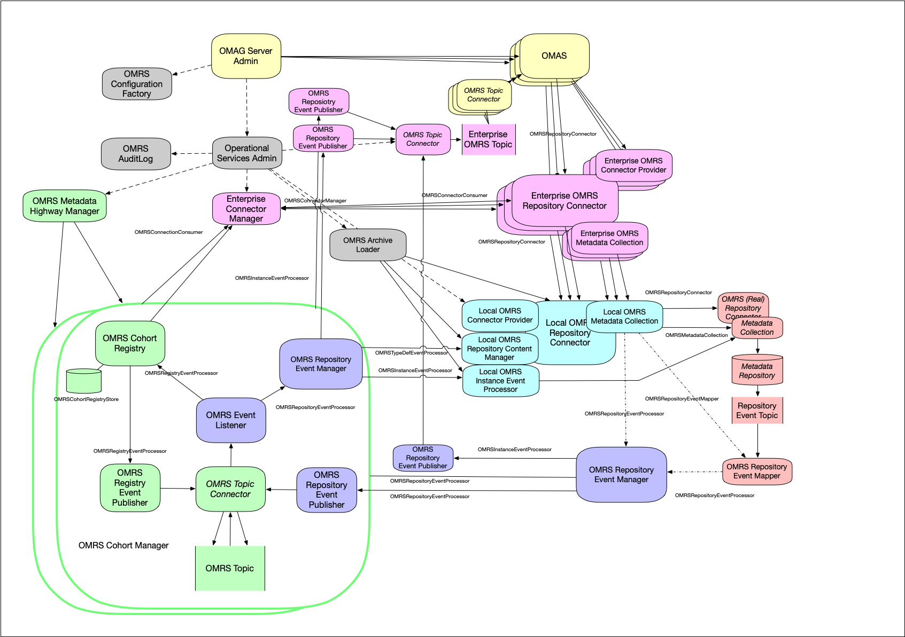
> Figure 14: Startup Sequence 11 - Activate the OMASs

When a new member of the cohort sends a registration request,
it is passed to the cohort registry.  It passes the details of the new partner
to the enterprise connector manager.

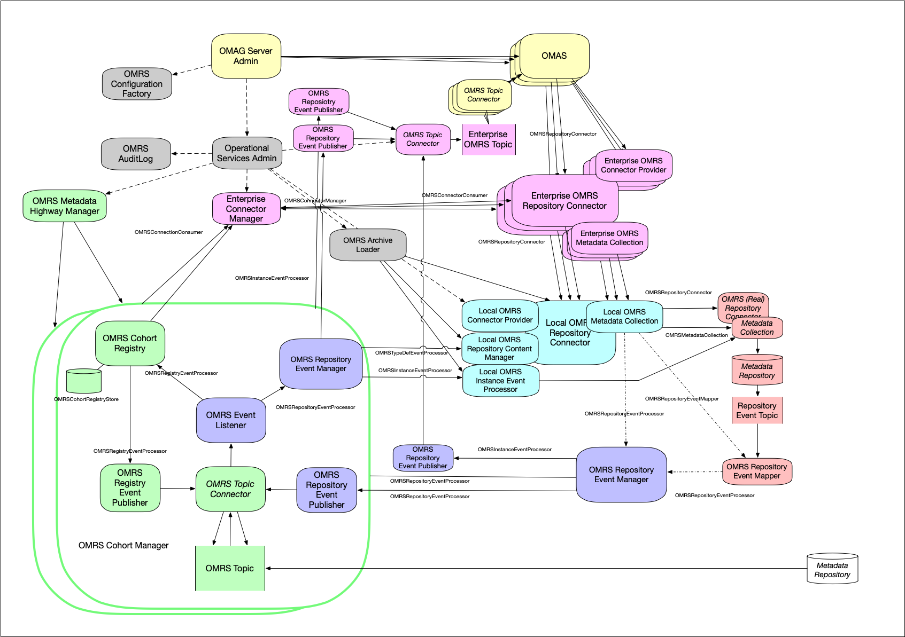
> Figure 15: Startup Sequence 12 - inbound registration from another repository

The enterprise connector manager adds the connection for the new member to each of the
enterprise repository connectors and the requests from the OMASs begin to call the new
member.

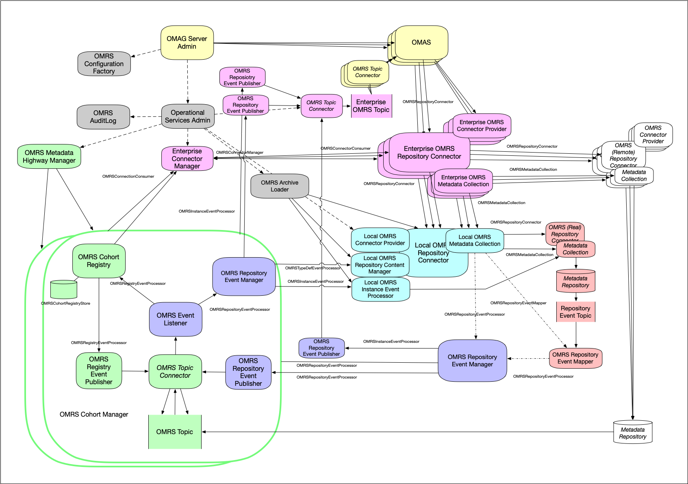
> Figure 16: Startup Sequence 13 - Remote connection established

---8<-- "snippets/abbr.md"
