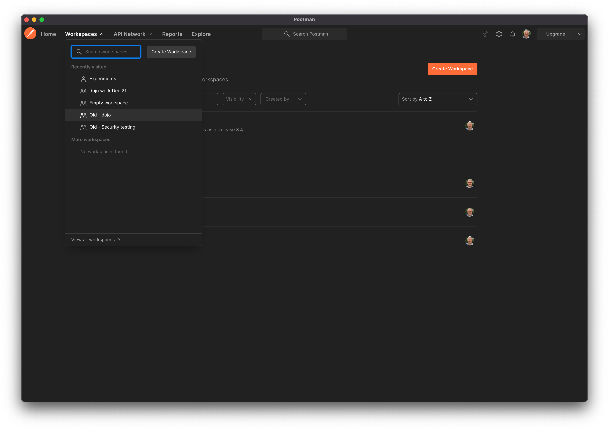
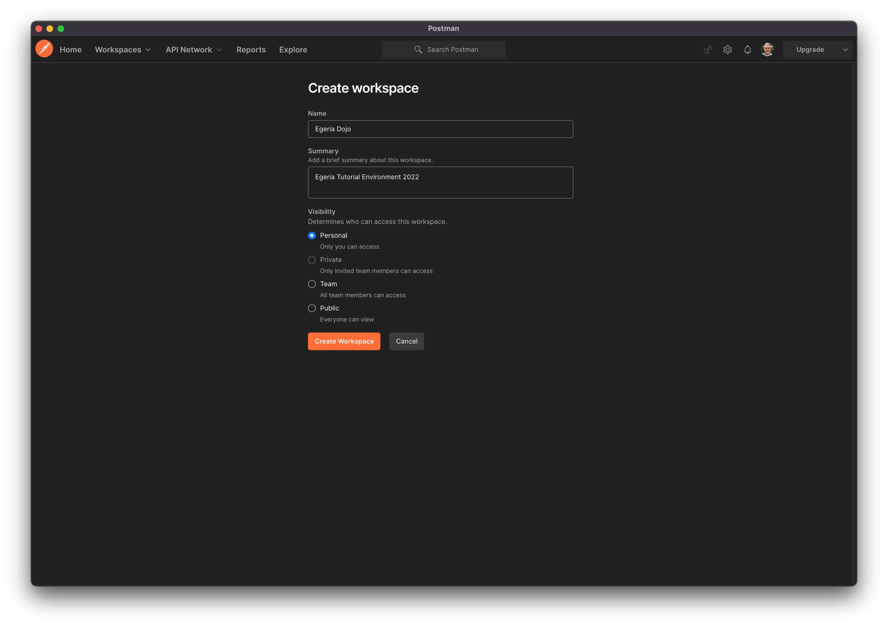
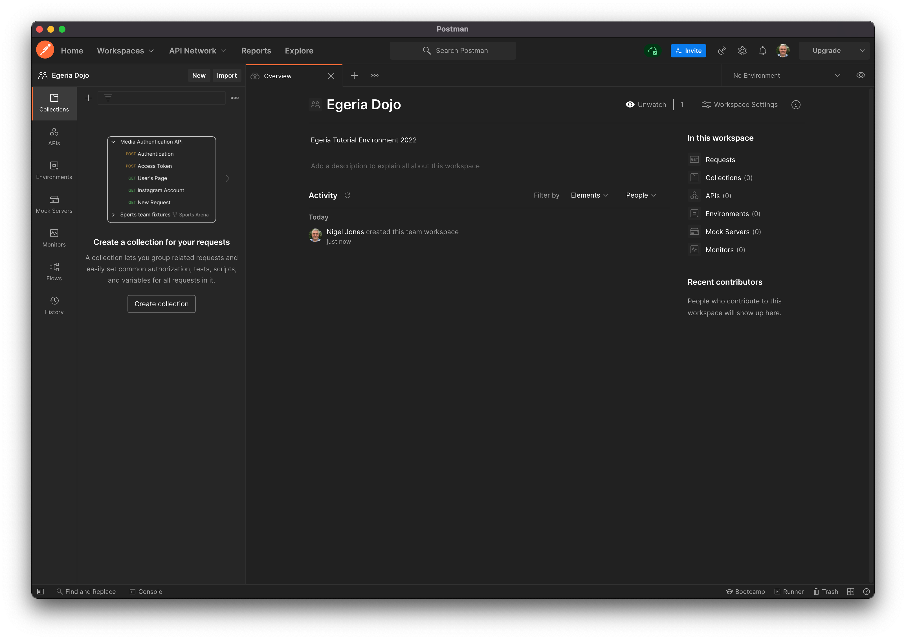
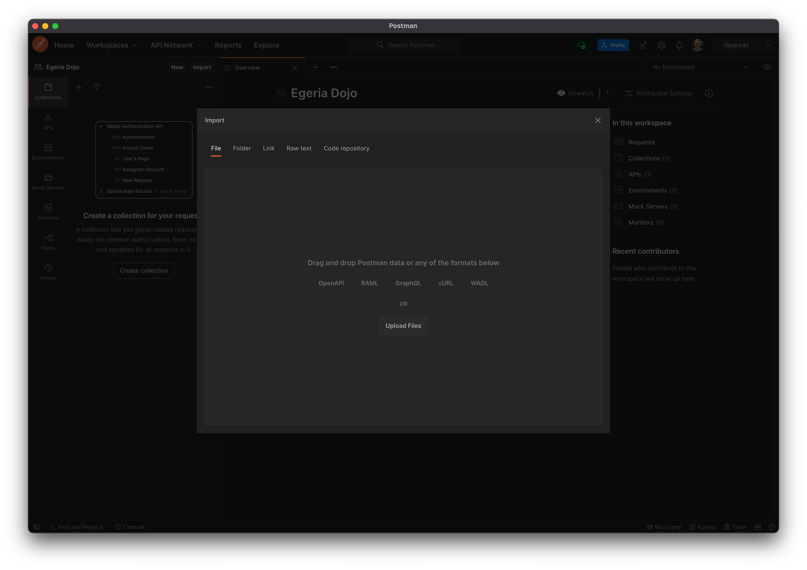
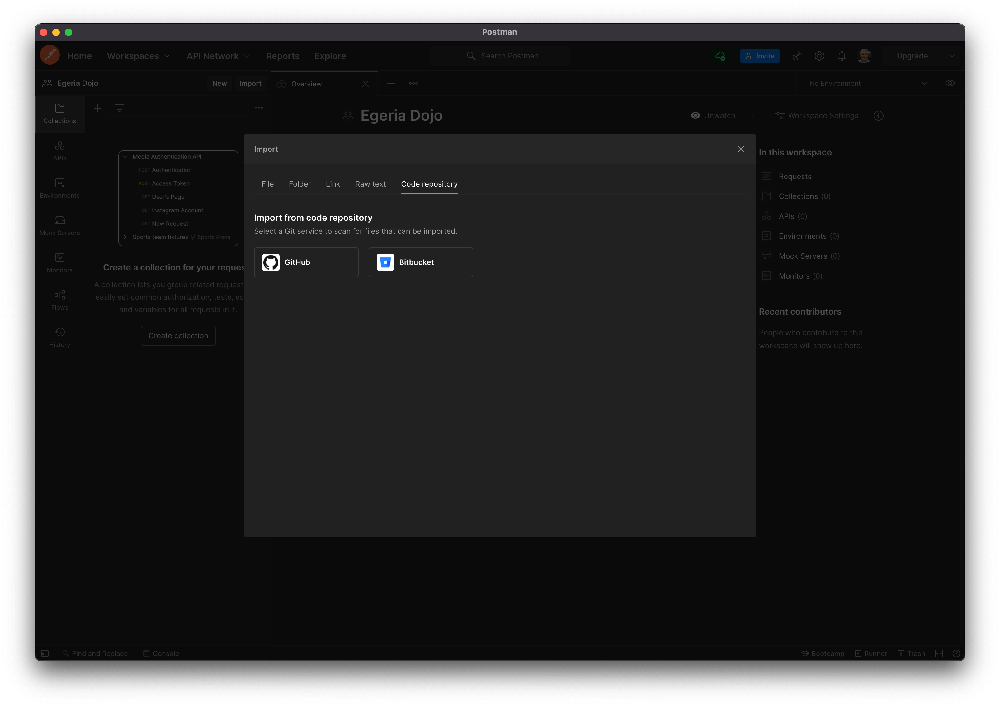
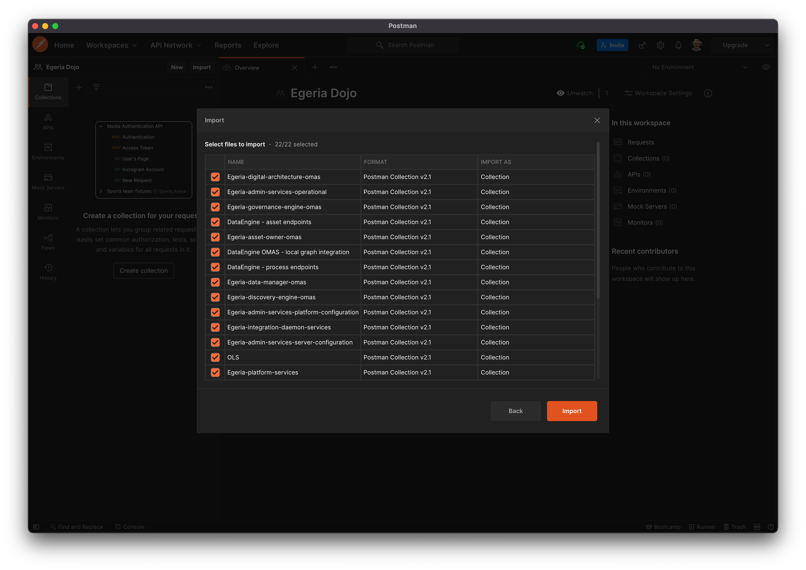
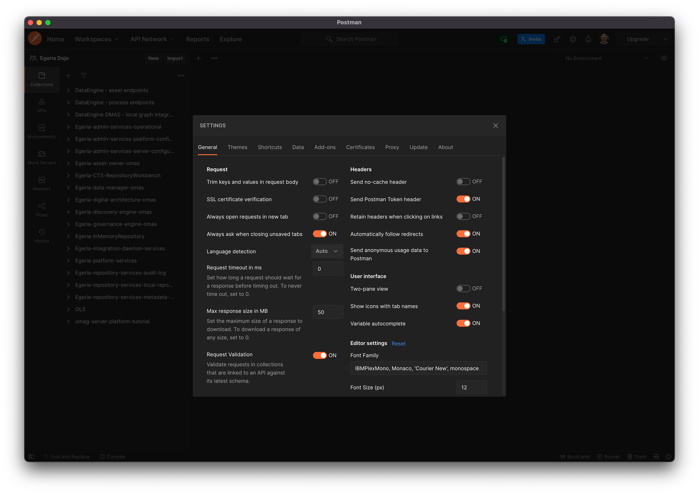
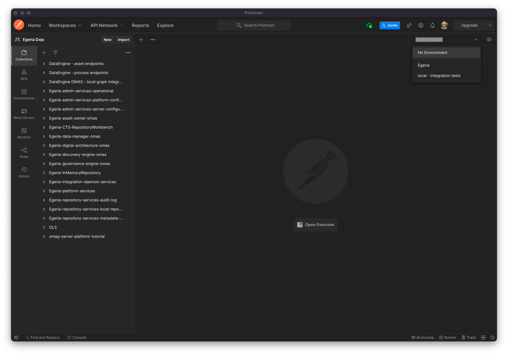
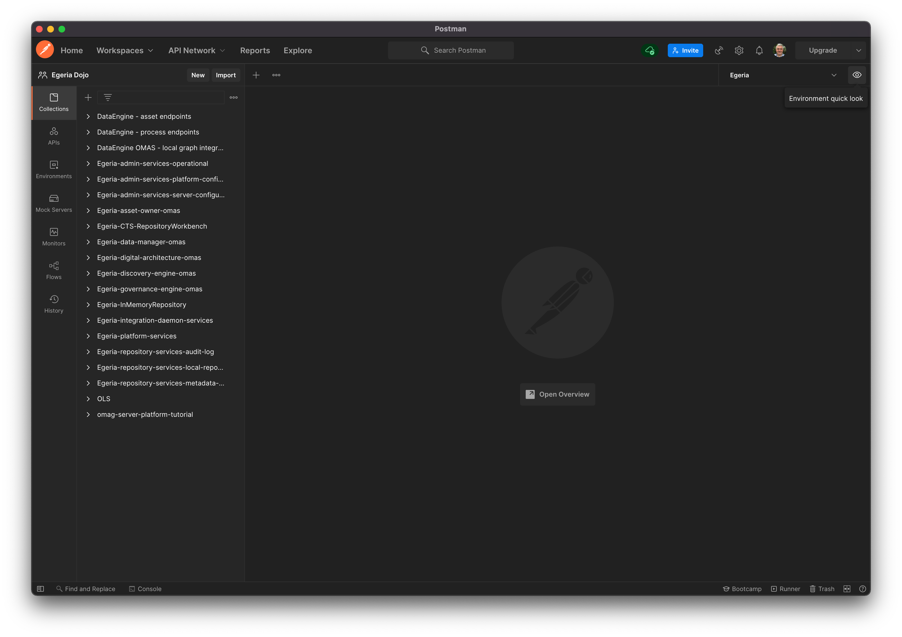
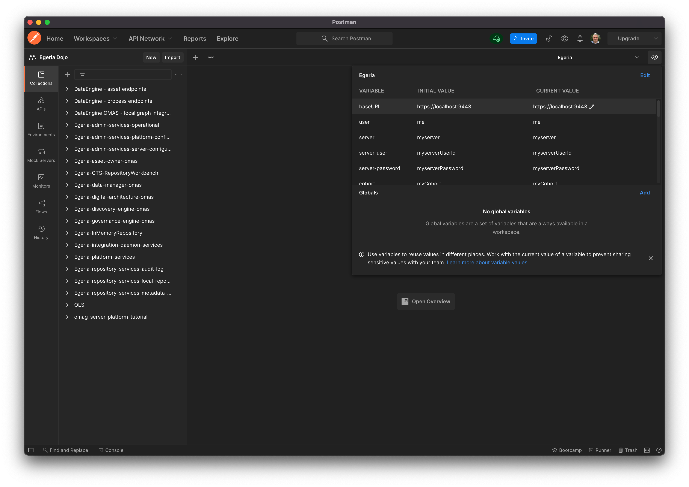

<!-- SPDX-License-Identifier: CC-BY-4.0 -->
<!-- Copyright Contributors to the ODPi Egeria project 2020. -->

# Postman

Postman provides an interactive application for issuing
REST API calls to a server and reviewing responses.

Install Postman from [here](https://www.getpostman.com/downloads/). At the time of writing 5.9.0 is 
current and recommended.

Once Postman is installed, start up the application.

You should see an initial page something like this:

## Setting up Postman with Egeria data

We will import two types of information from Egeria's code repository on GitHub:
* Environments - these define the values of replaceable variables in the API calls, such as host and server names.
* Collections - these define the REST API calls to issue.

Follow through these steps to configure your Postman environment:

## Create a new workspace

Creating a workspace for egeria helps keep everything we'll work with together. If you mess up your
postman files later, you can just create a new environment again to work with

Select the workspace menu at the top of the Postman interface, and create a new one
called 'Egeria dojo':

## Importing Egeria Postman data

We now will
* Select 'Import' and select 'GitHub' as the source
* Authenticate as required
* Select the odpi/egeria repository on GitHub
* Import all the Postman data found

## Updating Postman settings

Egeria uses secure connections. However the demo environment has self-signed certificates which 
Postman will not see as valid without further configuration. To simplify this process we will 
turn off certificate validation in postman:

* Go to settings
* Ensure 'SSL certificate verification' is switched off

## Egeria Environment settings

The Import process will have imported some egeria environment settings.

In general you can leave the values as default except for hostnames which should be pointed at the relevant
Egeria platform. Tutorial content will walk you through this explicitly.

* Make the egeria environment the default in this workspace

## Finished!

Postman is now ready to be used with egeria. Refer back to the tutorials for specific
examples, or experiment!

Instructions for contributing new Postman collections
are located in the [developer-resources](/egeria-docs/guides/contributor/guidelines/#postman-artifacts-for-apis).

--8<-- "snippets/abbr.md"
