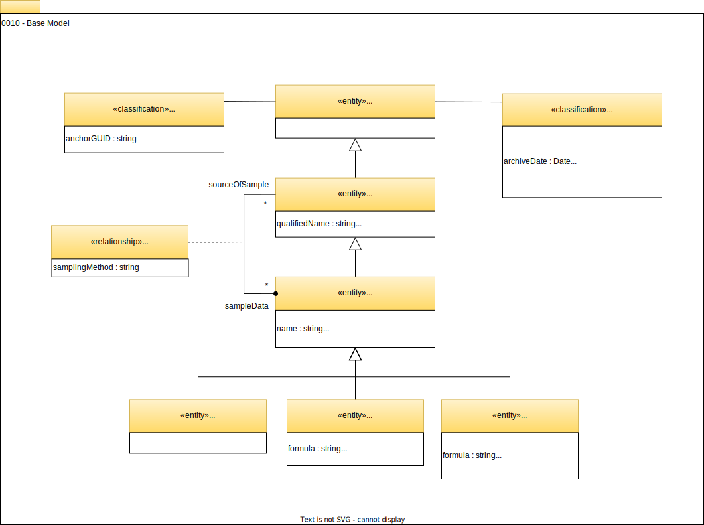

<!-- SPDX-License-Identifier: CC-BY-4.0 -->
<!-- Copyright Contributors to the Egeria project. -->

# 0010 Base model

## OpenMetadataRoot

*OpenMetadataRoot* is the root entity for all open metadata entity types.

## Referenceable

*Referenceable* is the super type for many of the open metadata entity types. A Referenceable entity is something that is important enough to be assigned a unique (qualified) name within its type. This unique name is often used outside the open metadata ecosystem as its unique identifier. Referenceable also has provision for storing additional properties. This is a set of name-value pairs (i.e. a map) where the values are all strings.

[Further information on the use of Referenceable.](/concepts/referenceable)

## Asset

An [Asset](/concepts/asset) is a metadata entity that describes a [resource](/concepts/resource) (either physical or digital) that is of value and so needs to be managed and governed.
`Infrastructure`, `Process` and `DataSet` are examples of Assets.

??? deprecated "Deprecated attributes"
    The `Asset` entity has the following deprecated attributes. Their values have been moved to classifications as shown in the table below. Many Assets are created by their hosting technology and locked read-only to the broader metadata ecosystem (see [external metadata provenance](/features/metadata-provenance/overview) for more detail). By moving the governance related information to a classification, it can be maintained by a different service to the Asset's creator.

    | Deprecated attribute | Moved to classification |
    |---|---|
    | `owner` (type `string`) | [Ownership](/types/4/0445-Governance-Roles/#ownership) |
    | `ownerType` (type `AssetOwnerType` enum) | [Ownership](/types/4/0445-Governance-roles/#ownership) |
    | `zoneMembership` (type `array<string>`) | [AssetZoneMembership](/types/4/0424-Governance-Zones/#assetzonemembership) |
    | `latestChange` (type `string`) | [LatestChange](/types/0/0011-Managing-Referenceables/#latestchange) |

### Infrastructure

*`Infrastructure`* represents both the physical and digital assets that the organization runs its business on. There is more information on `Infrastructure` in:

- [0030 Hosts and platforms](/types/0/0030-Hosts-and-Platforms)
- [0035 Complex hosts](/types/0/0035-Complex-Hosts)
- [0037 Software server platforms](/types/0/0037-Software-Server-Platforms)
- [0040 Software servers](/types/0/0040-Software-Servers)
- [0042 Software capabilities](/types/0/0042-Software-Capabilities)

### Process

*`Process`* describes a well-defined set of processing steps and decisions that drive a particular aspect of the organization's business. Most `Process`es are automated with software (see [`DeployedSoftwareComponent`](/types/2/0215-Software-Components/#deployedsoftwarecomponent)) but they may also be a manual procedure. An automated process can be invoked from a remote server through a [`DeployedAPI`](../../2/0212-deployed-apis/#deployedapi).

### DataSet

*`DataSet`* represents a collection of related data. This data does not need to be stored together. The *formula* property describes the logic used to populate the DataSet.  See [`DataStore`](/types/2/0210-Data-Stores) for the `Asset` that represents a physical store and the [`DataContentForDataSet`](/types/2/0210-Data-Stores/#datacontentfordataset) relationship links the DataSet to the asset(s) that describe the data sources.

More information on assets can be found in [Metadata Manager](/patterns/metadata-manager/overview).

## Anchors

The *`Anchors`* classification is used internally by the open metadata ecosystem to optimize the lookup of the entity at the root of a cluster of elements that represents a larger object. Currently, there is support for objects uniquely "owned" by an entity to store the GUID of that entity.

[Further information on the use of Anchors.](/concepts/anchor)

## Memento

Finally, the *Memento* classification identifies that the Referenceable refers to a real-world asset/artifact that has either been deleted or archived offline. The metadata element has been retained to show its role in the [lineage of other assets/artifacts](/features/lineage-management/overview). The properties in this classification identifies the archive processing and any information that helps to locate the asset/artifact in the archive (if applicable).

--8<-- "snippets/abbr.md"
