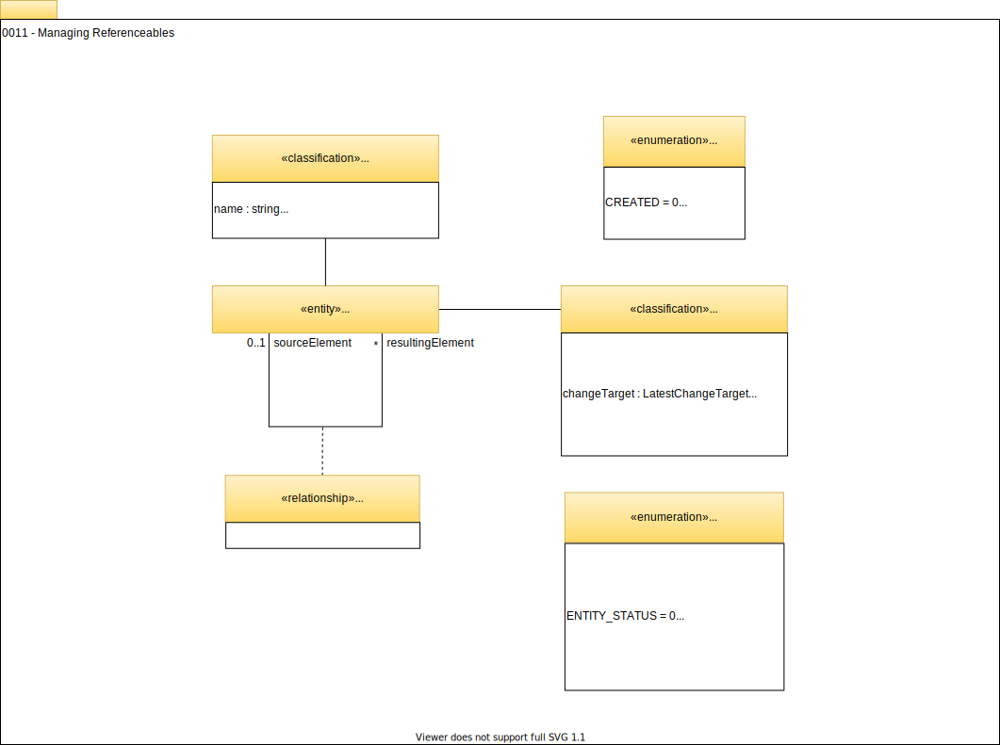

<!-- SPDX-License-Identifier: CC-BY-4.0 -->
<!-- Copyright Contributors to the Egeria project 2020. -->

# 0011 Managing Referenceables

`Referenceable`s can have chains of related feedback and additional knowledge attached to them. The following types help a metadata manager to process these collections of elements more efficiently.

## LatestChange

The *`LatestChange`* classification is a convenience mechanism to indicate where the last change occurred. Components that are monitoring [`Referenceable`s](/egeria-docs/types/0/0010-base-model/#referenceable) can use the open metadata events related to classifications to maintain a complete picture of the asset.

## Template

The *`Template`* classification indicates that a [`Referenceable`](/egeria-docs/types/0/0010-base-model/#referenceable) is a good element be used as a template when creating a new element of the same type. There is no restriction on using `Referenceable`s without this classification as templates. The `Template` classification is simply a useful marker to enable templates to be found.  

## SourcedFrom

When one `Referenceable` is created by using another `Referencable` as a template, the `qualifiedName` must be changed in the new `Referenceable` to give it a unique name - often the `displayName` changes, too. This makes it hard to identify which `Referenceable`s have been created from a template.

The *`SourcedFrom`* relationship is used to show the provenance of the information from the template. This is useful to help trace where information has come from and to help understand any potential impact cause by a change to the template if this change also needs to be made to the elements that were copied from it.

??? deprecated "Deprecated types"
    - `LastAttachment` - use `LatestChange` instead
    - `LastAttachmentLink` - use `LatestChange` instead

??? education "Further information"
    - [Cataloguing assets](../cataloging-assets)
    - [Using templates](../cataloging-assets/templated-cataloging.md)

--8<-- "snippets/abbr.md"
