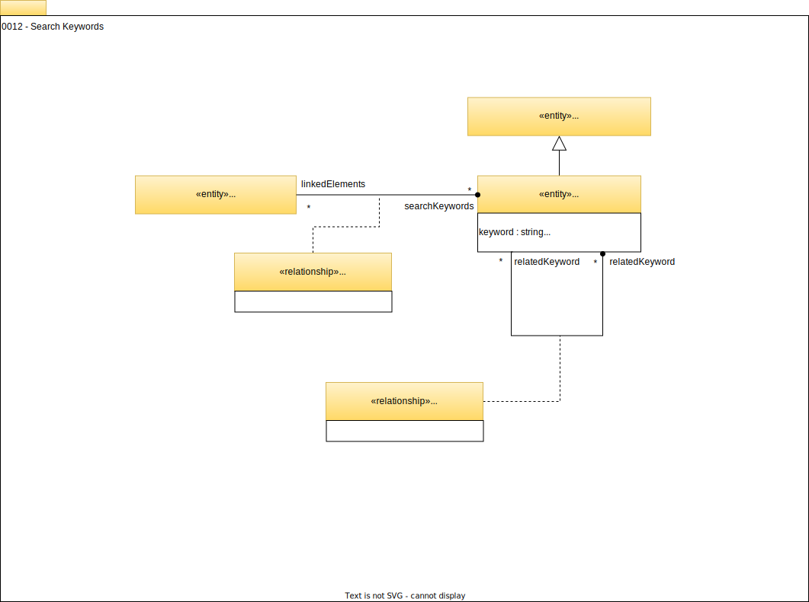

<!-- SPDX-License-Identifier: CC-BY-4.0 -->
<!-- Copyright Contributors to the Egeria project 2020. -->

# 0012 - Search Keywords

Some [`Referenceable`s](/egeria-docs/types/0/0010-Base-Model/#referenceable) such as [`GlossaryTerm`s](/egeria-docs/types/3/0330-Terms/#glossaryterm) have a lot of text in their definitions, making them easy to find using search strings. [`Asset`](/egeria-docs/types/0/0010-Base-Model/#asset) definitions, on the other hand, typically have less text. Even the schema associated with the asset might only contain technical terms, and they are often abbreviated. The result is that assets can be hard for consumers to find.

It is possible to link assets and schemas to glossary terms to make them findable by association. However, this linkage is a formal semantic relationship. Consumers of the assets can add [`InformalTag`s](/egeria-docs/types/1/0150-Feedback/#informaltag) to the assets and schemas, but only once they have found them. The search keywords provide a mechanism to allow the asset owner to tag the asset - and linked elements such as the schema - with a variety of keywords that can be matched during a search. This helps to boost relevant assets to the top of the search results.

## SearchKeyword

The *`SearchKeyword`* entity stores the definition of the search keyword.

## SearchKeywordLink

The *`SearchKeywordLink`* relationship links `SearchKeyword`s with the asset and their associated elements.

## RelatedKeyword

Related keywords can be linked together using the *`RelatedKeyword`* relationship to allow simple synonym type expansions of the search.

??? education "Further information"
    Search keywords can be added manually through the [Asset Owner OMAS](/egeria-docs/services/omas/asset-owner/overview). Some files such as documents and photos may have keywords embedded in them. These can be [automatically discovered through metadata discovery](../metadata-discovery) and stored in their corresponding asset properties using these same search keyword elements.

--8<-- "snippets/abbr.md"
