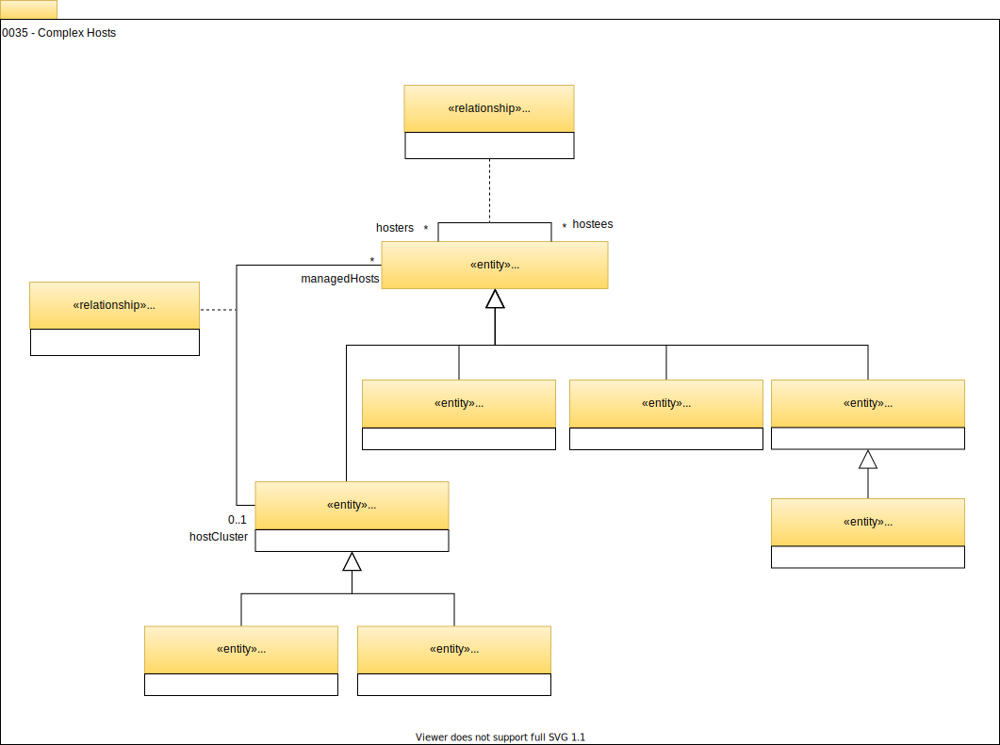

<!-- SPDX-License-Identifier: CC-BY-4.0 -->
<!-- Copyright Contributors to the Egeria project. -->

# 0035 Complex Hosts

In today's systems, hardware is managed to get the maximum use out of it. Therefore, the concept of a *host* is typically virtualized to allow a single computer to be used for many hosts and for multiple computers to collectively support a single host.

The complex hosts handle environments where many nodes are acting together as a cluster, and where virtualized containers (such as Docker) are being used.

## HostCluster

A *`HostCluster`* describes a collection of hosts that together are providing a service. Clusters are often used to provide horizontal scaling of services.

## VirtualContainer

A *`VirtualContainer`* provides the services of a host to the [software servers](/egeria-docs/types/0/0040-software-servers) deployed on it. When the server makes requests for storage, network access, etc, the `VirtualContainer` delegates the requests to the equivalent services of the actual host it is deployed on.

`VirtualContainer`s can be hosted on other `VirtualContainer`s, but to actually run they need to ultimately be deployed onto a real physical [`Host`](/egeria-docs/types/0/0030-hosts-and-platforms/#host).

--8<-- "snippets/abbr.md"
