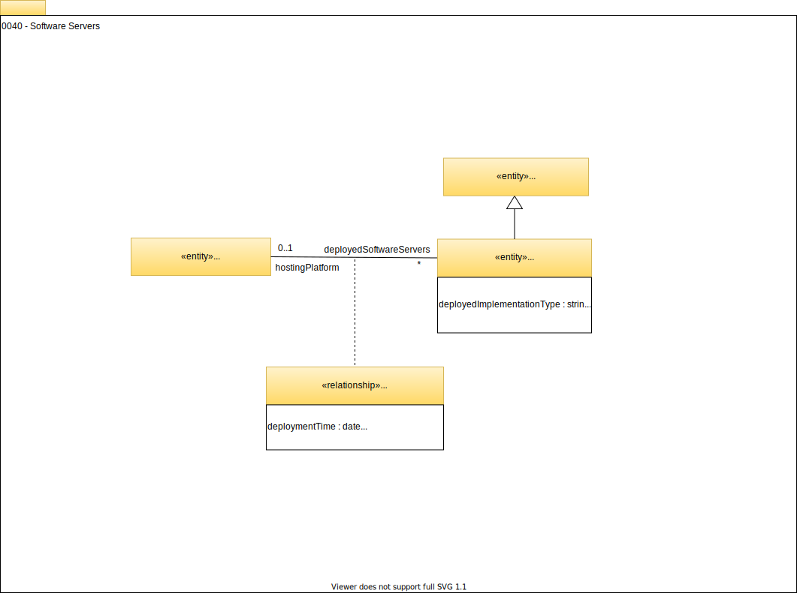

<!-- SPDX-License-Identifier: CC-BY-4.0 -->
<!-- Copyright Contributors to the Egeria project. -->

# 0040 Software Servers

Software servers describe the middleware software servers (such as application servers, data movement engines and database servers) that run on the [`Host`s](/egeria-docs/types/0/0030-hosts-and-platforms/#host).

## SoftwareServer

Within the *`SoftwareServer`* model we capture the `userId` that it operates under. Most metadata repositories are run in a secure mode requiring incoming requests to include the requester's security credentials. Therefore, we have an identifier for each unique logged on security identity (`userId`). This identity is recorded within specific entities and relationships when they are created or updated. By storing the user identifier for the server, it is possible to correlate the server with the changes to the metadata (and related data assets) that it makes.

See [`Actor`s](/egeria-docs/types/1/0110-actors/#actor) for details of how user identifiers are correlated with people and teams.

An [OMAG server](/egeria-docs/concepts/omag-server) is an example of a `SoftwareServer`.

## Endpoint

Open metadata may also capture the network `Endpoint`(s) that the server is connected to and the host it is deployed to.

The `Endpoint` defines the parameters needed to connect to the server. It also features in the [`Connection`](/egeria-docs/types/2/0201-connectors-and-connections/#connection) model used by applications and tools to call the server. Thus, through the `Endpoint` entity it is possible to link the connection to the underlying server.

--8<-- "snippets/abbr.md"
