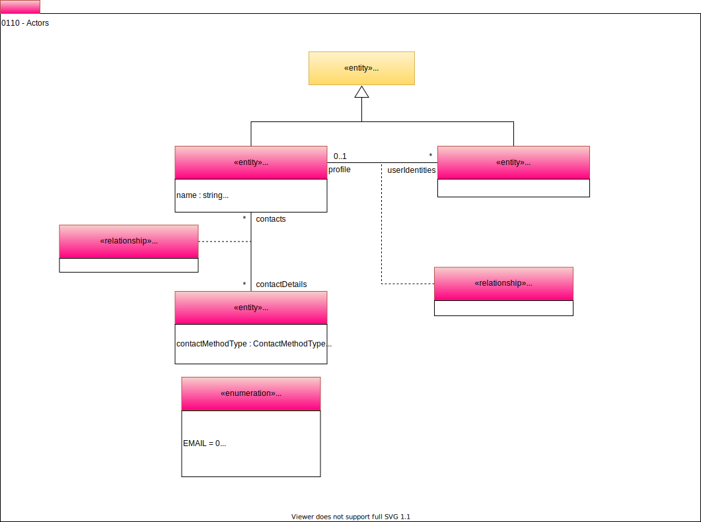

<!-- SPDX-License-Identifier: CC-BY-4.0 -->
<!-- Copyright Contributors to the Egeria project. -->

# 0110 Actors

Most metadata repositories are run in a secure mode requiring incoming requests to include the requester’s security credentials. Therefore we have an identifier for each unique logged on security identity (aka userId). This identity is recorded with specific entities and relationships when they are created or updated. The userId for a server is also captured in the metadata model (see [0040 Servers in Area 0](/egeria-docs/types/0/0040-software-servers)) so it is possible to correlate the actions of a data processing server with changes to the metadata.

## UserIdentity

*UserIdentity* provides a structure for storing the security authentication information about a person. Initially we have a simple string for the userId - but this could be extended to include more sophisticated identification information.

## ActorProfile

An *ActorProfile* describes the actual person, or possibly team if group userIds are being used, that is working either with the data assets or with the metadata directly. The profile is a record to add additional information about the person or engine that is making the requests. They may have more than one UserIdentity.

## Actors

*Actors* are associated with the new metadata that they create and comment on via their user identities. More information about the person behind the user identity is available through the ActorProfile. This separation is maintained because the user identity is the only information available on calls to the metadata repository.  The ActorProfile is used to aggregate the activity of the individual or team (or IT infrastructure - see [ITProfile](/egeria-docs/types/1/0117-it-profiles)). This includes crowd-sourcing and project participation.

--8<-- "snippets/abbr.md"
