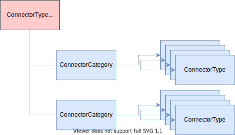

---
hide:
- toc
---

<!-- SPDX-License-Identifier: CC-BY-4.0 -->
<!-- Copyright Contributors to the ODPi Egeria project. -->

# 0201 Connectors and Connections

In [Area 0](/egeria-docs/types/0) we introduced the definition for an [*endpoint*](/egeria-docs/types/0/0026-Endpoints) that defined the network address of some running IT infrastructure.  The IT infrastructure could be hosting data and APIs. 

The [Open Connector Framework (OCF)](/egeria-docs/frameworks/ocf/overview) provides client java classes called connectors to enable an application, tool or engine to call the IT Infrastructure function's through the endpoint.

A `Connection` metadata entity contains the configuration information to allow the OCF's [Connector Broker](/egeria-docs/concepts/connector-broker) to create and configure the appropriate connector instance for a client application or tool to connect to the endpoint. The `ConnectorType` defines which connector implementation should be used to connect to the endpoint. The `securedProperties` holds authentication properties such as userId and password.  They are securely stored to protect the assets. If they are missing then the security credentials of the current user are used with the connection.

By default, connector implementations are assume to support the OCF.  However, many vendor platforms have their own connector frameworks.  The `ConnectorCategory` allows equivalent connector types from different connector frameworks to be gathered together so that the connector type from a connection can be swapped for an equivalent connector type for the locally supported connector framework.

The picture below shows how the connector category can be used to navigate to a different connector type implementation.

The next picture shows the ConnectorTypeDirectory can be used to organize the `ConnectorCategory` entities.

--8<-- "snippets/abbr.md"