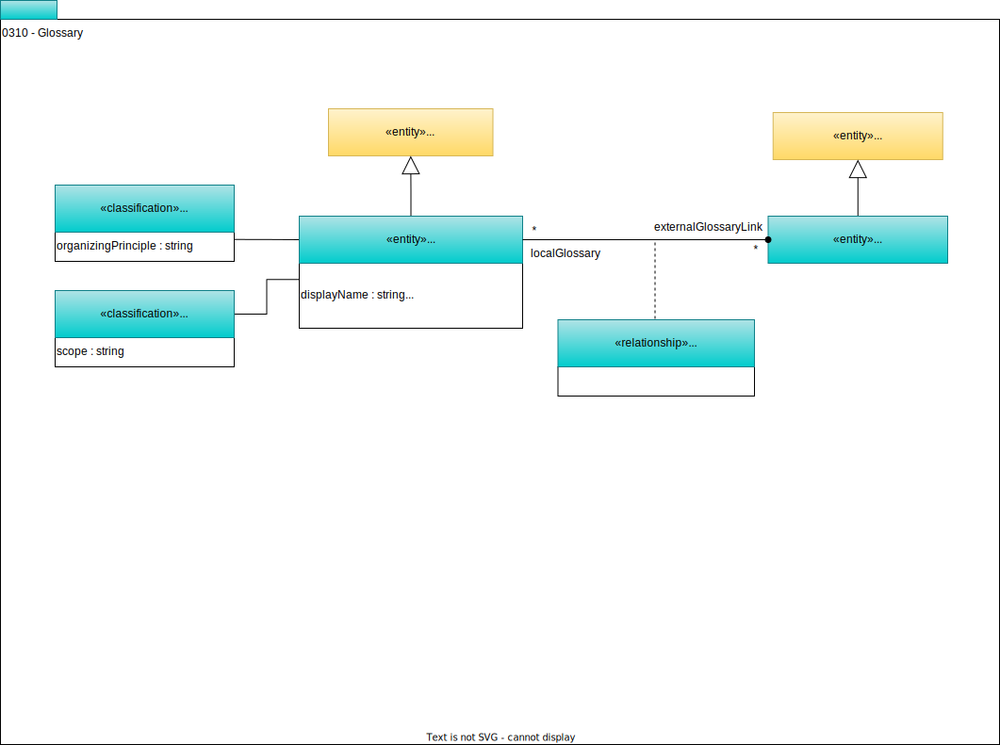

---
hide:
- toc
---

<!-- SPDX-License-Identifier: CC-BY-4.0 -->
<!-- Copyright Contributors to the ODPi Egeria project. -->

# 0310 Glossary Model

A glossary is a collection of related semantic definitions.
A semantic definition describes the meaning of something.
This may be, for example, a concept, object or activity.

A metadata repository may contain many glossaries,
particularly when it is part of a bigger enterprise cohort
of repositories.  Each glossary may come from a specific
team or external organization.
Or it may be focused on a particular topic or set of use cases.

The anchor for each glossary is the **Glossary** object. 

The classifications associated with the glossary object
are used to document the type of vocabulary it contains
and its purpose:

 * **Taxonomy** - A Taxonomy is a glossary that has a formal structure.
 Typically the terms have been organized into a category
 hierarchy that reflects their meaning or use.
 There may also be term relationships that also form
 part of the hierarchy.
 
   Taxonomies are often used to organize documents and other
 media in content repositories.
    
    
 * **Canonical Vocabulary** - this glossary provides the
 standard vocabulary definitions for an organization.
 Typically terms from other glossaries are linked to terms
 from the canonical glossary.

These classifications are independent of one another so
a Glossary object may have none, one or all of these
classifications attached.
In addition, there is a relationship to an external glossary called 
**ExternallySourcedGlossary**.
This indicates that the content from this glossary comes
from an external source.
It may be, for example an industry-specific glossary,
or from a standards body, or from an open data site,
or from a commercial organization.

--8<-- "snippets/abbr.md"