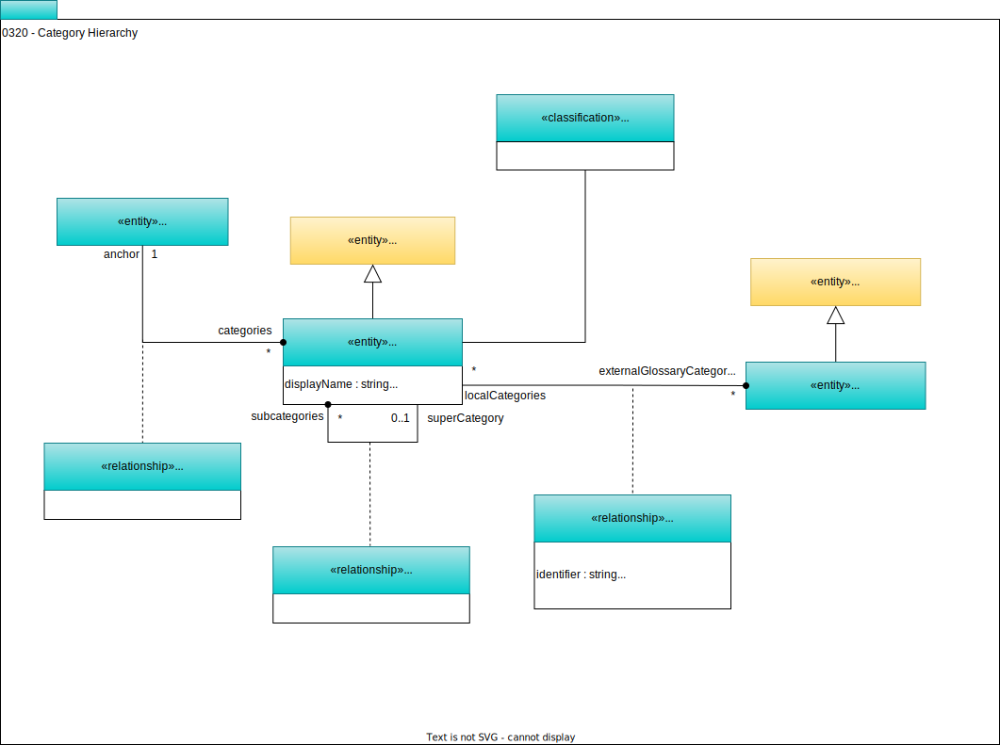

---
hide:
- toc
---

<!-- SPDX-License-Identifier: CC-BY-4.0 -->
<!-- Copyright Contributors to the ODPi Egeria project. -->

# 0320 Category Hierarchy

The vocabulary for the glossary is organized into a
hierarchy of categories.
These categories effectively provide a element structure
for the glossary.

* **GlossaryCategory** represents a category in a glossary. 
* **CategoryAnchor** links each category to exactly one Glossary object.
This means that this is its home glossary.
If the Glossary object is deleted then so are all of the categories linked to it.
* **CategoryHierarchyLink** is a relationship used to organize categories into a hierarchy to, for example, create a structure for a taxonomy.
A category may have none or one super-categories.
However this super-category may be in a different glossary.
* **SubjectArea**  is a classification for a category that indicates that the category represents a subject area.
* **LibraryCategoryReference** provides reference information for how this category corresponds to a category in an external glossary.

--8<-- "snippets/abbr.md"