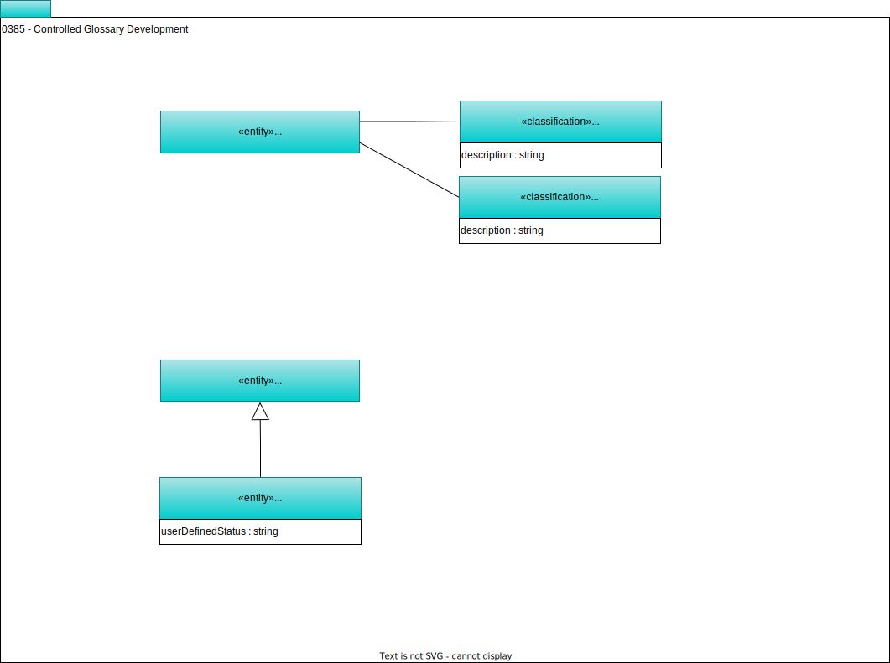

<!-- SPDX-License-Identifier: CC-BY-4.0 -->
<!-- Copyright Contributors to the ODPi Egeria project. -->

# 0385 Controlled Glossary Development

Many organization that use glossary terms to drive the operation of the data landscape, need to use a controlled process to introduce and amend glossary terms, because the consequences of any change need to be carefully considered.  

This model covers the extensions needed to support a controlled development process for glossary terms.  Typically, the organization has its (approved) live glossary locked read-only to normal users.  When updates need to be made, copies of the affected glossary terms are made and linked to an editing glossary.

> An example of an editing glossary with its glossary terms linked to the appropriate terms in the live glossary.

Once the updates are complete, they go through a review and approval process.

Once approved, the changes identified in the editing glossary are made to the terms in the live glossary.  This *merge* process is typically handled by a [Governance Action Process](/concepts/governance-action-process) which handles conflicts and organizes the subsequent correction and resubmission of the changes.

## EditingGlossary classification

The *EditingGlossary* classification identifies that a glossary is temporary and contains copies of live glossary terms that are being updated as part of a controlled glossary development process.

The contents of the editing glossary may represent a single change, changes associated with a particular project/community or may represent a new release of the whole glossary.

## ControlledGlossaryTerm entity

The *ControlledGlossaryTerm* extends the standard [GlossaryTerm](/types/3/0330-Terms) with additional valid [instance statuses](/concepts/instance-status) for supporting a complex development lifecycle.  The statuses are:

* Draft      - The term is incomplete. 
* Prepared   - The term is ready for review.
* Proposed   - The term is in review.
* Approved   - The term is approved and awaiting activation.
* Rejected   - The term is rejected and should not be used.
* Active     - The term is approved and in use.
* Deprecated - The term is out of date and should not be used.
* Other      - The term is in a locally defined state.
* Deleted    - The term has been soft-deleted and can no longer be used.

These status values can be thought of as the system-defined statuses.  It is possible to replace, or extend these statuses using the `userDefinedStatus` attribute that can be controlled through the use of [valid metadata values](/guises/planning/valid-metadta-values/overview).

## GlossaryTermEvolution relationship

The *GlossaryTermEvolution* links a term in an editing glossary to the live term it is updating.

--8<-- "snippets/abbr.md"