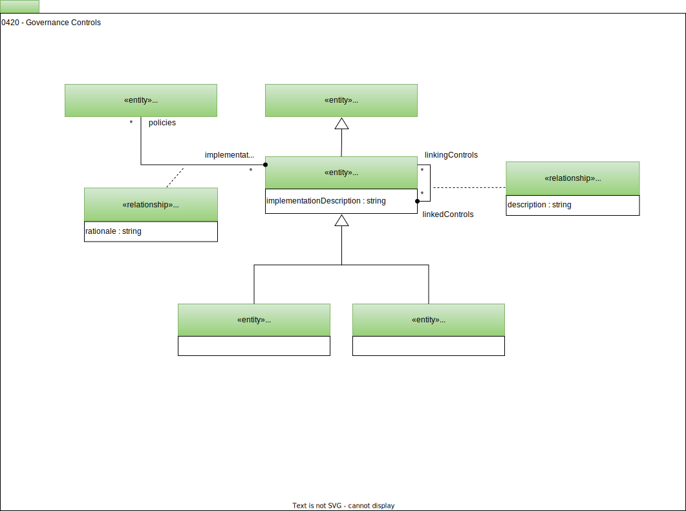

---
hide:
- toc
---

<!-- SPDX-License-Identifier: CC-BY-4.0 -->
<!-- Copyright Contributors to the ODPi Egeria project. -->

# 0420 Governance Controls

Governance is enabled through People, Process and Technology.
These are controlled through a combination of technical controls (implemented IT function) and organizational controls (training, responsibility, buddy-checking etc).

## Further Information

* Governance controls are types of **GovernanceDefinitions** which are located in model [0401](/types/4/0401-Governance-Definitions).
  The governance policies are defined in model [0415](/types/4/0415-Governance-Responses).

* The [Governance Program OMAS](/services/omas/governance-program/overview)
  provides support for defining governance policies through its **GovernancePolicyMakingInterface**. 

* There is further detail on the content of the governance controls in the following models:

     * [0430 Technical Controls](/types/4/0430-Technical-Controls) - describe automated behaviour that implements a governance control.
       * [0438 Naming Standards](/types/4/0438-Naming-Standards) - defines naming standard rules.
       * [0460 Governance Execution Points](/types/4/0460-Governance-Execution-Points) - describe classifications for software components that link them to a technical control.
       * [0461 Governance Action Engines](/types/4/0461-Governance-Engines) - support the execution of technical controls.
       * [0462 Governance Action Types](/types/4/0462-Governance-Action-Types) - provide the choreography of the execution of technical controls.
     * [0440 Organizational Controls](/types/4/0440-Organizational-Controls) - identity governance roles and manual procedures (such as approvals) that implement a governance control.
       * [0445 Governance Roles](/types/4/0445-Governance-Roles) - define governance roles and the people associated with them.

--8<-- "snippets/abbr.md"