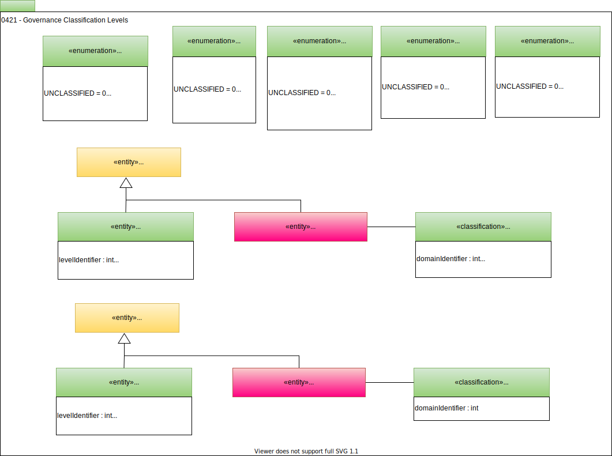

---
hide:
- toc
---

<!-- SPDX-License-Identifier: CC-BY-4.0 -->
<!-- Copyright Contributors to the ODPi Egeria project 2020. -->

# Governance Classification Levels

Most organizations already define their standard levels for
governance classifications such as confidentiality.
Although the Open Metadata Types include
[Standard Enumerations](0422-Governance-Action-Classifications.md)
for these classification, the **GovernanceClassificationLevel**
allows an organization to make use of their own definitions.

An organization creates one of these entities for each of their confidentiality levels.
The levelIdentifier value is then used in the classifications.
It can be programmatically examined by security processing to,
for example, compare the confidentiality of an asset against a person's access.

Set of classification levels used in a particular classification can be grouped using a
**Collection** which can be classified using **GovernanceClassificationSet**
with details of the classification
the values are used in.

Similarly, the status of governance classification, entities and relationships can be
customized through the **GovernanceStatusLevel**.  The **levelIdentifier** values
should be set up so

* Positive values relate to statuses which mean the element is ok to use.
* Zero means the element has just been created, but not vetted so use with caution.
* Negative values mean that the element is not to be trusted because it is, for example,
obsolete or incorrect.

??? deprecated "Deprecated types"
    - *GovernanceConfidentialityLevel* - use *GovernanceClassificationLevel*.

--8<-- "snippets/abbr.md"