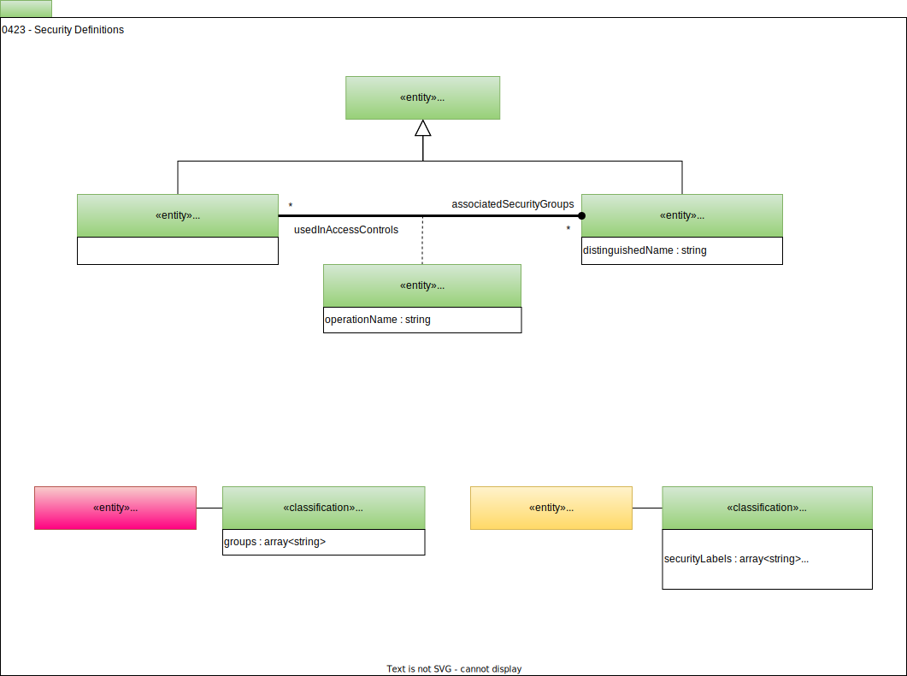

---
hide:
- toc
---

<!-- SPDX-License-Identifier: CC-BY-4.0 -->
<!-- Copyright Contributors to the ODPi Egeria project. -->

# 0423 Security Definitions

Security, particularly access control, is an important form of governance that preserves exclusive access to specific [resources](/egeria-docs/concepts/resource) for particular *[actors](/egeria-docs/types/1/0110-Actors)*.

## SecurityGroup and SecurityGroupMembership

The *SecurityGroup* represents a group of actors that need to be given the same access to a specific set of resources.

The actors in a security group have the group's *qualifiedName* listed in their *SecurityGroupMembership* classification attached to one of their *[UserIdentity](/egeria-docs/types/1/0110-Actors)* entities.

## SecurityTags

*SecurityTags* identify labels and properties that are used in determining which data protection rules should be executed when particular data is requests.  They can be attached to [assets](/egeria-docs/types/0/0010-Base_Model) or [schema elements](/egeria-docs/types/5/0501-Schema-Elements) depending on the scope of data that the security tags apply to. The [synchronized access control](/egeria-docs/features/synchronized-access-control) feature describes how security tags are set up and used.

--8<-- "snippets/abbr.md"