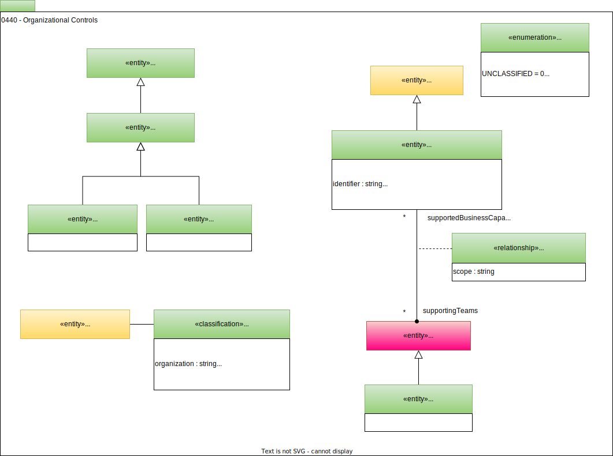

---
hide:
- toc
---

<!-- SPDX-License-Identifier: CC-BY-4.0 -->
<!-- Copyright Contributors to the ODPi Egeria project. -->

# 0440 Organizational Controls

Organizational controls describe governance controls that are implemented through people, organizational structures and responsibilities plus manual procedures and rules.  *0440* defines the two main sub-types of the organizational controls.

## GovernanceResponsibility

*GovernanceResponsibility* describes a responsibility that is assigned to a person or team.  It could be a requirement to take certain action in specific circumstances, or to make particular types of decisions or to give approvals for particular actions.

## GovernanceProcedure

*GovernanceProcedure* describes a manual procedure that is performed under certain situations.  An example would be a visual check of a person's government identity document such as a passport or driving license.

Linked to the *OrganizationalControl* via the *BusinessCapabilityControls* relationship are the business capabilities that are part of the scope of the control.

## BusinessCapability

*BusinessCapability* describes the business responsibility or services provided by a team in an organization.  It is linked to the owning team using the *OrganizationalCapability* relationship.

## Organization

*Organization* is a special type of [team](/types/1/0115-Teams) that is the root of a hierarchy of teams and represents a collection of people and resources with a particular purpose such as a business, non-profit organization or governance department.

## AssetOrigin

*[Asset](/types/0/0010-Basic-Model)* entities describe [resources](/concepts/resource) used by an organization.  This use could be by many teams.  The *AssetOrigin* classification describes the part of the organization that the resource originated in.  For example, it may show that a data set with personal information originated from the Swiss part of the organization and is therefore subject to specific controls.

--8<-- "snippets/abbr.md"