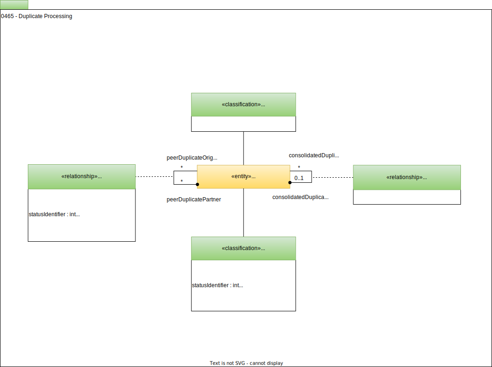

---
hide:
- toc
---

<!-- SPDX-License-Identifier: CC-BY-4.0 -->
<!-- Copyright Contributors to the ODPi Egeria project. -->

# 0465 Duplicate Processing

Since metadata is being created by many tools, it is possible that the same resource is catalogued multiple times.
These duplicate elements are then exposed when the tools are connected together with Egeria.
The duplicate processing types are used by the governance engines and stewards to link elements that are duplicates
so that the open metadata ecosystem can ensure consumers of open metadata do not see the duplicates when they query
the open metadata repositories.

## PeerDuplicateLink

When a governance engine or steward detects that two elements are duplicates of one another, they are linked using
the *PeerDuplicateLink*.  This link on its own indicates a potential duplicate.

## KnownDuplicate

When the duplicate is confirmed (either by a steward, or a governance engine) the
**KnownDuplicate** classification is added to the entities that are linked with the
**PeerDuplicateLink**.  This classification is detected by metadata retrieval processes
and triggers the following duplicate processing:

* When an entity is retrieved either by guid or via a query and it has the **KnownDuplicate** classification attached,
its header and properties are returned
along with a combination of the classifications from itself and each of the entities linked with
the **PeerDuplicateLink** relationship.  If there are conflicts in the classifications they are
logged in the audit log and the newest classification takes precedence.

* When the relationships linked to an entity with the **KnownDuplicate** classification is requested,
the relationships attached to this entity, along with the relationships attached to all entities linked with
the **PeerDuplicateLink** relationship.  If there should only be one of a particular type of relationship
then the conflicts are logged to the audit log and the newest relationship takes precedence.

There is no special duplicate processing when a relationship is retrieved independently of an entity.

## ConsolidatedDuplicate and ConsolidatedDuplicateLink

It may be that this simple set of survivorship rules and consolidation process is insufficient
(or too expensive from a performance perspective).
It is possible for a steward/governance engine to construct and store a consolidated entity
with its consolidated classification and relationships.  Such an entity is decorated with the **ConsolidatedDuplicate**
classification and is linked to each of the source entities using the **ConsolidatedDuplicateLink** relationship.
Once the **ConsolidatedDuplicateLink** relationship is in place, the simple survivorship rules and peer consolidation process
are ignored and the properties, classifications and relationships from the consolidated entity are used
for a query to one of the linked entities with the **KnownDuplicate** classification.
The steward/governance engine is responsible for the ongoing maintenance of this consolidated entity.

## Support for duplicate processing

The [Stewardship Action OMAS](/services/omas/stewardship-action/overview)
provides APIs for setting up peer duplicates and consolidated entities.

The Governance Action Services running in the [Governance Engines](/concepts/governance-engine) can automate the detection of
duplicates and the maintenance of consolidated entities.  The governance engines are supported by the
[Governance Engine OMAS](/services/omas/governance-engine/overview).

??? deprecated "Deprecated types"
    - *KnownDuplicateLink* is deprecated in favor of the two specialized relationships: PeerDuplicateLink and ConsolidatedDuplicateLink.

--8<-- "snippets/abbr.md"