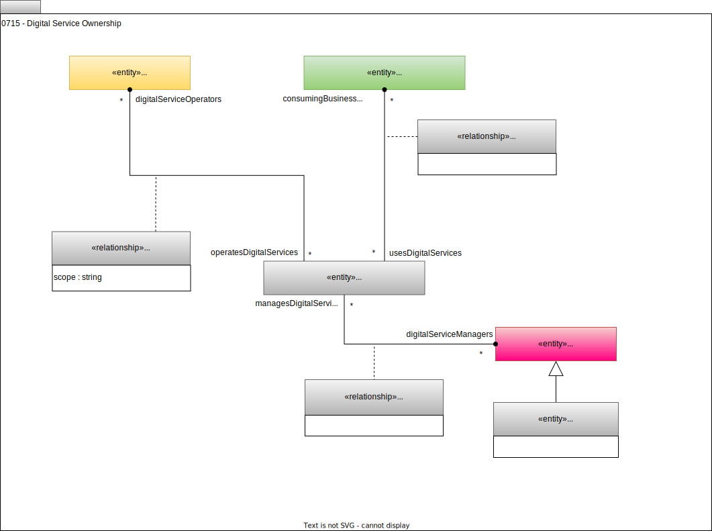

<!-- SPDX-License-Identifier: CC-BY-4.0 -->
<!-- Copyright Contributors to the ODPi Egeria project 2020. -->

# 0715 Digital Service Ownership

Digital services often provide the focus for governance activity such as data privacy, data quality or cyber-security.  They typically have executive ownership and provide a key digital capability that enables the organization to function properly.

The relationships on this page show how the digital service fits in with the organization.

## DigitalServiceOperator

*DigitalServiceOperator* shows which [organization(s)](/types/4/0440-Organizational-Controls) are responsible for the digital service.  The *scope* property identifies the scope of the responsibility for a particular organization where multiple organizations have responsibility.

This relationship is useful when the local organization is using digital services from other organizations.

## DigitalSupport

*DigitalSupport* identifies which [business capabilities](/types/4/0440-Organizational-Controls) are dependent on the digital service for their operations.

## DigitalServiceManagement

*DigitalServiceManagement* defines who is responsible for the digital service.  This includes its operation and evolution.  It links to a [PersonRole](/types/1/0112-People) which may have one or more individuals appointed to it.

## DigitalServiceManager

*DigitalServiceManager* is a [PersonRole](/types/1/0112-People) that can be used as the digital service manager for a digital service.

--8<-- "snippets/abbr.md"